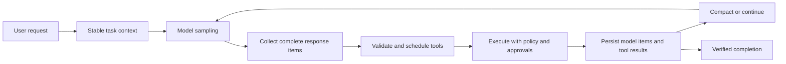

# Codex Harness Gap Investigation

Date: 2026-07-10  
Repository: Alpha (`745e1e2`, `main`)  
Question: What changed between Alpha's current orchestrator experience and the current Codex experience, and what should Alpha build to improve core problem-solving and coding ability?

## Executive conclusion

Alpha is not missing a single prompt trick, a memory system, or an embedding feature. The largest gap is that Alpha is using a capable coding model through an Alpha provider adapter, while Codex is using a purpose-built coding-agent harness around its model.

The practical difference is a coherent execution kernel:



Alpha has almost all of these nouns somewhere in the codebase, but they are not one kernel. They are spread across `Task`, streaming parsers, `presentAssistantMessage`, provider adapters, mode filters, terminal state, approval callbacks, history repair, and context-management code. That makes the system behave like a chat extension that learned to orchestrate, not like a coding agent whose primary job is to drive a reliable work loop.

The highest-leverage change is therefore:

> Build a single provider-neutral turn engine that collects a model response, normalizes it, executes tools through one scheduler, persists the exchange atomically, and decides whether to continue based on task state. Make orchestration an internal capability of the coding agent, not the user's primary mode.

This is the likely source of the large qualitative jump the user is feeling.

## Scope and method

This investigation deliberately excludes long-term memory as a primary improvement area. It examined:

- Alpha's current task loop, prompt assembly, tool surface, provider boundary, mode model, context management, and recent history.
- The current public Codex agent-loop writeup and the current open-source Codex Rust core and model configuration.
- Existing Alpha design documents, especially `docs/codex-convergence.md`, `docs/orchestrator-prompt-flow.md`, and `docs/orchestration-regression-review.md`.

The Codex comparison is based on public implementation and documentation, not private product prompts. The strongest conclusions are the ones visible in both the public Codex core and Alpha's local runtime. Some product details can vary by Codex surface and account configuration; those are marked as secondary or bounded observations.

## The important distinction

There are three different things that are easy to conflate:

| Layer           | Alpha today                                                                    | Codex today                                                                  | Why it matters                                            |
| --------------- | ------------------------------------------------------------------------------ | ---------------------------------------------------------------------------- | --------------------------------------------------------- |
| Model           | Can call OpenAI Codex models through `OpenAiCodexHandler`                      | Uses Codex-tuned models through the Responses API                            | Model quality matters, but it is not the whole experience |
| Harness         | Alpha `Task` loop, Alpha prompt, Alpha tools, Alpha approval and terminal flow | Codex session/turn core, tool router, execution policy, compaction, protocol | This is the major gap                                     |
| Product surface | VS Code extension and CLI that mirror the extension task state                 | CLI, app-server, IDE, and cloud surfaces over a shared core                  | Shared core behavior compounds across surfaces            |

Using a Codex model does not automatically provide the Codex harness. Alpha's `src/api/providers/openai-codex.ts` translates Alpha's conversation into the Responses API, but it still calls Alpha's `Task` loop, passes Alpha's generated `systemPrompt` as `instructions`, and uses Alpha's tool execution and history lifecycle. It is a model/provider integration, not an integration of `codex-rs`'s execution kernel.

That distinction explains why a model can feel substantially better in Codex than in an Alpha mode even when the model name is similar.

## What Alpha currently does

### 1. Alpha has a chat-oriented outer loop

Alpha's main loop is in [`Task.ts`](../src/core/task/Task.ts#L2771-L2801). It repeatedly calls `recursivelyMakeClineRequests`, then feeds accumulated tool results back into another request. It also has a special rule for a response that did not use a tool: send a `noToolsUsed` message and ask the model to use a tool or complete the task.

This is a workable legacy agent loop, but its completion contract is tool-centric:

- The model is told it must call at least one tool per assistant response.
- `attempt_completion` is a tool rather than simply a normal assistant terminal message.
- A no-tool assistant response is treated as a likely mistake or incomplete turn.
- The loop can be driven by UI-oriented asks, retries, and recovery prompts rather than by a clear task-state machine.

The current Codex loop has a simpler terminal contract: the model samples, the harness executes requested function calls and feeds their outputs back, and an assistant message with no follow-up work ends the turn. OpenAI's public agent-loop description explicitly treats the assistant message as the end of a turn and the tool calls as iterations inside that turn.

Alpha's forced-tool contract creates several failure modes:

- A useful explanation or a request for missing information can be incorrectly treated as a failure because it did not call a tool.
- The model is encouraged to call `attempt_completion` instead of naturally stating what it found and what remains.
- The harness spends requests coercing the model back into tool use.
- A model response that is semantically complete but not formatted as the expected terminal tool can be rejected or retried.

### 2. Alpha advertises parallelism but executes the response sequentially

Alpha's shared tool-use prompt says:

> Prefer calling as many tools as are reasonably needed in a single response.

That instruction is in [`tool-use.ts`](../src/core/prompts/sections/tool-use.ts). Alpha also sends `parallelToolCalls: true` in request metadata in [`Task.ts`](../src/core/task/Task.ts#L4510-L4527).

However, [`presentAssistantMessage.ts`](../src/core/assistant-message/presentAssistantMessage.ts#L45-L60) describes the actual behavior as sequential processing of content blocks. The same file has a `didAlreadyUseTool` path that interrupts the response after tool use and tells the model that only one tool may be used at a time ([`presentAssistantMessage.ts`](../src/core/assistant-message/presentAssistantMessage.ts#L3271-L3285)).

This is a direct harness contradiction:

```text
Model contract: call multiple independent tools when useful.
Request metadata: parallel tool calls are enabled.
Runtime contract: execute one tool, interrupt the response, then ask again.
```

The cost is not just latency. The model cannot plan a small batch of independent reads, so it must repeatedly reconstruct its working state. That uses more turns, more context, more opportunities for tool-history errors, and more chances for the model to drift.

### 3. Tool execution is coupled to streaming presentation

Alpha presents and can execute completed tool blocks while the model stream is still being consumed. Later in the same request it builds and saves the assistant message to API history. The code contains repeated comments and guards around this ordering, including the requirement to save the assistant message before `new_task` flushes pending tool results ([`Task.ts`](../src/core/task/Task.ts#L3651-L3805)).

This has produced real regression pressure in the repository:

- Mixed `new_task` calls need all-or-nothing rejection.
- Tool-result IDs need duplicate detection and repair.
- Delegation needs to flush pending results before disposing the parent.
- Resuming and condensing need to reconstruct missing tool results.
- Provider-specific conversions need to preserve user/assistant/tool ordering.

These are symptoms of execution and persistence being interleaved. The system is trying to repair a history after the fact instead of making an atomic turn boundary a first-class invariant.

### 4. The central executor is a large switch and callback protocol

`presentAssistantMessage.ts` is responsible for:

- Streaming presentation.
- Partial block handling.
- Tool validation.
- Tool repetition detection.
- Approval callbacks.
- Workspace checkpointing.
- Tool dispatch.
- Tool-result formatting.
- Error display.
- MCP translation.
- Delegation isolation.
- Advancing the streaming content index.

The implementation has useful defensive behavior, but the architecture makes every new tool or provider invariant interact with the same execution path. The result is a large surface for subtle state bugs.

Alpha's native tool list also has substantial overlap before MCP is added. [`native-tools/index.ts`](../src/core/prompts/tools/native-tools/index.ts) defines roughly 21 native tools, including multiple read, search, edit, patch, command, mode, completion, skill, and delegation paths. [`filter-tools-for-mode.ts`](../src/core/prompts/tools/filter-tools-for-mode.ts) then applies mode restrictions, model-specific inclusion/exclusion, aliases, experiments, and conditional features.

The tool surface is powerful, but the model has to choose among too many overlapping ways to accomplish basic work. More importantly, the tool choice is not backed by a central execution contract.

### 5. The Codex provider is still wrapped in Alpha's provider-agnostic history model

`OpenAiCodexHandler` does several good things: it supports Responses API events, preserves reasoning content when available, translates tool calls and outputs, and sets `parallel_tool_calls`. But it receives Alpha's Anthropic-shaped `MessageParam[]`, converts it in [`formatFullConversation`](../src/api/providers/openai-codex.ts#L409-L488), and sends Alpha's generated prompt as the Responses API `instructions` ([`openai-codex.ts`](../src/api/providers/openai-codex.ts#L284-L340)).

That means the Codex model is being asked to operate under a prompt and tool protocol designed for Alpha's historical runtime. The provider adapter can preserve wire compatibility while still losing the behavioral contract the Codex model was trained to expect:

- Stable coding-agent role and persistence instructions.
- Codex's preferred shell and patch semantics.
- Codex's plan and progress vocabulary.
- Codex's normal terminal-message behavior.
- Codex's sandbox and approval model.
- Codex's item-level response lifecycle.

The adapter is not wrong; it is simply not the same thing as embedding the Codex harness.

### 6. Alpha's default mode model puts orchestration in the wrong place

The built-in `orchestrator` mode in [`packages/types/src/mode.ts`](../packages/types/src/mode.ts#L215-L226) has `groups: []`. It can use always-available coordination tools, but it does not receive normal read, edit, or command tools. The model therefore has to delegate ordinary repository inspection and implementation to a child mode.

This creates a user-facing mode transition for work that Codex treats as one continuous coding task:

```text
Alpha Orchestrator -> new_task -> Code child -> result -> parent synthesis
Codex coding agent -> inspect -> plan -> edit -> test -> report
```

Delegation is valuable for genuinely parallel or isolated work. It should not be required for a normal implementation path. The existing Alpha docs already point in this direction: make Code the main capable mode and move orchestration behind it.

### 7. The prompt is broad but the operating contract is weak

Alpha's system prompt assembly in [`system.ts`](../src/core/prompts/system.ts#L41-L109) includes role definition, formatting, shared tool policy, capabilities, the full mode list, skills, rules, system information, objective, and custom instructions. This is a lot of surface area, but the default Code role in [`mode.ts`](../packages/types/src/mode.ts#L181-L190) is essentially a generic software-engineer persona.

The current Codex model instructions are much more operational. The public Codex model configuration tells the agent to examine the codebase before making assumptions, persist until the task is handled end to end, use plans for complex tasks, use focused verification, keep edits scoped, use `rg`, parallelize independent tool calls, and follow repository instructions.

The difference is not that Codex has a longer personality prompt. The difference is that its instructions define a working method and the runtime supports that method.

### 8. Context management is present but not a stable execution context

Alpha has serious context-management work. It supports condensation, sliding-window truncation, file tracking, summary metadata, and provider-specific recovery. That is a strength, not something to discard.

The weakness is that the request context is rebuilt from many live sources at several points:

- `getSystemPrompt()` reads current extension state, mode, rules, skills, MCP state, and model state.
- `getEnvironmentDetails()` reads visible files, open tabs, terminal output, modified files, time, git status, cost, mode, model, and workspace files ([`getEnvironmentDetails.ts`](../src/core/environment/getEnvironmentDetails.ts#L19-L253)).
- Tools are rebuilt and filtered against current settings and model state.
- The effective history is filtered, merged, sanitized, and provider-transformed before every request.

This makes the model-visible world difficult to snapshot and reproduce. It can also destabilize the earliest prompt prefix. The public Codex agent-loop writeup calls out exact prefix preservation as an explicit performance concern and treats sandbox, environment, tools, and turn context as request-scoped state.

The right lesson is not "remove context." It is "capture one coherent step context, keep stable content stable, and append volatile world updates as structured deltas."

## What Codex is doing differently

### A. It treats the harness as the product

OpenAI's [Codex agent-loop writeup](https://openai.com/index/unrolling-the-codex-agent-loop/) describes the harness as the core logic that orchestrates the user, model, and tools. The important loop is deliberately simple:

1. Build instructions, tools, and input.
2. Sample the model.
3. If the model requests a tool, execute it and append its output.
4. Sample again.
5. Stop when the model returns an assistant message rather than a tool request.

The simplicity is deceptive. Codex invests heavily in making each boundary correct: exact item history, structured tool calls, explicit execution policy, context-window management, stream retry, approvals, telemetry, and a shared protocol for multiple UIs.

Alpha's code has a more complicated visible loop because it is also doing UI presentation, streaming partial blocks, legacy compatibility, provider conversion, task persistence, and repair inside the same path.

### B. It has a model-specific coding-agent contract

The current public Codex model configuration in [`codex-rs/core/models.json`](https://github.com/openai/codex/blob/main/codex-rs/core/models.json) pairs models with model-specific base instructions and capabilities. The instructions are operational rather than merely descriptive:

- Ground in the repository before making assumptions.
- Continue until the task is handled when feasible.
- Use plans for multi-step work.
- Verify changes and report residual risks.
- Prefer `rg` and parallelize independent reads.
- Keep changes scoped and respect `AGENTS.md`.

The same configuration declares harness-relevant capabilities such as parallel tool calls, context limits, truncation policy, reasoning settings, and a dedicated freeform `apply_patch` tool type.

Alpha can adopt the operating contract without copying private prompts. It should make its Code profile express the same behavior and then make the runtime capable of honoring it.

### C. It separates session, turn, step context, model client, and tool execution

The current Codex Rust core separates responsibilities across objects and modules:

- Session owns conversation state and lifecycle.
- Turn owns one user-to-terminal interaction.
- Step context captures the model-visible state for one sampling request.
- Model client handles provider streaming and retries.
- Tool router and registry normalize and dispatch tools.
- Execution modules own shell, patch, sandbox, and approval behavior.
- Protocol events expose lifecycle to UIs.

The current [Codex `run_turn` implementation](https://github.com/openai/codex/blob/main/codex-rs/core/src/session/turn.rs) captures a step context, builds the prompt from session history, samples, records tool outputs, checks token state, compacts when needed, and continues or stops. This separation lets the implementation change without making the UI presentation function the state machine.

Alpha's `Task` is simultaneously a session object, turn engine, API history manager, stream parser coordinator, UI event source, approval state, terminal coordinator, and delegation owner. That concentration is the underlying maintainability and reliability problem.

### D. It has a real tool router and execution contract

Codex's [tool module](https://github.com/openai/codex/blob/main/codex-rs/core/src/tools/mod.rs) includes separate registry, router, orchestrator, parallel, sandboxing, lifecycle, approval, and dispatch-trace modules. The [tool registry](https://github.com/openai/codex/blob/main/codex-rs/core/src/tools/registry.rs) gives each handler a specification and can ask whether a tool supports parallel calls. Dispatch records completion or failure in one place.

This is important because tool use is not just a function call. The harness needs to know:

- Whether a tool mutates the workspace.
- Whether it can run concurrently.
- Whether it needs approval.
- What exact provider call ID it belongs to.
- How to serialize its result.
- How to expose errors to the model.
- What context it contributes.

Alpha has pieces of this as callbacks and per-tool code, but no single typed contract that all tools pass through.

### E. It treats compaction as a first-class turn operation

Codex has explicit local and remote compaction paths in [`compact.rs`](https://github.com/openai/codex/blob/main/codex-rs/core/src/compact.rs), with pre-turn and mid-turn phases, compaction metadata, hooks, and a controlled replacement history. The turn loop checks token status before and after sampling and can compact before continuing.

Alpha's condensation is more reactive and is closely interwoven with provider history repair. It is effective enough to keep tasks running, but it is not represented as a clean state transition in the core loop. The likely quality difference is that Codex can maintain a stable, compact task state without asking the model to reconstruct the entire history after every repair.

### F. It has a policy-backed execution substrate

Codex's shell execution runs through explicit sandbox and approval policy. The [Codex README](https://github.com/openai/codex/blob/main/codex-rs/README.md) documents read-only, workspace-write, and danger-full-access policies. The [app-server protocol](https://github.com/openai/codex/blob/main/codex-rs/app-server/README.md) exposes approval requests as structured lifecycle events tied to a thread and turn.

This allows the agent to act autonomously within a clear safety envelope. Alpha's approval flow is primarily a per-tool UI callback around VS Code commands and file writes. It can work, but it does not provide the same clean separation between:

- What the model proposed.
- What policy permits.
- What the user must approve.
- What actually executed.
- What result is returned to the model.

That separation affects both safety and problem-solving speed.

### G. It makes the UI a client of the agent core

Codex's app-server protocol exposes threads, turns, items, approvals, plans, tool calls, and lifecycle events. The UI renders those events; it does not need to own the agent's tool-history invariants.

Alpha's CLI documentation describes the CLI as mirroring extension task state. That is useful for compatibility, but it also means the extension's historical state model remains the de facto agent core. A future Alpha core should be UI-independent, with the extension and CLI consuming the same turn events.

## The root cause in one sentence

Alpha has accumulated agent features around a legacy chat/task state machine; Codex was designed as a reliable software-execution state machine and then exposed through product surfaces.

That difference causes the observed symptoms:

| Symptom in Alpha                                  | Underlying cause                                       | Codex-style remedy                                            |
| ------------------------------------------------- | ------------------------------------------------------ | ------------------------------------------------------------- |
| Orchestrator must delegate basic coding           | Orchestration is a top-level mode with no normal tools | Coding agent owns planning and can delegate internally        |
| One tool at a time despite parallel metadata      | Streaming presenter is the executor                    | Collect the response, then schedule independent calls         |
| Many `new_task` and tool-result repairs           | Tool execution and history persistence are interleaved | Persist an atomic assistant-item/tool-result exchange         |
| Model sometimes stops or asks to switch modes     | Generic role and mode-gated capabilities               | One capable coding posture with explicit task-state semantics |
| Provider-specific tool/history bugs               | Anthropic-shaped canonical history plus adapters       | Provider-native item IR and a provider-aware boundary         |
| Long tasks drift or re-read too much              | Live prompt/environment rebuilds                       | Step-context snapshots and deliberate compaction              |
| Approval interrupts flow                          | Per-tool UI callback rather than execution policy      | Sandbox and approval policy below the model loop              |
| More features do not produce proportional quality | Features are not connected by one control loop         | Optimize the execute/observe/verify cycle                     |

## Priority recommendations

### P0: Fix the execution kernel

These changes directly affect the agent's ability to solve coding problems.

#### 1. Stop executing tools from the streaming presenter

Make streaming a data-collection concern. The stream should emit complete model items into a turn buffer. After the response completes:

1. Normalize all tool calls and call IDs.
2. Persist the assistant response item(s).
3. Validate every tool call.
4. Run approval and policy checks.
5. Schedule independent calls and serialize dependent calls.
6. Persist exactly one tool result per call.
7. Continue sampling with the resulting items.

This is the single most important mechanical change. It removes the current execution/history race and makes parallelism possible without asking the model to recover from an interrupted response.

#### 2. Introduce a typed `ToolInvocation` and `ToolResult` contract

Every tool should pass through one router with metadata like:

```text
name
canonicalName
providerCallId
arguments
mutatesWorkspace
supportsParallel
approvalKind
contextContribution
execute
```

The router must guarantee:

- One result for every accepted model call.
- Structured errors for validation, denial, timeout, cancellation, and execution failure.
- Stable provider call IDs from stream through history and back to the model.
- No duplicate result insertion.
- No tool execution after the turn has been cancelled.
- A trace entry for proposal, approval, execution, and result.

Keep existing tools as adapters initially. Do not rewrite every tool before the router exists.

#### 3. Make a capable Code profile the default execution posture

The default coding agent should have read, edit, command, test, MCP, plan, and completion capabilities in one task. Planning should be a behavior selected by task complexity, not a user-required mode switch.

Keep `orchestrator` for explicit coordination workflows, but do not make it the path for ordinary coding. A parent can delegate a focused investigation or parallel slice when that materially helps, then resume the same coding task with the result.

#### 4. Remove the forced-tool completion contract

Allow a normal assistant message to end a turn. Treat the model's output as terminal when there are no pending tool calls, unless the user explicitly requested implementation and the harness has evidence that work is incomplete.

`attempt_completion` can remain for compatibility and structured subtask handoff, but it should not be the only valid way to finish.

Replace the generic `noToolsUsed` coercion with a small set of explicit states:

- `completed`: assistant message has answered or completed the task.
- `needs_user_input`: a specific missing input blocks progress.
- `tool_calls_pending`: the model requested work.
- `incomplete_but_actionable`: only use a bounded continuation when the harness has concrete evidence of unfinished work.

#### 5. Replace the generic Code role with an operating contract

The Code prompt should explicitly teach the model to:

- Inspect the repository before making non-trivial assumptions.
- Read the applicable `AGENTS.md` and project rules.
- Use a plan for multi-step work.
- Keep edits scoped to the request.
- Prefer existing patterns.
- Run focused verification after changes.
- Continue through failures and repair them when feasible.
- Give concise progress preambles.
- Ask for input only when a specific decision is blocked.
- Use delegation only when it improves the work.

This is a prompt change, but it only pays off after the runtime supports the contract above.

### P1: Make the kernel efficient and provider-correct

#### 6. Add a provider-neutral response item IR

The canonical internal objects should represent:

- User input.
- Assistant text.
- Reasoning summary or provider reasoning item.
- Function call with stable provider ID.
- Function call output.
- Plan/progress item.
- Compaction item.
- Approval request/result.
- Error and retry lifecycle.

Providers can translate their native wire formats at the edge. Avoid using one provider's message schema as the universal internal truth. In particular, preserve Responses API function-call items and reasoning items instead of flattening everything into Anthropic-style role messages and repairing it later.

#### 7. Add a real scheduler for independent tool calls

The scheduler should use tool metadata and workspace mutation policy:

- Read-only calls can run concurrently when they do not depend on each other's output.
- Mutating calls should serialize unless the tool explicitly supports safe concurrency.
- A call can declare that it depends on a previous call.
- Approval can be requested for a batch while preserving per-call decisions.
- Results are returned in stable model-call order even if execution finishes out of order.

Start with parallel reads and searches. This is low-risk and immediately improves repository exploration latency.

#### 8. Capture one immutable step context per request

Create an Alpha equivalent of Codex's `StepContext` containing:

- Task and turn IDs.
- CWD and workspace roots.
- Model and provider.
- Effective mode/profile.
- Tool registry hash and final tool list.
- Applicable rule and agent-file hashes.
- Approval and sandbox policy.
- Environment snapshot version.
- Context token estimate.

The prompt, tool schemas, execution policy, and telemetry for that request should all use the same snapshot. State changes should take effect on the next step, not halfway through the current one.

#### 9. Rework context management around turn boundaries

Keep Alpha's existing condensation machinery, but move the decision into the turn engine:

- Compact pre-turn when the next user input plus known context would cross the threshold.
- Compact mid-turn only at a safe item boundary.
- Preserve the current goal, constraints, plan, edited files, verification results, and unresolved issues as structured summary fields.
- Keep UI transcript history separate from model-visible history.
- Keep stable prompt sections and tool declarations at stable prefixes.
- Add dynamic environment changes as deltas rather than regenerating every field every time.

This is context management, not long-term memory. It directly affects whether the agent can solve a task after many tool cycles.

#### 10. Make execution policy a first-class layer

Add a policy object beneath tools with:

- Read/write roots.
- Network access.
- Command approval mode.
- File-write approval mode.
- Allowed command patterns.
- Timeout and output limits.
- Cancellation behavior.

The model should see the effective policy, while the executor enforces it. A safe default with low-friction read and test execution will make the agent more autonomous without making it reckless.

#### 11. Reduce and simplify the core tool surface

For the main Code profile, converge on a smaller set:

- `shell` or a single command tool with structured cwd, timeout, and output semantics.
- `apply_patch` as the primary edit path.
- `read`/`list` only where shell is not an adequate or safe interface.
- `update_plan`.
- `view_image` when needed.
- MCP and specialized tools as explicit extensions.

Retain legacy aliases for old conversations, but stop advertising multiple overlapping edit tools to new model sessions unless the selected provider truly needs them.

### P2: Add leverage after the core is correct

#### 12. Build an inspectable harness trace

Every turn should be debuggable from one trace:

- User input and effective instructions hash.
- Model and provider request metadata.
- Tool definitions and ordering.
- Model response items.
- Scheduler decisions and concurrency.
- Approval and policy decisions.
- Tool outputs and truncation.
- History persistence events.
- Context compaction events.
- Retries and error classification.
- Completion reason.

This will turn "the model felt worse" into evidence such as "the agent lost 4 turns to single-tool serialization" or "the Codex model received Alpha's generic instruction profile and 17 overlapping tools."

#### 13. Add bounded internal subagents

After the single-agent loop is reliable, add internal delegation with:

- Explicit child goal and scope.
- Parent-provided context snapshot.
- Separate child history.
- Bounded depth and concurrency.
- Structured handback containing findings, edits, tests, and unresolved issues.
- Automatic cleanup of completed children.

Alpha's current `new_task` can remain a compatibility surface, but it should become a wrapper over this internal capability rather than the primary mechanism for ordinary coding.

#### 14. Evaluate retrieval only after the loop is measurable

Code indexing and embeddings can improve context selection in large workspaces, but they do not replace exact reads and do not make retrieved tokens free. Treat retrieval as a tool in the exploration stage, measured by:

- Retrieval precision.
- Follow-up exact reads.
- Repeated searches.
- Tokens injected.
- Time to first correct edit.

It is not the first fix for the harness gap.

## Proposed implementation sequence

### Phase 0: Measure the current loop

Add structured events without changing model behavior. Measure:

- Requests per completed task.
- Time to first useful read.
- Time to first edit.
- Tool calls per request.
- Single-tool interruption count.
- No-tool coercion count.
- Tool validation and duplicate-result errors.
- Provider-history repair count.
- Retry count and reason.
- Verification commands after edits.
- Context tokens and cache-read tokens where available.
- User approvals and user interruptions.

Create a small benchmark set of real Alpha tasks: feature implementation, bug fix, repository investigation, test repair, and documentation change.

### Phase 1: Extract the turn engine

Introduce a new internal module, for example `src/core/agent/AgentTurnEngine.ts`, with explicit states:

```text
prepare_step
sample_model
collect_response
persist_assistant_items
validate_tool_calls
await_policy_and_approval
execute_tool_batch
persist_tool_results
decide_continue_or_complete
compact_if_needed
```

Initially adapt the existing tools and provider stream into this engine. Keep `Task` as a compatibility façade for UI events and task storage.

### Phase 2: Make Code the real agent

- Give Code the complete core tool set.
- Add the operating contract.
- Stop requiring a mode switch for planning or delegation.
- Allow ordinary assistant completion.
- Move Orchestrator to an advanced/internal path.
- Keep Ask and Debug as behavior profiles, not separate execution engines.

### Phase 3: Add atomic tool scheduling

- Collect complete response items before execution.
- Persist assistant items before tool execution.
- Add one router and one result invariant.
- Parallelize independent reads.
- Serialize mutations by default.
- Add provider call-ID and history invariant tests.

### Phase 4: Stabilize context and policy

- Add immutable step context.
- Separate stable prompt prefix from volatile environment delta.
- Add pre-turn and safe mid-turn compaction.
- Make sandbox/approval policy visible and enforceable below the tool layer.
- Add structured command output limits and cancellation.

### Phase 5: Add internal collaboration

- Wrap `new_task` over a bounded child-agent API.
- Add spawn, wait, handback, and cleanup semantics.
- Preserve the parent's goal and plan as structured state.
- Ensure the parent can continue directly if delegation is unnecessary or fails.

## Acceptance tests and evaluations

The work should be evaluated on completed-task outcomes, not prompt snapshots alone.

### Execution correctness

- A model response with three independent reads produces three results without interrupting the model stream.
- Independent reads run concurrently; dependent or mutating calls serialize.
- Every accepted tool call produces exactly one result, including validation failures, denials, cancellation, and timeouts.
- The assistant response is persisted before any tool result is persisted.
- A mixed delegation/tool response cannot dispose the parent with dangling tool calls.
- Provider IDs remain stable from streamed response through execution and next request.

### Problem-solving behavior

- A normal Code task can inspect, plan, edit, run tests, repair failures, and report completion without switching modes.
- A task that needs clarification asks one focused question rather than fabricating a tool call.
- A task with no tool calls but a complete answer ends cleanly.
- A task with a failed command receives a structured failure and continues with a reasonable next action.
- The agent does not claim tests passed when no verification was run.
- The agent does not stop after a plan when the user asked for implementation.

### Context behavior

- The request uses one coherent model/tool/policy/environment snapshot.
- Compaction can happen before the next sampling request without breaking tool-call adjacency.
- Compaction preserves goal, plan, changed files, verification, and open issues.
- Environment changes do not rebuild stable prompt content unnecessarily.
- Resuming a task reproduces the effective tool registry and instruction sources used by the original task.

### Product behavior

- The extension and CLI consume the same core turn events.
- Approval requests are tied to a turn and tool call.
- A user can steer or cancel without corrupting the model-visible history.
- Delegated child work has bounded lifecycle and cleanup.

## What not to do first

Do not start by:

- Adding more modes or making Orchestrator more elaborate.
- Writing a longer generic system prompt.
- Adding more memory or task-history features.
- Adding more embeddings before measuring exploration failures.
- Adding more provider-specific history repair.
- Exposing more overlapping tools.
- Rewriting every tool before extracting the router.
- Treating prompt snapshots as a substitute for end-to-end task evaluations.

These can improve isolated cases while leaving the main failure intact: the model is not operating inside one reliable execute-observe-verify loop.

## Final diagnosis

The qualitative leap from Alpha to Codex is best explained as a shift in center of gravity:

```text
Alpha today:
  UI/task state + provider adapters + mode permissions + streaming presenter
  + many tools + history repair + delegation

Codex:
  agent turn kernel + stable context + structured items + tool router
  + policy-backed execution + compaction + UI protocol
```

Alpha should not attempt to copy Codex's entire repository or product surface. It should copy the architectural priority: make the turn engine the product, make tool execution deterministic, make the Code posture capable by default, and make context/policy lifecycle explicit.

If only one branch is funded, it should be the execution-kernel branch: stop streaming-driven tool execution, add atomic tool scheduling and persistence, remove forced one-tool/no-tool coercion, and run the main Code mode through that kernel. That will improve reasoning quality, latency, tool reliability, and completion rate at the same time.

## References

### Alpha source map

- [`Task.ts`](../src/core/task/Task.ts)
- [`presentAssistantMessage.ts`](../src/core/assistant-message/presentAssistantMessage.ts)
- [`system.ts`](../src/core/prompts/system.ts)
- [`tool-use.ts`](../src/core/prompts/sections/tool-use.ts)
- [`build-tools.ts`](../src/core/task/build-tools.ts)
- [`filter-tools-for-mode.ts`](../src/core/prompts/tools/filter-tools-for-mode.ts)
- [`packages/types/src/mode.ts`](../packages/types/src/mode.ts)
- [`openai-codex.ts`](../src/api/providers/openai-codex.ts)
- [`getEnvironmentDetails.ts`](../src/core/environment/getEnvironmentDetails.ts)
- [`codex-convergence.md`](./codex-convergence.md)
- [`orchestrator-prompt-flow.md`](./orchestrator-prompt-flow.md)
- [`orchestration-regression-review.md`](./orchestration-regression-review.md)

### Codex primary sources

- [Unrolling the Codex agent loop](https://openai.com/index/unrolling-the-codex-agent-loop/)
- [Codex model instructions and capabilities](https://github.com/openai/codex/blob/main/codex-rs/core/models.json)
- [Codex turn loop](https://github.com/openai/codex/blob/main/codex-rs/core/src/session/turn.rs)
- [Codex tool module](https://github.com/openai/codex/tree/main/codex-rs/core/src/tools)
- [Codex tool registry](https://github.com/openai/codex/blob/main/codex-rs/core/src/tools/registry.rs)
- [Codex compaction](https://github.com/openai/codex/blob/main/codex-rs/core/src/compact.rs)
- [Codex sandbox and execution README](https://github.com/openai/codex/blob/main/codex-rs/README.md)
- [Codex app-server protocol](https://github.com/openai/codex/blob/main/codex-rs/app-server/README.md)
- [Codex protocol vocabulary](https://github.com/openai/codex/blob/main/codex-rs/docs/protocol_v1.md)
