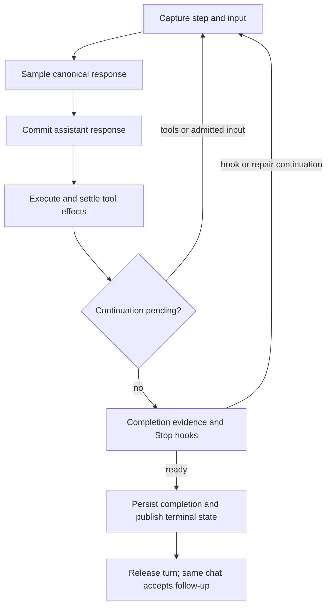

# Codex loop reliability and Alpha convergence review — 2026-10-01

Reference: current `openai/codex` main at
[`b707714ae4200db0a0385da24b3981d99139fa62`](https://github.com/openai/codex/tree/b707714ae4200db0a0385da24b3981d99139fa62),
retrieved on 2026-10-01. The commit timestamp is 2026-10-01T22:32:29Z. Alpha's reference host is **VS Code 1.125.0**.
This review inspects current source and tests; September investigations supply history, not the current contract.

Alpha retains its native TypeScript runtime, execution policy, approval boundaries, and built-in features. No Rust
implementation or wholesale upstream prompts are imported. Skills, HTML previews, Alpha Tickets, scheduled tasks,
and managed-agent verification continue through the existing shared harness. Codex's sandbox is outside this work.

## What the loop does

Upstream's [regular task](https://github.com/openai/codex/blob/b707714ae4200db0a0385da24b3981d99139fa62/codex-rs/core/src/tasks/regular.rs)
publishes a started turn before preparation, propagates cancellation during startup, and runs the
[turn loop](https://github.com/openai/codex/blob/b707714ae4200db0a0385da24b3981d99139fa62/codex-rs/core/src/session/turn.rs).
After sampling and tool effects finish, the loop examines model continuation and pending active-turn input, performs
compaction at the appropriate boundary, and runs Stop hooks before returning a final response. The
[task lifecycle owner](https://github.com/openai/codex/blob/b707714ae4200db0a0385da24b3981d99139fa62/codex-rs/core/src/tasks/mod.rs)
publishes a terminal event, releases the active turn by identity, flushes history, and admits later pending work.
Ordinary completion does not require a human acknowledgment of the assistant's final message.

Alpha's production adapter uses [AgentTurnEngine](../src/core/agent/AgentTurnEngine.ts) with explicit stages. The
[Task adapter](../src/core/task/Task.ts) captures one immutable step, samples an ordered canonical response, commits
the assistant transaction before effects, executes tools through [ToolScheduler](../src/core/agent/ToolScheduler.ts),
selects concrete continuation input, and releases the step. Task then applies its durable completion and Stop-hook
checks. Provider state, historical message formats, and UI presentation remain adapter responsibilities.



The main reliability gaps were at these integration boundaries. The existing staged sequencer did not need a second
loop or a replacement scheduler. Its focused sequencing, snapshot, retry, scheduling, compaction, and persistence
coverage passed **335 tests across 9 files** before integration validation.

## Ranked findings and changes

| Priority | Reproduced gap                                                                                                                                              | Owning fix                                                                                                                                                                                                         |
| -------- | ----------------------------------------------------------------------------------------------------------------------------------------------------------- | ------------------------------------------------------------------------------------------------------------------------------------------------------------------------------------------------------------------ |
| P1       | Both ordinary text and `attempt_completion` wait indefinitely for a primary `completion_result` reply after completion evidence is satisfied.               | Remove that acknowledgment from the primary completion path; retain result presentation, Stop hooks, pending-input checks, durable finalization, and managed-child review.                                         |
| P1       | Checkpoint saves can block a checkpoint-bearing tool indefinitely; cancellation does not settle save/init waiters or stop their underlying subprocess work. | Apply the existing checkpoint operation timeout and task cancellation to each operation; signal Git and nested-repository discovery, fence late publication, and retain serialization until physical work settles. |
| P1       | Closing a VS Code terminal leaves its output/end waiter unresolved. Errors after foreground command yield can also retain running evidence.                 | Settle the terminal process once with an unknown command outcome, dispose reader/listener/timer ownership, and observe errors across the yielded command lifetime. Preserve unresolved mutation debt.              |
| P2       | Completed-chat follow-up appears as queued while the preceding lifecycle and new transcript write drain.                                                    | Claim the selected input before the old lifecycle join without starting a new request early. Present the submitted input immediately as a user row and reconcile it by its durable submission ID.                  |
| P2       | A completed read's success or error is replaced by cancellation while a sibling read drains.                                                                | Mark the existing terminal result boundary and preserve that outcome through ordered batch finalization. Running handlers remain joined, and unfinished reads retain cancellation.                                 |
| P2       | Project MCP creation, watches, marketplace operations, and some other project config consumers still target `.roo`.                                         | Use the shared `.alpha` resolver and discovery precedence; exclusively copy a legacy MCP file when no canonical file exists and keep the legacy source.                                                            |

Each behavioral failure has a controlled fail-before regression. The completed-follow-up fix also checks that cancellation
during the previous lifecycle join cannot be cleared into a new turn. Failed preparation releases its input claim,
and saved old messages remain readable. Optional `AlphaMessage.queuedMessageIds` correlates presentation with the
existing durable input identities; it adds no new queue or lifecycle authority. Accepted receipts and delayed snapshots
cannot duplicate the user row, and rejected admission restores the owning draft.
If immediate delivery fails after durable admission, the host explicitly reports accepted input retained in the queue.
The UI releases the composer and exposes that recovery input without inventing a rejection or creating another message.
An Alpha feedback row alone does not hide an input that was released before provider-history persistence succeeded.
Retrying that exact unconsumed receipt updates its existing durable feedback row, including any edited text or images.
Already-consumed receipts cannot renew request progress or invalidate completion evidence. A late admission callback
after Stop resolves the durable receipt without publishing a new Active or Started transition or starting the provider.
Reload classifies completed work from persisted task status; an uncommitted final-answer row or completed model turn
does not override an interrupted task.

Detailed evidence and focused validation:

- [Completion and follow-up review](codex-completion-review-2026-10-01.md).
- [Command and checkpoint review](codex-command-checkpoint-review-2026-10-01.md).
- [Project configuration contract](alpha-project-config-2026-10-01.md).
- [Tool cancellation result review](codex-tool-cancellation-review-2026-10-01.md).

## Applicable contracts and deliberate differences

| Surface                                | Current comparison                                                                                                                                                                                                                                                                                                                                                                                               |
| -------------------------------------- | ---------------------------------------------------------------------------------------------------------------------------------------------------------------------------------------------------------------------------------------------------------------------------------------------------------------------------------------------------------------------------------------------------------------- |
| Turn sequencing and captured state     | Both retain the step that advertised each tool. Alpha sequences commit, effects, continuation, and cleanup through its existing staged engine and immutable `StepContext`.                                                                                                                                                                                                                                       |
| Tool scheduling                        | Upstream's [tool runtime](https://github.com/openai/codex/blob/b707714ae4200db0a0385da24b3981d99139fa62/codex-rs/core/src/tools/parallel.rs) distinguishes parallel-capable calls from exclusive effects. Alpha additionally captures policy and scopes, bounds batches, orders results, and serializes approvals and mutations. These stronger host protections remain.                                         |
| Completion                             | Final text can finish when no continuation remains. Alpha deliberately retains evidence/debt gates and parent-owned managed-child review; ordinary primary completion no longer requires an extra human acceptance.                                                                                                                                                                                              |
| Commands                               | [Unified exec](https://github.com/openai/codex/blob/b707714ae4200db0a0385da24b3981d99139fa62/codex-rs/core/src/unified_exec/process_manager.rs) separates foreground yield from process lifetime. Alpha's `exec_command`/`write_stdin` adapters retain numeric task-owned sessions and bounded waits through native terminal providers. Terminal closure must not invent an exit code or a passing verification. |
| Compaction, cancellation, and recovery | Safe-boundary compaction, canonical tool transactions, provider state, explicit terminal outcomes, and next-turn recovery are existing shared contracts. Tests cover them; the new work closes cancellation holes at checkpoint and retained-follow-up boundaries.                                                                                                                                               |
| Project configuration                  | `.alpha` is Alpha's project namespace. Legacy reads and persisted `.alphamodes` remain compatible; global configuration paths are separate contracts.                                                                                                                                                                                                                                                            |
| Queued input and steering              | Upstream's passive TUI queue waits for idle; active-turn steering is separate. Alpha retains that distinction. Its explicit steering action interrupts the current step, while CLI steering appends input without interruption. This existing UX difference remains intentional in this bounded reliability repair.                                                                                              |
| Extension features and sandbox         | Alpha-specific capabilities remain integrated. Their host policy and implementation are deliberate differences, not requests to reproduce Codex sandbox internals.                                                                                                                                                                                                                                               |

One confirmed remaining adapter gap is upstream `exec_command`'s optional `shell`, `login`, and `tty` controls in its
[tool schema](https://github.com/openai/codex/blob/b707714ae4200db0a0385da24b3981d99139fa62/codex-rs/core/src/tools/handlers/shell_spec.rs).
Alpha's exposed schema does not currently offer them. Implementing these requires native backend capability and
approval-policy design; silently advertising unsupported parameters would break the schema/execution invariant.
This review does not claim exhaustive CLI feature parity or a measured general speed improvement.

## Test host and validation

The retained test profile at `F:\alpha-e2e\profiles\1.125.0` completed Copilot setup successfully. The observed host
was 1.125.0, discovery found 24 models, and setup run `profile-1250-ready-20261001` exited successfully with complete
capture. That successful setup artifact later expired under the runner's 20-run retention policy; the signed-in profile
remains retained. Discovery is setup evidence, not a live-model workflow evaluation.

The existing host runner accepts `ALPHA_E2E_PROFILE_ROOT`, `ALPHA_E2E_WORKSPACE_ROOT`, and
`ALPHA_E2E_ARTIFACTS_ROOT` defaults so normal automated scripts can reuse that profile. CLI paths override them;
ownership validation and profile leases still apply. The defaults neither initialize nor replace user data. See
[the profile instructions](vscode-live-test-profiles.md) for exact commands.

The combined source passed `pnpm lint` and `pnpm check-types`. Additional regression results are listed separately;
the suites overlap and their counts must not be added into a unique-test total.

| Validation surface                                                  | Result                                                |
| ------------------------------------------------------------------- | ----------------------------------------------------- |
| Completion, retained follow-up, hooks, and durable task state       | 363 tests passed in four files                        |
| Command/terminal/checkpoint cancellation and timeout                | 296 tests passed; 12 existing skips across 23 files   |
| Actual Git checkpoint service and search                            | 69 tests passed in five files                         |
| Project config, modes, marketplace, commands, and tool discovery    | 360 tests passed; one existing skip in 17 files       |
| Tool scheduler and deferred read results                            | 169 tests passed in five files                        |
| Provider transforms, transport, persistence, and compaction         | 239 tests passed in six files                         |
| Queue, ask drain, and API queued-message deletion                   | 64 tests passed in three files                        |
| Final host resume receipt handling                                  | 92 tests passed                                       |
| Shared public types                                                 | 369 tests passed; package type check and build passed |
| ChatView, composer, queued controls, and extension-state projection | 231 tests passed; webview type check passed           |
| E2E runner unit tests                                               | 470 tests passed; two existing Windows skips          |

`pnpm --filter @alpha-code/vscode-e2e test:smoke:1250` passed all **12 host scenarios** on the retained 1.125.0 profile.
They cover activation, modes, approvals, command scope/diffs, tool discovery, Tickets, async questions, plans, images,
compaction, and VS Code LM fixture ordering, errors, late cancellation, and same-task follow-up.
The three scripted `core-loop.test` cases each used one model request, zero tools, and one durable completion.

The scripted `completion-idle.test` implementation workflow also passed. Its 35,028 ms quiet window retained 20 model
requests, no acknowledgement wait, and a completed task. A follow-up in the same task reached 23 requests and six
completed turns; all 17 tool calls had matching results and the recorded error list was empty. Evidence is retained at
`F:\alpha-e2e\artifacts\ffa7ed7e-c039-40c2-9c77-1fb1dfdd0029`. The original attempt correctly refused to seed its repository
fixture over the shared smoke workspace. The passing run used a fresh owned fixture workspace with the same profile.

Managed-agent deterministic certification passed **2,672 tests and 26 contract rows**, with stable source fingerprints.
Its eight declared live-provider, restart, multi-window, and renderer integration rows remain pending; a deterministic
pass does not establish those conditions. The subsequent host scenario exposed an obsolete fixture wait for the removed
primary completion prompt after the runtime had already completed correctly. The fixture now checks automatic,
exactly-once completion while retaining its child review, Apply/Discard, verification, projection, and cancellation checks.
The equivalent hard wait in the basic task fixture is updated to the same contract. Its scripted host run passed
(`0d81f968-38d4-47cc-82b8-a7f3a483f2b0`), and E2E type checks, lint, and the full 470-test runner suite passed again.

The final-source strict certification again passed all **2,672 tests and 26 rows**, with matching start/end source hashes.
The aggregate command's host phase then stopped at fixture setup: its shared workspace was clean at an existing
`managed-agent acceptance baseline` commit, so seeding the same files produced no new commit. The same freshly compiled
host scenario was rerun in a fresh owned workspace with the retained profile and **passed in 15.249 seconds**:

```powershell
node apps/vscode-e2e/out/runTest.js --vscode-version 1.125.0 --provider scripted --file managed-agents.acceptance.test --workspace F:\alpha-e2e\managed-agents-workspace-20261001 --init-profile
```

Run `14cabfad-607c-458f-81c5-7aa8c6327236` records actual host 1.125.0, a passing executed-test receipt, observed host exit,
verified ownership, and complete captured evidence. The source did not change between the final deterministic run and
this successful host rerun. Earlier failures remain captured separately; the original aggregate invocation is not
reported as a passing command. These documentation result notes were appended after validation.

`pnpm vsix` passed and produced `bin/alpha-3.1.3.vsix` (77.82 MB). The production bundle built successfully, and
`node scripts/verify-vsix-contents.mjs F:\roo-fork\Alpha-Code\bin\alpha-3.1.3.vsix` passed: all 1,675 package entries were
checked, required files are present, and no `.env` file is packaged. The extension release version was not changed.
