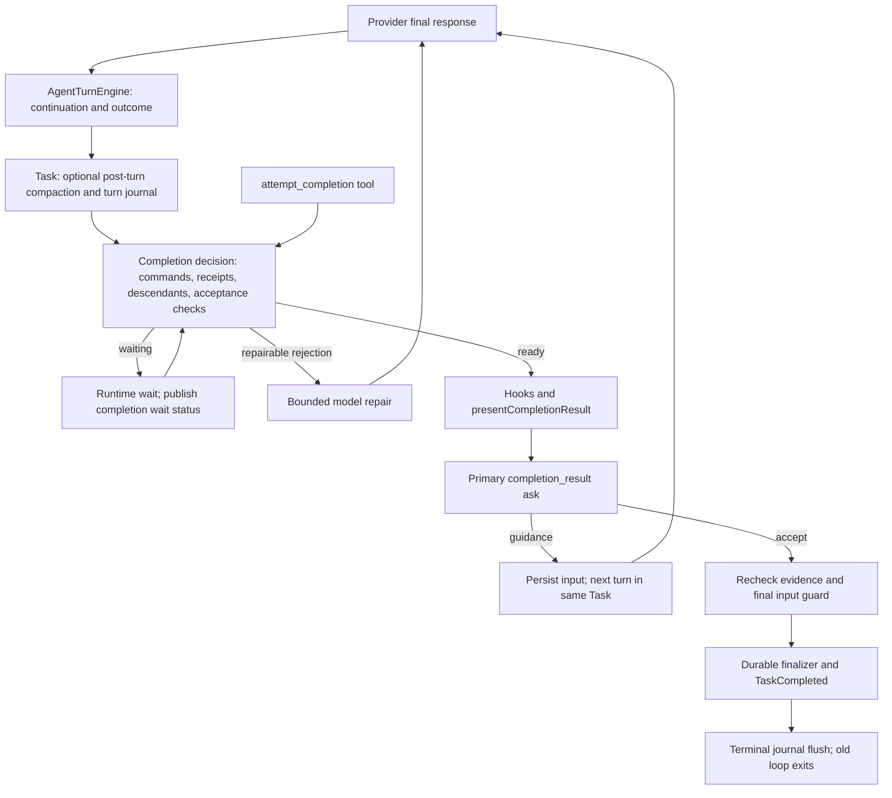

# Completion and follow-up alignment investigation

Reviewed September 30, 2026. This investigation confirms nine defect families at the current shared runtime/UI boundaries,
including an indefinite development-server completion wait and stale lifecycle projection after a long turn. It also
identifies three static recovery/routing risks and two behavior choices requiring an explicit alignment decision.

This is a diagnosis, with executable reproductions and a bounded implementation plan. No production behavior was changed
during this investigation. Subsequent authorized repairs are tracked in the
[implementation record](F:/roo-fork/Alpha-Code/docs/codex-cli-convergence-implementation-2026-09-30.md).

## Scope, provenance, and preservation

- Active checkout: `F:\roo-fork\Alpha-Code`, branch `main`, HEAD
  `40803ed6d5f487950b35824fea30e6e2d1a325ee`. The earlier communication fixes are substantial **uncommitted local work**.
- Read the applicable root `AGENTS.md`, checked status, and recorded SHA-256/deletion state for all 75 existing
  modified/untracked paths before this investigation. Those files are preserved; this investigation adds separate files.
- The preserved AlphaNet prototype checkout was outside the investigation. No branch switch, reset, stash, commit,
  installation, deployment, build, release gate, or VS Code automation was performed in this investigation.
- Inspected current Codex CLI source and tests at
  [`60947e234156ac12bdb7fba2477d3965f166bd34`](https://github.com/openai/codex/tree/60947e234156ac12bdb7fba2477d3965f166bd34),
  commit time **2026-09-30 19:22:34 UTC**, retrieved **2026-09-30 21:30:14 UTC**. The temporary source cache contains 56
  relevant core, process, TUI, app-server, and test files. No Rust or upstream prompts were copied into Alpha.
- Three scoped subagents investigated Task completion/resume, command/website lifecycle, and UI routing/projection.
  Their claims were integrated with source inspection and isolated reproductions.
- No affected live user-task trace or provider/model details were available. Reproductions establish actual failure
  paths, but do not identify the precise cause of an unseen installed task.

**Origin matters:** CF03–CF05 expose interactions introduced by the current local communication fixes. They must be
repaired before shipping that work; they are not evidence that the user's previously installed extension had those exact
regressions. The website wait, primary background timeout, lifecycle promise, late completion error, and projection defects
are present in the `main` baseline. Earlier design documents were checked against code, rather than treated as proof.

## Verified upstream contract

| Behavior                                                                                                        | Current primary evidence                                                                                                                                                                                                                                                                                                                                                                                                                                                           | Implication for Alpha                                                                                                                                                   |
| --------------------------------------------------------------------------------------------------------------- | ---------------------------------------------------------------------------------------------------------------------------------------------------------------------------------------------------------------------------------------------------------------------------------------------------------------------------------------------------------------------------------------------------------------------------------------------------------------------------------- | ----------------------------------------------------------------------------------------------------------------------------------------------------------------------- |
| Tools or pending input require continuation; stopping hooks run after ordinary continuation is clear.           | [Core turn loop](https://github.com/openai/codex/blob/60947e234156ac12bdb7fba2477d3965f166bd34/codex-rs/core/src/session/turn.rs#L540), [regular task](https://github.com/openai/codex/blob/60947e234156ac12bdb7fba2477d3965f166bd34/codex-rs/core/src/tasks/regular.rs#L120)                                                                                                                                                                                                      | Accepted input needs an actual consuming turn or recoverable pending owner.                                                                                             |
| A long-running command can remain alive after turn completion.                                                  | [Explicit long-running-session test](https://github.com/openai/codex/blob/60947e234156ac12bdb7fba2477d3965f166bd34/codex-rs/core/tests/suite/unified_exec.rs#L2847); [completion records background count without waiting for zero](https://github.com/openai/codex/blob/60947e234156ac12bdb7fba2477d3965f166bd34/codex-rs/core/src/tasks/mod.rs#L785)                                                                                                                             | Service lifetime and model-turn completion are separate. A finite required check still needs its real outcome.                                                          |
| Turn interruption does not automatically kill every managed background process.                                 | [Background-process interrupt/cleanup test](https://github.com/openai/codex/blob/60947e234156ac12bdb7fba2477d3965f166bd34/codex-rs/core/tests/suite/unified_exec.rs#L2948)                                                                                                                                                                                                                                                                                                         | Make process ownership and explicit stop behavior clear; preserve Alpha's stronger existing cancellation/security rules deliberately.                                   |
| Start-only and steer-only admission have distinct ownership checks. Steering requires the expected active turn. | [Admission implementation](https://github.com/openai/codex/blob/60947e234156ac12bdb7fba2477d3965f166bd34/codex-rs/core/src/session/turn_input.rs#L329), [no-active-turn and expected-turn tests](https://github.com/openai/codex/blob/60947e234156ac12bdb7fba2477d3965f166bd34/codex-rs/core/src/session/turn_input_tests.rs#L838)                                                                                                                                                 | Use Task-owned identity at admission, independently of delayed UI attention status.                                                                                     |
| Task errors and terminal events have a uniform owner.                                                           | [Task finish](https://github.com/openai/codex/blob/60947e234156ac12bdb7fba2477d3965f166bd34/codex-rs/core/src/tasks/mod.rs#L619), [terminal event and active-turn release](https://github.com/openai/codex/blob/60947e234156ac12bdb7fba2477d3965f166bd34/codex-rs/core/src/tasks/mod.rs#L834)                                                                                                                                                                                      | Post-stream failures must remain visible and recoverable; an old rejected promise must not permanently reject future input.                                             |
| The TUI clears running state, drains the next queued input, and correlates completion to turn identity.         | [Turn lifecycle](https://github.com/openai/codex/blob/60947e234156ac12bdb7fba2477d3965f166bd34/codex-rs/tui/src/chatwidget/turn_lifecycle.rs#L38), [completion/queue handling](https://github.com/openai/codex/blob/60947e234156ac12bdb7fba2477d3965f166bd34/codex-rs/tui/src/chatwidget/turn_runtime.rs#L117), [draft recovery tests](https://github.com/openai/codex/blob/60947e234156ac12bdb7fba2477d3965f166bd34/codex-rs/tui/src/chatwidget/tests/question_turn_end_tests.rs) | A finished turn should make the same chat ready for another prompt. Counter ordering is valid within a turn, not across unrelated turn IDs.                             |
| Optional post-turn compaction occurs before the turn returns.                                                   | [Post-turn compaction](https://github.com/openai/codex/blob/60947e234156ac12bdb7fba2477d3965f166bd34/codex-rs/core/src/session/turn.rs#L715), [steering admission](https://github.com/openai/codex/blob/60947e234156ac12bdb7fba2477d3965f166bd34/codex-rs/core/src/session/turn_input.rs#L665)                                                                                                                                                                                     | Current source does not establish that CLI steering immediately cancels post-turn summarization. Alpha responsiveness improvements here are a deliberate design choice. |

Official product documentation independently defines queued input as the next turn and steering as input to active work.
The [app-server contract](https://learn.chatgpt.com/docs/app-server) supplies thread/turn IDs, separate start and steer
requests, and terminal outcomes of completed, interrupted, or failed. The [prompting guide](https://learn.chatgpt.com/docs/prompting)
describes visible, editable queued input. The [official remote workflow](https://developers.openai.com/blog/mastering-codex-remote-for-engineering)
describes reviewing a completed change and sending a follow-up in the same chat. [Notification documentation](https://learn.chatgpt.com/docs/notifications)
distinguishes completion alerts from permission/question alerts and identifies running, unread, and waiting chats.
These establish public behavior; no claim is made about private desktop implementation or unverified internal races.

## Current flow maps

### Final assistant text and explicit completion



The explicit tool performs its own preflight/hook/review calls, then uses the same durable decision and finalizer.
Managed children have parent-owned review and do not open the primary local completion review. The ordinary-text path is
[Task.initiateTaskLoop](../src/core/task/Task.ts#L10314); the explicit path is
[AttemptCompletionTool](../src/core/tools/AttemptCompletionTool.ts#L36); the shared invariant is
[finalizeTaskCompletion](../src/core/task/Task.ts#L6252). Completion repair is bounded separately in
[CompletionRecovery](../src/core/agent/CompletionRecovery.ts#L94).

Failures are concentrated after the model has stopped: CF01 retains the candidate at the command wait; CF06 escapes
recovery during journal/presentation/finalization; CF04 leaves a claim that the final input guard cannot consume.

### Follow-up admission, running or completed

```mermaid
sequenceDiagram
  participant UI as ChatView / task composer
  participant Host as Webview handler
  participant Task as Canonical Task owner
  participant Queue as Durable message queue
  participant Kernel as Turn engine / provider
  UI->>Host: Reply, queue, steer, or resume; task/request/ask identity
  Host->>Task: Resolve recipient and admit input
  alt Current ask
    Task->>Task: Claim exact active ask reply slot
    Task->>Kernel: Persist containing input and continue
  else Running task
    Task->>Queue: Persist admission; select at a safe boundary
    Task->>Kernel: Steer or later consume queued input
  else Completed task
    Task->>Task: Join preceding lifecycle; prepare retained Task
    Task->>Kernel: Persist follow-up; begin new turn with same task ID
  end
  Task-->>Host: Admission receipt or actionable rejection
  Host-->>UI: Scoped acknowledgment, state, transcript and lifecycle
  Kernel-->>UI: New turn activity and final outcome
```

The completed path is [resumeCompletedTaskFollowup](../src/core/task/Task.ts#L9023), reached through the scoped
[webview handler](../src/core/webview/webviewMessageHandler.ts), or the public API's durable Task admission.
The runtime queue owns accepted text; [useTaskComposer](../webview-ui/src/components/chat/hooks/useTaskComposer.ts)
owns unsent drafts and pending UI submissions. Ordinary ask replies still clear the UI draft without a corresponding
durable acknowledgment, which magnifies CF03. Claimed queue IDs must be attached to the exact input/tool result that will
persist them; acceptance is not evidence of consumption.

### Website launch, backgrounding, timeout, and recovery

1. `exec_command` is normalized by [ToolRegistry](../src/core/tools/ToolRegistry.ts#L245). The existing command adapter
   captures workspace scope and reserves a primary physical mutation token before launching.
2. [ExecuteCommandTool](../src/core/tools/ExecuteCommandTool.ts#L1003) owns the physical execution. The agent yield timer
   returns a running session, while physical exit owns its final workspace/content receipt.
3. A successful [VS Code browser call](../src/core/tools/VSCodeBrowserTool.ts#L39) reports browser success. It does not
   change process lifetime or discharge a finite command's verification obligation.
4. Task records running evidence and waits at completion. A healthy dev server never exits, so both the runtime wait and
   the durable physical reservation can remain open. CF01 requires fixing both fences.
5. A hard timeout after the foreground tool result fences the normal exit callback. Its receipt finalizer is stranded in
   a foreground catch that has already returned: CF02.
6. Stop/cancel should retain ownership until cleanup and the final receipt settle. Crash/reload must conservatively
   recover unknown effects without inventing a successful exit: CF10–CF11.

## Prioritized findings

| ID   | Priority     | Finding                                                                                                        | Evidence level / origin                                             |
| ---- | ------------ | -------------------------------------------------------------------------------------------------------------- | ------------------------------------------------------------------- |
| CF01 | P1           | An intentionally live development server retains the final candidate indefinitely.                             | Reproduced; baseline.                                               |
| CF02 | P1           | A primary hard timeout after background return strands its mutation reservation.                               | Reproduced; baseline.                                               |
| CF03 | P1           | A fast reply is silently rejected by delayed ask status, after the UI clears its draft.                        | Four variants reproduced; current local regression.                 |
| CF04 | P1           | An occupied completion reply slot can leave queued guidance invisibly claimed.                                 | Two variants reproduced; local CAS/queue interaction.               |
| CF05 | P1           | Completion can win before durable input admission is visible, leaving accepted input without a consuming turn. | Reproduced; local durable-admission interaction.                    |
| CF06 | P1           | Exceptions after streaming bypass visible recovery.                                                            | Three fault boundaries reproduced; baseline.                        |
| CF07 | P2           | A failed completed-task follow-up poisons every later retry on the retained Task.                              | Reproduced; baseline.                                               |
| CF08 | P1           | Sequence numbers from different turns preserve or resurrect an old lifecycle view.                             | Both delivery directions reproduced; baseline.                      |
| CF09 | P1/P2        | Degraded projection resurrects an answered historical ask during a new turn.                                   | Four ask kinds reproduced; baseline.                                |
| CF10 | P2           | Crash recovery retains physical reservations without an active publisher/recovery owner.                       | Static trace; end-to-end reload reproduction still required.        |
| CF11 | P1 candidate | Failed process stopping still releases terminal associations during disposal.                                  | Static trace; cleanup-failure reproduction still required.          |
| CF12 | P2           | Enabled post-turn compaction delays accepted steering until the summary completes.                             | Observed in a controlled probe; not established as CLI divergence.  |
| CF13 | P2           | Mandatory primary completion review keeps the model turn in finalizing until human acceptance.                 | Verified intentional Alpha divergence, not a demonstrated deadlock. |
| CF14 | P2 candidate | Sending while an existing chat's transcript hydrates can select new-task routing.                              | Static trace; rendered interaction reproduction still required.     |

### CF01 — service lifetime is treated as a finite completion obligation

[shouldWaitForCommandCompletion](../src/core/task/Task.ts#L6596) waits for every running command on implementation turns.
Its exemption is restricted to background lookup inspection. [waitForCompletionGateDecision](../src/core/task/Task.ts#L6623)
sets an overall 30-second limit for orphan `receipt_pending`, but repeatedly resets per-read deadlines for healthy
`command_running` and `descendants_running`. Those waits have no overall bound. The model has already stopped and cannot
issue a `manage_command` repair while that candidate waits.

The service probe advances controlled time by 60 seconds with a yielded `pnpm dev` execution and a successful browser
result; the decision remains unsettled. Its finite verification control deliberately waits, then completes after the exact
exit. The existing [long finite-check test](../src/core/task/__tests__/stageThreeCompletion.integration.spec.ts#L835)
also establishes that a 60-second command is not itself a defect.

Simply ignoring all background commands is incorrect. [Primary reservation](../src/core/tools/ExecuteCommandTool.ts#L1003)
and [physical-exit receipt](../src/core/tools/ExecuteCommandTool.ts#L127) form a second durable fence. A service needs an
explicit validated readiness/lifetime contract, continued mutation observation, and clear stop ownership. Preview success
must not masquerade as deployment completion or a passed test.

### CF02 — timeout finalization loses its owner after yield

The [hard timeout callback](../src/core/tools/ExecuteCommandTool.ts#L1113) sets the terminal fence and aborts the process.
The [ordinary exit callback](../src/core/tools/ExecuteCommandTool.ts#L921) then skips receipt publication. The timeout-specific
receipt settlement lives in [the foreground catch](../src/core/tools/ExecuteCommandTool.ts#L1153), which no longer executes
after the agent yield has won `Promise.race`.

The probe uses the real agent ledger and real workspace observations: the command yields at one second, stops at two,
reports exit/completion, and retains its physical reservation. The before-yield timeout control settles the same no-op
receipt. The existing Worker timeout test has no primary reservation, so process termination coverage missed this failure.
Move settlement into one idempotent, owned asynchronous finalizer shared by foreground and background outcomes.

### CF03–CF05 — admission and consumption disagree about ownership

- **CF03:** [handler precheck](../src/core/webview/webviewMessageHandler.ts#L790) validates a displayed ask timestamp
  against `task.taskAsk`. [Task.ask](../src/core/task/Task.ts#L5659) installs `activeAsk` immediately, but its attention fields
  are delayed by two seconds; [taskAsk](../src/core/task/Task.ts#L15087) reads only those delayed fields. The real handler plus
  real ask reproduces lost immediate replies for `followup`, `completion_result`, `resume_task`, and `resume_completed_task`.
  [ChatView](../webview-ui/src/components/chat/ChatView.tsx#L1394) has already cleared the draft. Validate against the actual
  Task-owned ask boundary and return a scoped acceptance/rejection before discarding recoverable input.
- **CF04:** [ask queue drain](../src/core/task/Task.ts#L5755) claims an item before checking the occupied response slot,
  ignores CAS rejection at the next call, and returns the first response. The hidden claim blocks
  [finalization](../src/core/task/Task.ts#L6370) while pending dequeue cannot retrieve it. Both human acceptance and off-screen
  auto-accept reproduce the failure. The ask owner must release every rejected selection or attach its receipt to the
  response that actually carries its text; a claimed entry cannot have neither owner.
- **CF05:** [submitUserMessage](../src/core/task/Task.ts#L7804) checks completion, then awaits
  [durable admission](../src/core/message-queue/MessageQueueService.ts#L180) before the input is staged. Completion can win in
  that interval. Admission returns successfully into a completed queue, with no resume call. Queue change events project
  state; [processQueuedMessages](../src/core/task/Task.ts#L15144) intentionally does not start work. Serialize the admission
  decision with terminal ownership, or recheck after durability and transfer the same accepted receipt into follow-up.
  Do not append a second copy while abandoning the queue record.

### CF06–CF07 — the lifecycle promise is not a complete error boundary

Fault injection at [finishCanonicalLifecycleTurn](../src/core/task/Task.ts#L10147),
[presentCompletionResult](../src/core/task/Task.ts#L10408), and [finalizeTaskCompletion](../src/core/task/Task.ts#L10495)
returns the exact injected exception from the real Task/turn-engine flow with no `resume_task` recovery. Those awaits sit
outside the engine's normal error handling. [ownBackgroundLifecycle](../src/core/task/Task.ts#L1910) only logs a rejected
start/resume operation. A silent stopped loop can therefore retain a final-looking transcript or stale running projection.

A failed follow-up restores Completed flags, but leaves its rejected `ownedLifecyclePromise` retained.
[The next follow-up](../src/core/task/Task.ts#L9056) joins that rejection and never reaches the repaired persistence adapter.
The retry probe proves that the second submission fails with the first error. Retire a settled failed owner safely while
retaining real outstanding write barriers. Handle pre-commit failure through visible existing recovery; handle a
post-commit notification/journal failure idempotently without reversing completed effects or publishing completion twice.

The earlier [September completion investigation](turn-completion-investigation.md) remains accurate for these late
exception paths. The current receipt timeout improves one wait category, but does not resolve CF01.

### CF08–CF09 — the view can remain on an earlier turn

[shouldReplaceSnapshot](../webview-ui/src/context/agentLifecycleState.ts#L292) compares `lastSequence` even when run/turn IDs
differ. An old in-progress turn at sequence 100 defeats a new turn at sequence 1. A delayed old snapshot at sequence 100 can
also replace the new turn. [mergeExtensionState](../webview-ui/src/context/ExtensionStateContext.tsx#L225) merges lifecycle
snapshots before applying its stale task-state guard, so an otherwise stale packet can still roll back lifecycle identity.
Both cases reproduce through the actual state merge, rather than a copied comparator.

[Legacy fallback](../webview-ui/src/context/agentLifecycleState.ts#L441) finds the last ask anywhere in history without
checking `isAnswered` or a later input/request boundary. After new `user_feedback` and `api_req_started`, an answered old
`resume_completed_task` projects Completed; answered completion/follow-up/tool asks project Waiting. All four variants fail
the probe, while a current unanswered ask remains Waiting. The degraded path is consumed by
[ChatView](../webview-ui/src/components/chat/ChatView.tsx#L362).

Use authoritative host generation/order to accept a new turn and reject older turns. Compare sequence counters only within
the same identity. A fallback must identify an unanswered current boundary and respect later activity. Do not create a
second lifecycle engine inside React or infer authority from historical prose.

### CF10–CF11 — crash and failed cleanup need a recovery owner

Command evidence is an [in-memory Task map](../src/core/task/Task.ts#L862), and
[CommandSessionRegistry](../src/core/tools/CommandSessionRegistry.ts#L13) is keyed by Task instance.
[ManageCommandTool](../src/core/tools/ManageCommandTool.ts#L83) rejects unavailable instance-owned sessions.
[AgentControlStore recovery](../src/core/agent/AgentControlStore.ts#L3148) repairs agent/mailbox ownership but retains
mutation reservations. [Receipt reconciliation](../src/core/webview/AlphaProvider.ts#L7888) skips reserved obligations.
A new physical execution settles its own token, not the orphan. The static trace predicts repeated orphan-receipt pauses
after reload; a saved-ledger restart reproduction is still needed.

[Process stopping](../src/core/task/Task.ts#L7049) has a ten-second cleanup bound. After its failure,
[abort](../src/core/task/Task.ts#L9634) still disposes; [dispose](../src/core/task/Task.ts#L9723) releases terminal task
associations even if physical stop failed. [Provider retention](../src/core/webview/AlphaProvider.ts#L6221) retains the Task,
but may no longer retain a discoverable physical cleanup owner. This is a static P1 candidate, not a reproduced leak.

Extend the existing ledger/session recovery with backward-compatible publisher ownership and a conservative reconciliation
transaction. Unknown effects need scoped inspection and unresolved debt, not deletion of old reservations or a fabricated
success. Retain failed cleanup handles until a confirmed stop or explicit recoverable disposition.

### CF12–CF14 — responsiveness and completion semantics

Optional [post-turn compaction](../src/core/task/Task.ts#L8291) uses the task lifetime signal. Accepted
[steering](../src/core/task/Task.ts#L8158) aborts step/request/wait controllers, which do not interrupt that summary. The
observation probe confirms this and confirms that task cancellation does propagate. Already pending input skips compaction.
The feature is disabled by default (`postTurnCondenseContextPercent: 0`); API timeout defaults to 600 seconds and can be
disabled. Improve the explicit compaction status and follow-up ownership, and consider safe preemption or a bounded optional
summary budget. CLI also compacts before returning, so immediate summary preemption is a recommendation, not verified parity.

Alpha's [primary completion review](../src/core/task/Task.ts#L10409) blocks on human acceptance even after a normal verified
answer. The [existing 35-second host test](../apps/vscode-e2e/src/suite/completion-idle.test.ts#L65) intentionally expects
`finalizing` while waiting for input. This proves the current review contract, not a deadlock. Align ordinary model-turn
completion with a ready chat after required checks settle, leaving review as an optional action. Retain explicit approvals,
Worker Apply, unresolved effects, and verification debt as real blockers. Saved historical review asks remain readable.

During hydration, [lightweight navigation](../src/core/webview/AlphaProvider.ts#L3477) sends the selected task ID with an
empty transcript. [ChatView Send](../webview-ui/src/components/chat/ChatView.tsx#L1373) can choose new-task routing solely
from empty messages when idle. Route by selected Task identity and show loading; this path still needs a rendered repro.
An earlier theory that metadata ticks alone starved transcript publication was examined and withdrawn: both publication
guards execute synchronously before the relevant await. It is not counted as a finding.

## UX contract to implement

1. Show explicit **Working**, **Waiting for input**, **Waiting for check**, **Preparing history**, **Ready**, **Interrupted**,
   and **Failed** states from canonical runtime projection. Name the blocking execution/check, show elapsed settlement time,
   and provide the appropriate existing stop/recover action. Do not present a completed model stream as unexplained work.
2. A verified ordinary answer makes the same chat ready for another prompt. Review and open-preview actions remain available
   on the result. A running service has its own visible session/stop affordance; its lifetime does not keep the answer busy.
3. Keep typed text recoverable until a recipient-scoped admission receipt. Clearly distinguish accepted pending input from
   input consumed by a new request. Restore a rejected draft, preserve newer edits, and correlate by task/request/turn/ask ID.
4. Queued follow-ups remain visible and editable until their actual containing transcript is durable. Steering and queueing
   must remain distinct operations at safe runtime boundaries.
5. Reopening, foreground/background switching, and reload preserve the selected chat identity and current turn. Historical
   prompts cannot relabel a newer request. Completion alerts identify the right chat; permission/question alerts remain
   separate. Suppress duplicate completion alerts during replay and recovery.
6. Preserve keyboard focus, narrow-sidebar layout, theme tokens and accessible state labels. A loading transcript retains
   the draft and recipient instead of silently starting a different chat.

## Bounded implementation plan

| Batch                                            | Owning existing abstractions                                                            | Completion criteria                                                                                                                                                                                                                                               |
| ------------------------------------------------ | --------------------------------------------------------------------------------------- | ----------------------------------------------------------------------------------------------------------------------------------------------------------------------------------------------------------------------------------------------------------------- |
| 1. Reliable admission and receipts               | Task active-ask CAS, MessageQueueService claims, webview handler, useTaskComposer       | CF03–CF05 green; accepted input has exactly one recoverable owner, rejected selection releases its claim, fast replies do not disappear. Add compatible typed acknowledgment for ordinary ask replies.                                                            |
| 2. Lifecycle failure and retained follow-up      | Task-owned lifecycle promise, canonical finalizer, existing recovery boundary           | CF06–CF07 green; pre-commit errors display actionable recovery; post-commit failures are idempotent; failed admission can retry without overlapping an old write.                                                                                                 |
| 3. Current-turn UI projection                    | ExtensionStateContext and existing lifecycle adapter/shared wire types                  | CF08–CF09 green; a newer host turn replaces the old turn, stale packets cannot restore it, and historical answered asks are ignored. Reproduce/fix CF14 in the same routing layer.                                                                                |
| 4. Physical command settlement                   | ExecuteCommandTool, command evidence/session registry, AgentControlStore receipt ledger | CF02 green first. Add validated service lifetime/readiness and continued observation to address both CF01 fences. Finite verification remains strict. Add crash/failed-stop reproductions before CF10–CF11 changes.                                               |
| 5. Turn completion UX and optional summarization | AgentTurnEngine host integration, Task projection, existing completion components       | Replace mandatory ordinary-answer acceptance with Ready after gates settle; update the old completion-idle expectation deliberately. Preserve real approval/Apply/debt gates. Give optional compaction visible bounded ownership; document any preemption choice. |

Keep each batch independently reviewable. Convert the corresponding investigation cases into normal regression specs when
their implementation is ready. Extend Alpha's shared kernel and adapters; do not add a parallel runtime, message path,
registry, lifecycle engine, or authority store. No verification or mutation reservation may be weakened just to end a wait.

## Reproductions and validation

Diagnostic files use `.investigation.ts`, outside ordinary `.spec`/`.test` discovery. The two explicit configs reuse the
existing package setups and aliases. Failures assert the desired contract and are intentionally retained as evidence of
unfixed production behavior; their nonzero exit is not a successful acceptance gate.

```sh
pnpm --dir src test --config completion-followup.investigation.config.ts
pnpm --dir webview-ui test --config completion-followup.investigation.config.ts
```

The commands were run through the pinned pnpm **11.24.0** CLI with `verifyDepsBeforeRun=false`; no dependency install or
lockfile update was needed.

| Probe                                                                                                                          | Observed result                                                                                                     |
| ------------------------------------------------------------------------------------------------------------------------------ | ------------------------------------------------------------------------------------------------------------------- |
| [Task admission/ask/finalization/retry](../src/core/task/__tests__/Task.completion-followup-races.investigation.ts)            | 7 intended failures, 2 passing controls.                                                                            |
| [Fast real-handler/real-ask replies](../src/core/webview/__tests__/fast-ask-response.investigation.ts)                         | 4 intended failures.                                                                                                |
| [Ready service versus finite verification](../src/core/task/__tests__/Task.website-service-completion.investigation.ts)        | 1 intended failure, 2 passing controls.                                                                             |
| [Primary timeout after yield](../src/core/tools/__tests__/ExecuteCommand.background-timeout.investigation.ts)                  | 1 intended failure, 1 passing control.                                                                              |
| [Post-turn compaction signal observation](../src/core/task/__tests__/Task.post-turn-followup.investigation.ts)                 | 3 passes: accepted steer does not interrupt a started summary; task cancel propagates; pending input skips summary. |
| [Cross-turn and historical-ask projection](../webview-ui/src/context/__tests__/followup-lifecycle-projection.investigation.ts) | 6 intended failures, 1 passing control.                                                                             |

Combined result: **28 cases, 19 reproduced contract failures and 9 passing observations/controls**. These are lower-level,
controlled tests, with no live model, arbitrary race sleeps, website deployment, or real VS Code UI run. They do not prove
every frontend timing, external provider, notification, or multi-process recovery scenario.

Additional checks run during this investigation:

| Check                                                                                   | Result                                                                                                             |
| --------------------------------------------------------------------------------------- | ------------------------------------------------------------------------------------------------------------------ |
| `pnpm --dir src check-types`                                                            | Passed.                                                                                                            |
| `pnpm --dir webview-ui check-types`                                                     | Passed after correcting the new probe's incomplete typed fixture.                                                  |
| Existing `AgentTurnEngine`, `Task.compaction-safety`, and `completionDiagnostics` specs | 112 passed, 2 failed across 114 cases. Both failures are the compaction array-identity assertions described below. |
| Existing `ExtensionStateContext.spec.tsx`                                               | 43 passed.                                                                                                         |
| Local review links                                                                      | 58 targets and referenced line numbers checked; all valid.                                                         |
| Preservation snapshot                                                                   | All 75 pre-existing modified/untracked paths retain their original hashes/deletion state.                          |

The two existing failures are at `Task.compaction-safety.spec.ts:1118` and `1170`. They require
`task.apiConversationHistory` to be the exact `result.messages` array. The earlier local provenance change creates a
copy with `input_origin: "agent"` on the synthetic summary, so both reference-identity expectations fail. This is existing
test debt exposed by widening the investigation, not a new production edit or proof of a compaction hang. Update these
cases with the owning provenance contract: verify saved content, agent origin, rewind linkage, cancellation/deadline
ordering, exactly one commit, and no extra request. Do not simply remove the content or lifecycle assertions. The original
test files were preserved, and the normal core check is truthfully reported as failing.

The earlier broad communication certification remains a record of that earlier implementation, not evidence that these
new failure paths are covered. The normal short completion-idle scenario misses persistent service lifetime, failed receipt
publication, rapid asks, missed terminal packets, and already-started optional compaction.

### Later acceptance scenarios

- Exact **VS Code 1.122.1**: long implementation → finite checks → launch local dev server → verify preview readiness → Ready
  with service still owned → follow-up reaches the same task and a new turn → stop service. Separate deployment with a
  finite remote postcondition; an opened browser alone must not count as a successful deployment.
- Inject input before staging, during final persistence, while review/auto-accept owns the slot, and immediately after
  TaskCompleted. Assert exactly one saved human input, one consuming turn, and no stranded claim.
- Reply within two seconds to all ask kinds; duplicate/retry delivery; persistence rejection; navigation to another chat
  before acknowledgment. Assert draft recovery, correct recipient, and no approval overwritten by ordinary guidance.
- Drop the old terminal packet after a high-sequence turn. Deliver the next turn and delayed old snapshots in both orders.
  Test full state, incremental events, foreground/background views, and degraded projection.
- Hard timeout before/after yield, physical abort rejection, stop/dispose retry, reload with an abandoned mutation publisher.
  Assert exactly one terminal command result and conservative durable debt/receipt settlement.
- Enable optional compaction on a large history; submit follow-up before and after summary starts; cancel and simulate a
  stalled summary/provider timeout. Preserve complete tool pairs and input receipts; show current phase and pending input.
- Fault each terminal journal/history/presentation/hook boundary before and after durable completion. Recovery must be
  visible; replay must not duplicate effects, final answers, or notifications.
- Verify completion notifications open the correct chat, background input stays unread until viewed, canceled/failed work
  is not announced as successful, and reload does not resurrect a historical completion prompt.

After implementation, run the owning focused specs and both consumer typechecks, managed-agent certification where its
contract changes, and the exact-host smoke/core/cross-task gates required by `AGENTS.md`. These later host/live scenarios
were described, not executed in this investigation.
