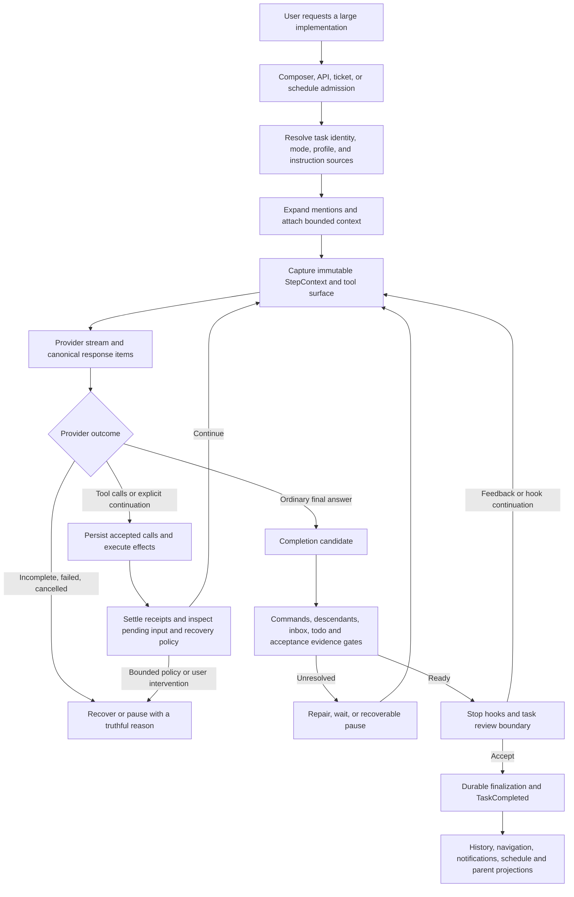
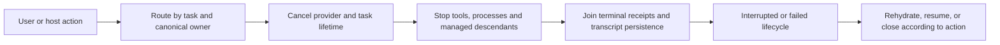

# Completion and continuation: Codex CLI convergence review

Date: September 30, 2026. Updated after the user clarified GitHub Copilot with GPT-5.6 and directed a systematic CLI
comparison rather than investigation tailored to one specification or request phrasing.

The goal is to identify behavioral differences between current Codex CLI and Alpha's shared execution harness,
including its GitHub Copilot/VS Code LM adapter, then converge through the existing kernel and adapters. The report of
roughly 10% completion motivates the review; it is not a fixture to overfit. The comparison does not depend on knowing
how that particular document was supplied. Copilot Chat remains a reported comparison, not the intended harness.

The first summary emphasized Gemini/Anthropic defects too heavily for that Copilot context. **Eight of the original
eleven failing assertions concern those other providers and do not exercise GitHub Copilot.** The remaining three
exercise shared ingestion/classification contracts. They are significant defects in their own right, but neither they
nor the other-provider failures establish the reported task's cause. The revised priority is actual CLI convergence,
not the number of red assertions.

Shared bugs, explicit Alpha policy differences, optional CLI capabilities, and limitations imposed by the VS Code host
are separated below. Provider-specific fixes remain valid backlog work; they are not the leading Copilot convergence
work. No production changes were implemented during this review. Subsequent authorized fixes and their refreshed
reference are tracked in the [implementation record](F:/roo-fork/Alpha-Code/docs/codex-cli-convergence-implementation-2026-09-30.md).

This review distinguishes a successful task, an ordinary model turn ending, an interrupted attempt, and a task waiting
for input. None of these states establishes a numerical percentage of specification coverage. Alpha must not present
an inferred percentage as verified progress.

## Scope, preservation, and reference

Root `AGENTS.md` and git status were checked first. The checkout remains on main at `40803ed6…`, with substantial prior
uncommitted work. The original start snapshot recorded 84 modified/untracked paths. This investigation added this
document, a separate diagnostic runner, and isolated diagnostic files. The follow-up updates this requested document
and adds two isolated Copilot diagnostics. It does not switch, reset, stash, commit, overwrite unrelated work, or change
production code. The separate preserved AlphaNet prototype was not touched.

Three subagents investigated runtime stopping/recovery, completion/spec coverage/delegation, and provider/input/context
handling. The parent investigated UI and host ownership, task adapters, instruction assembly, and integrated their
evidence. Existing design documents were treated as history and checked against live code and tests.

The sole reference is current official [Codex CLI source at commit
60947e234156ac12bdb7fba2477d3965f166bd34](https://github.com/openai/codex/tree/60947e234156ac12bdb7fba2477d3965f166bd34),
retrieved **2026-09-30T23:20:54Z**, committed **2026-09-30T19:22:34Z**. Source and existing tests were inspected before
making behavioral comparisons. Upstream tests were read, not executed. No claim about Codex desktop or Copilot Chat
behavior is needed for these recommendations.

The follow-up rechecked upstream main at **2026-10-01T00:15:43Z**; it still returned the same commit. Current official
[VS Code LM response/request documentation](https://code.visualstudio.com/api/references/vscode-api#LanguageModelChatResponse)
was retrieved during this follow-up to establish the host adapter boundary. VS Code 1.122.1 remains Alpha's compatibility
contract. The exact [1.122.1 response interface](https://github.com/microsoft/vscode/blob/1.122.1/src/vscode-dts/vscode.d.ts#L20191)
and [host option routing](https://github.com/microsoft/vscode/blob/1.122.1/src/vs/workbench/api/common/extHostLanguageModels.ts#L330)
were also read. They establish stream/text rather than a stable finish-reason field, and forwarding of the existing
configuration compatibility property. Local installed `@types/vscode` is 1.120.0; those older declarations alone would
not establish the exact host contract. A mock host is not evidence from a live installed Copilot session.

Evidence labels:

- **Reproduced defect:** a deterministic probe fails the intended observable contract in current Alpha.
- **Observed limitation:** a passing probe demonstrates current behavior; it is not automatically CLI divergence.
- **Static evidence:** code establishes a reachable path or policy; the complete incident was not reproduced.
- **Unverified incident hypothesis:** plausible association requiring the user's actual trace.

## Primary convergence priorities

The comparison is about stable contracts, not a special rule to keep a particular long spec running. Provider-neutral
differences below apply to Copilot tasks as well as other supported providers. Detailed evidence remains in the numbered
findings and the earlier completion/follow-up review.

| Contract                                             | Current CLI versus Alpha                                                                                                                                                                                                                  | Convergence action                                                                                                         |
| ---------------------------------------------------- | ----------------------------------------------------------------------------------------------------------------------------------------------------------------------------------------------------------------------------------------- | -------------------------------------------------------------------------------------------------------------------------- |
| Preserve recognized tool intent                      | CLI's typed tool pipeline returns routing errors or propagates fatal errors rather than erasing an accepted operation. Alpha LM can discard a recognized invalid tool part and complete surrounding text; four new probes reproduce this. | Fix the existing LM adapter's typed error/non-success normalization (EE-16).                                               |
| Bind instructions to the selected model              | CLI uses the resolved model's metadata/template. Alpha can select the right host model and edit tool, yet choose another model's instruction template from its opaque routing ID; two new probes reproduce this.                          | Carry verified family/prompt identity separately from routing ID through existing model/step contracts (EE-14).            |
| Keep the authorized implementation surface           | Alpha's question heuristic can narrow tools and waive already-declared verification for an action request. This narrowing is an Alpha optimization, not a CLI completion rule.                                                            | Repair the shared conservative classifier and retain real obligations (EE-04); broad request forms, not one user sentence. |
| Finish a turn while a persistent service stays alive | CLI tests permit long-running sessions after turn completion. Alpha can wait indefinitely on a healthy implementation dev server.                                                                                                         | Separate service readiness/ownership from finite check settlement in the existing command evidence gate; prior CF01/CF02.  |
| Admit follow-up in the same chat reliably            | CLI uses explicit turn identity and queue/steer ownership. Alpha has reproduced fast-response loss, claimed-input/CAS races, idle wake gaps and stale cross-turn UI projection.                                                           | Repair admission/finalization and lifecycle projection; prior CF03–CF09.                                                   |
| Continue useful exploration                          | No equivalent search-shape counter was found in the inspected CLI loop. Alpha can pause after nine distinct successful search-only steps.                                                                                                 | Use the shared evidence-sensitive progress detector; remove shape-only suspension or document a retained policy (EE-05).   |
| Honor Stop-hook continuation                         | CLI's multiple-block regression continues sampling. Alpha suspends after three continuation prompts per recovery window.                                                                                                                  | Reconcile the fixed Alpha bound with CLI behavior while preserving cancellation and limits (EE-10).                        |
| Recover eligible connection failures                 | CLI's enabled connection-retry feature can reconnect until cancellation; Alpha normally exhausts four attempts/90 seconds per logical step.                                                                                               | Review this exact retry class and server retry deadlines without replaying uncertain effects (limit inventory).            |
| Preserve usable context and provenance               | CLI local compaction is also lossy; Alpha adds a quarter-history retention bound and saved-handoff excerpts without an exposed full-source reader.                                                                                        | Preserve retrieval through existing persistence/read contracts and make omissions actionable (EE-03/07/08).                |
| Distinguish turn completion from human review        | Alpha keeps primary completion in a `completion_result` ask until acceptance; CLI ordinary completion releases the turn.                                                                                                                  | Decide this deliberate UX divergence explicitly; separate review from authoritative running/finalizing state (prior CF13). |
| Optional durable explicit goals                      | Current CLI has explicit-goal continuation separate from ordinary turns. No corresponding `create_goal/get_goal/update_goal` tool contract was found in Alpha's current canonical surface.                                                | Treat optional goal alignment as separate work in the shared kernel; never infer a goal from a long prompt alone.          |

### Behaviors that should not be “fixed” as false differences

- Ordinary visible assistant output without tool calls, queued input or an explicit continuation can end a CLI turn
  too. CLI even retains commentary text as the last message; the presence of commentary is not by itself a demand for
  another request. Do not add a mandatory completion tool or unconditional extra model round trip.
- CLI `update_plan` is a checklist update, not a semantic verifier of every original requirement. Neither harness has
  a general proof that a large implementation is complete. Better coverage evidence is useful, but a new mandatory
  requirements engine must not be described as existing CLI behavior.
- Copilot's LM response iterator does not expose the same terminal status/`end_turn` contract as CLI Responses. A
  clean iterator end after valid ordinary text is the available host boundary. Do not invent hidden finish metadata or
  call every such end a transport truncation bug.
- Known-family standard/extended input budgets, smaller live ceilings and unknown-family live budgets are covered by
  passing new controls. A larger advertised host ceiling is not proof that Alpha ignored a selected extended window.
- Model selection, reasoning effort, instruction template and execution authority are separate contracts. Fixing one
  must not silently widen another.

The first five priorities address reproduced integrity/lifecycle defects. Exploration, hook and retry changes require
explicit alignment decisions because existing Alpha bounds are policy. They are still meaningful harness differences;
they should not disappear from the review merely because a particular incident cannot be attributed to them.

Origin remains explicit: prior CF03–CF05 expose interactions in the current unshipped local communication work. Other
findings are baseline behavior or policy. This review examines the current working tree; it does not claim that every
local failure exists in an installed release. The earlier report records each finding's provenance.

The tool comparison is deliberately scoped to recognized/typed intent: current CLI's raw SSE parser can log and skip
an item that cannot deserialize. It does not establish universal rejection of every malformed transport record. Alpha's
new LM failures violate its own fail-closed semantic boundary; they are not proof that CLI never skips invalid raw data.

## What the current CLI actually ends

The ordinary [CLI turn loop](https://github.com/openai/codex/blob/60947e234156ac12bdb7fba2477d3965f166bd34/codex-rs/core/src/session/turn.rs#L149)
samples, executes tool calls, and continues while tool follow-up or pending input exists. At lines 653–755 it evaluates
Stop hooks and a final pending-input check before ending. A visible final assistant answer without remaining
continuation can end an ordinary turn. There is no general parser that proves every requirement in an arbitrary
specification was implemented. The model remains responsible for fulfilling the request.

[CLI `update_plan`](https://github.com/openai/codex/blob/60947e234156ac12bdb7fba2477d3965f166bd34/codex-rs/core/src/tools/handlers/plan.rs)
publishes a plan update. It is not a requirements-coverage certificate or an execution gate. Alpha's analogous checklist
must not be treated as proof that the original scope was covered.

Current CLI has a separate [explicit goal extension](https://github.com/openai/codex/tree/60947e234156ac12bdb7fba2477d3965f166bd34/codex-rs/ext/goal).
Its durable active-goal continuation and stopped states are distinct from ordinary turn completion. This does not
justify silently creating a goal for every large task or installing another task loop in Alpha. Goal alignment, if
later requested, belongs in the existing kernel and lifecycle/persistence contracts.

Provider termination is also explicit. [CLI Responses parsing](https://github.com/openai/codex/blob/60947e234156ac12bdb7fba2477d3965f166bd34/codex-rs/codex-api/src/sse/responses.rs#L418)
distinguishes terminal events, failures, and interrupted continuation. Its tests include missing terminal completion
(`error_when_missing_completed`, line 857), a terminal event without network EOF (line 953), and failure classification
(line 1028). A stream closing after partial text is not itself a successful terminal response. The turn loop at
2952–2999 preserves an optional `end_turn=false` as follow-up work.

A terminal response with no visible content is a different case from missing terminal transport evidence. The
[empty-response app-server regression](https://github.com/openai/codex/blob/60947e234156ac12bdb7fba2477d3965f166bd34/codex-rs/app-server/tests/suite/v2/thread_goal_empty_responses.rs#L28)
accepts an ordinary empty turn as completed without an error; the separate Goals breaker blocks after three inactive
automatic turns. Do not infer a global CLI retry-until-visible-output contract from that goal behavior.

CLI compaction is intentionally lossy. [Local compaction](https://github.com/openai/codex/blob/60947e234156ac12bdb7fba2477d3965f166bd34/codex-rs/core/src/compact.rs#L58)
retains at most 20,000 direct-user tokens, prioritizes newer records, and marks oversized excerpts. Its
[overlong-user test](https://github.com/openai/codex/blob/60947e234156ac12bdb7fba2477d3965f166bd34/codex-rs/core/src/compact_tests.rs#L429)
expects truncation. Exact original-spec retention cannot be assumed in either harness.

Current CLI can enforce a configured shared rollout budget:
[budget accounting](https://github.com/openai/codex/blob/60947e234156ac12bdb7fba2477d3965f166bd34/codex-rs/core/src/agent/control/budget.rs#L13)
returns `SessionBudgetExceeded` when the configured budget is consumed. Claims in older Alpha documents that the CLI
has no child/session budget must not be carried forward without this qualification.

Transport recovery also needs a qualified comparison. CLI's bounded defaults are five stream retries and four HTTP
attempts, but [eligible connection failures](https://github.com/openai/codex/blob/60947e234156ac12bdb7fba2477d3965f166bd34/codex-rs/core/src/responses_retry.rs#L99)
can reconnect indefinitely with 5–60-second backoff until cancellation. The
[connection-retry feature](https://github.com/openai/codex/blob/60947e234156ac12bdb7fba2477d3965f166bd34/codex-rs/features/src/lib.rs#L1325)
is stable and enabled by default; this excludes internal sessions and Amazon Bedrock and requires the specific sampling
connection-failure class. It does not mean unlimited auth, rate-limit, or overload retries. CLI preserves server retry
deadlines; Alpha's bounded retry window and 30-second retry-delay clamp are intentional differences to review.

## Complete boundary map



The two important loss points are **before sampling**, when only part of the requirement source arrives, and **at
provider termination**, when an incomplete response becomes an ordinary completion candidate. A third is **scope
classification**, which changes both tool availability and which evidence gates are required.



Cancellation and suspension must remain separate from `TaskCompleted`. Losing the UI projection or task owner can make
work look ended even while a process or resumable task still exists.

## Active provider coverage

The [public registry](F:/roo-fork/Alpha-Code/packages/types/src/provider-settings.ts:38) contains exactly `vertex`,
`vscode-lm`, `stellar`, and `openai`; `fake-ai` is process-local test support. Direct Anthropic, Bedrock, Gemini and
other retired provider IDs are compatibility data and are rejected before [factory dispatch](F:/roo-fork/Alpha-Code/src/api/index.ts:153).
They are not additional live adapters. Vertex selects Gemini, Anthropic or the OpenAI-compatible partner branch.

| Active family                                                                                                  | Terminal and EOF contract                                                                                                                                                                                                                                                            | Existing tests inspected                                                                                                                                                           |
| -------------------------------------------------------------------------------------------------------------- | ------------------------------------------------------------------------------------------------------------------------------------------------------------------------------------------------------------------------------------------------------------------------------------ | ---------------------------------------------------------------------------------------------------------------------------------------------------------------------------------- |
| Gemini through Vertex, direct/gateway, streaming/buffered                                                      | Shared Gemini handling; partial output limits and premature EOF can complete, as reproduced in EE-01/02.                                                                                                                                                                             | [Vertex cases](F:/roo-fork/Alpha-Code/src/api/providers/__tests__/vertex.spec.ts:135); safety case at 407.                                                                         |
| Anthropic through Vertex, direct/gateway, streaming/buffered                                                   | Shared Anthropic Vertex handling; stop reasons discarded and terminal marker not required, reproduced in EE-01.                                                                                                                                                                      | [Anthropic Vertex cases](F:/roo-fork/Alpha-Code/src/api/providers/__tests__/anthropic-vertex.spec.ts:269); buffered 386, empty 1107.                                               |
| OpenAI-compatible Chat Completions, including Azure endpoint configuration and model-specific conversion paths | [Normalizer](F:/roo-fork/Alpha-Code/src/api/providers/openai.ts:59) emits typed outcomes for normal stop, output limit, filtering, unknown reason and missing-terminal EOF.                                                                                                          | [OpenAI EOF](F:/roo-fork/Alpha-Code/src/api/providers/__tests__/openai.spec.ts:1385); unfinished tools 1324, O3 output limit 2001.                                                 |
| Stellar and Vertex partner Chat routes                                                                         | [Stellar](F:/roo-fork/Alpha-Code/src/api/providers/stellar.ts:94) and [partner adapter](F:/roo-fork/Alpha-Code/src/api/providers/vertex-openai.ts:108) forward the shared OpenAI implementation.                                                                                     | [Stellar](F:/roo-fork/Alpha-Code/src/api/providers/__tests__/stellar.spec.ts:124), [Vertex partner](F:/roo-fork/Alpha-Code/src/api/providers/__tests__/vertex-openai.spec.ts:133). |
| OpenAI Responses, selected within OpenAI/Stellar/partner adapters                                              | Explicitly rejects failed/incomplete events, missing terminal EOF, invalid completed status and incomplete items. Optional continuation compatibility is EE-11.                                                                                                                      | [Responses cases](F:/roo-fork/Alpha-Code/src/api/providers/__tests__/openai.spec.ts:739); buffered incomplete 777, completed-status validation 431.                                |
| VS Code Language Model                                                                                         | [Host iterator completion](F:/roo-fork/Alpha-Code/src/api/providers/vscode-lm.ts:1196) is the available ending boundary; errors propagate. No finish-reason metadata is interpreted. Host-contract limitation, not a reproduced Gemini-style defect or proof of Copilot Chat parity. | [LM completion without usage](F:/roo-fork/Alpha-Code/src/api/providers/__tests__/vscode-lm.spec.ts:932), streaming/error cases in the same file.                                   |
| Fake test source                                                                                               | [Generator passthrough](F:/roo-fork/Alpha-Code/src/api/providers/fake-ai.ts:81) honors supplied outcomes; otherwise semantic EOF can take the legacy fallback. Harness-only limitation.                                                                                              | [Fake registration/rehydration](F:/roo-fork/Alpha-Code/src/api/providers/__tests__/fake-ai.spec.ts:1).                                                                             |

[BaseProvider](F:/roo-fork/Alpha-Code/src/api/providers/base-provider.ts:14) leaves response generation abstract; it
does not normalize EOF for every adapter. Task's compatibility fallback is therefore material. No additional public
partial-text-at-EOF adapter was found beyond Gemini/Anthropic Vertex and the documented LM host boundary.

## Detailed findings: shared harness, adapter defects, and deliberate policies

### EE-01 — P1: provider output limits and premature EOF become successful turns

**Reproduced defect; baseline main.**

[Gemini](F:/roo-fork/Alpha-Code/src/api/providers/gemini.ts:944) captures a finish reason but checks it only when no
visible output exists (894/1063). Partial visible text with `MAX_TOKENS` has no canonical incomplete outcome.
[Anthropic Vertex](F:/roo-fork/Alpha-Code/src/api/providers/anthropic-vertex.ts:863) handles streaming `message_delta`
as usage and discards `stop_reason`; buffered handling at 807 also ignores it. Neither adapter declares a terminal
lifecycle outcome contract.

[Task's legacy stream fallback](F:/roo-fork/Alpha-Code/src/core/task/Task.ts:11965) treats semantic output without a
reported outcome as completed. [The kernel](F:/roo-fork/Alpha-Code/src/core/agent/AgentTurnEngine.ts:224) then accepts
ordinary visible text without tool calls or a continuation. Closing a stream after partial text, before Gemini's
terminal reason or Anthropic's `message_stop`, takes the same path.

The provider probes reproduce four output-limit failures across streaming/buffered modes and two partial-EOF failures.
Normal `STOP`/`end_turn` controls pass. This proves the adapter-to-kernel misclassification, not that a real model would
complete a whole specification after the repair. The Task path's defaulting rule is separately verified in code.

Fix the existing adapters to emit exactly one typed terminal outcome, preserve the raw normalized stop cause, and
require the expected terminal marker. Keep already accepted tool call IDs and receipts; do not retry effectful calls
blindly. Apply the same contract to summary generation so truncated summaries cannot silently become successful
compaction output.

### EE-02 — P1: an empty Gemini safety response is fabricated as successful assistant output

**Reproduced defect; baseline main.**

The Gemini fallback around [1063](F:/roo-fork/Alpha-Code/src/api/providers/gemini.ts:1063) emits a descriptive failure
explanation as ordinary assistant text when there is no model content. The two streaming/buffered `SAFETY` probes
demonstrate that this reaches `completed` rather than a non-success outcome. This can end a task without useful work.
The displayed explanation should accompany a failed/incomplete provider outcome. It must not become successful model
content merely to keep the UI readable.

### EE-03 — P1: file mentions hide long-line requirement loss

**Reproduced defect; baseline main.**

[The mention formatter](F:/roo-fork/Alpha-Code/src/integrations/misc/indentation-reader.ts:244) clips each line beyond
2,000 characters to 1,997 characters plus an ellipsis. [The read metadata](F:/roo-fork/Alpha-Code/src/integrations/misc/indentation-reader.ts:464)
sets `wasTruncated` only when lines were omitted. A single-line 20,000-character spec therefore loses roughly 90% while
reporting `wasTruncated:false`. [Mention rendering](F:/roo-fork/Alpha-Code/src/core/mentions/index.ts:94) omits its normal
explicit truncation and continuation warning. The ellipsis remains, so this is misleading provenance rather than
completely marker-free truncation.

The probe fails on truncation metadata while confirming that the final requirement never arrived. Controls show that
canonical `read_file` preserves that long line when it fits and supplies versioned column continuation when bounded.
Ordinary omitted-line mention warnings also work.

Use the existing bounded file renderer/continuation contract for mentions, or propagate precise line/column loss through
their metadata and rendered guidance. The complete source should remain retrievable through an existing permitted
tool. Do not create a competing file reader.

### EE-04 — P1: interrogative action requests are classified as lookups

**Reproduced defect; baseline main.**

For example, `Can you add all twelve product sections described in SPEC.md?` becomes `lookup`.
[Implementation matching](F:/roo-fork/Alpha-Code/src/core/agent/requestWorkClass.ts:67) recognizes direct imperatives
and selected unanchored verbs, but misses this phrasing; the subsequent question pattern matches `Can`.
[Tool catalog construction](F:/roo-fork/Alpha-Code/src/core/task/build-tools.ts:653) uses that classification to narrow
the supplied surface. [Completion checking](F:/roo-fork/Alpha-Code/src/core/task/Task.ts:6451) bypasses registered work
plan acceptance checks for lookup-style turns.

The [lookup catalog](F:/roo-fork/Alpha-Code/src/core/agent/lookupToolCatalog.ts:8) retains `exec_command` under the
existing approval policy. This narrowing removes relevant planning/editing tools; it does not make execution read-only
or remove every mutation path.

Two probes fail: the requested mutation is classified as lookup, and a declared, unverified acceptance check is bypassed
as `ready`. A genuine subsequent lookup is a passing control. This is a violation of explicit user intent, independent
of whether every large specification needs a checklist.

Repair the shared classification conservatively: explicit action requests retain the full surface and applicable
verification. A scope-reduction heuristic must not silently remove execution capability or discharge existing debt.
Preserve deliberate read-only questions, authorization constraints, and input provenance. Provider selection must remain
independent from this policy.

### EE-05 — P2: search-only recovery can pause useful broad exploration

**Reproduced current policy; alignment decision remains separate from the observation.**

[SearchLoopRecoveryPolicy](F:/roo-fork/Alpha-Code/src/core/agent/SearchLoopRecoveryPolicy.ts:1) uses three consecutive
search-only model steps and two automatic recovery attempts. It does not inspect successful result novelty. Nine
consecutive search-only steps can therefore reach a recoverable pause even if each searches a distinct requirement or
subsystem. A mixed/non-search step resets the window. This is a step count, not a count of individual parallel calls.

Three passing runtime probes demonstrate the pause after nine distinct successful search steps with novel receipts,
renewal after a non-search step, and a healthy 233-step turn. The policy sees calls rather than their receipts, so useful
result novelty cannot prevent this pause. Task constructs the default policy independently of the mistake-limit
setting; setting that other limit to zero does not disable this boundary.

The current CLI turn loop inspected above does not impose this search-shape stopping rule. Alpha's general tool-progress
detector already has evidence-sensitive behavior, so this additional stopping rule needs an intentional alignment
decision. Prefer advice based on demonstrated repeated outcomes; do not force manual Continue solely because useful
searches share a tool shape. Retain bounded failure handling, policy enforcement, and cancellation.

This path pauses work; it does not prove success or explain a final answer claiming the whole specification is complete.

### EE-06 — P2: completion validates declared evidence, not original spec coverage

**Observed limitation shared with ordinary CLI completion.**

The real Task gate accepts a partial-scope candidate with no registered acceptance checks and with unfinished todos when
the existing open-todo setting is disabled. It also accepts a prose work plan with an empty checks array. Enabling the
todo policy blocks the same candidate, and a declared check lacking a passed receipt blocks an implementation candidate.
These are passing observations/controls rather than failed CLI-parity assertions.

[Open-todo enforcement](F:/roo-fork/Alpha-Code/src/core/task/Task.ts:6771) defaults to false. Canonical `update_plan`
exposes steps/status; it does not install the legacy `work_plan` verification contract. The checklist itself is authored
by the model and may cover only a subset of the designated specification. Passing tests for touched files likewise
does not prove omitted features were implemented.

Make the model's final assessment compare the result with the original designated requirements and report remaining
scope explicitly. Preserve a retrievable source and useful coverage evidence across turns. Do not add a mandatory
completion tool or an unconditional autonomous continuation loop and call that CLI alignment. A richer host-owned
coverage contract is a deliberate extension feature requiring a separate bounded design and compatibility decision.

### EE-07 — P2: bounded Plan handoffs can repeatedly omit the same requirements

**Observed prompt visibility; completeness impact is a static continuity risk.**

[Saved handoffs](F:/roo-fork/Alpha-Code/packages/types/src/task-design-handoff.ts:4) allow 100,000 characters, while
[prompt attachment](F:/roo-fork/Alpha-Code/src/core/prompts/sections/design-handoff.ts:4) caps the excerpt at 24,000.
[Task](F:/roo-fork/Alpha-Code/src/core/task/Task.ts:13122) can reduce it to 4,096 for smaller contexts. Three passing
probes show that the durable full text contains tail requirements, but repeated attachment and reload continue to
supply the same prefix. The warning and content digest are present.

The full plan can still be in initial conversation history. This does not establish loss on the first implementation
request. After compaction removes that history, however, the retained provenance URI
`task:<id>:design-handoff` does not itself provide a retrieval action. No supplied read-handoff operation was found in
the inspected tool catalog. Excerpting should identify a readable complete source and permit bounded retrieval of later
sections. Reuse persistence and canonical read/tool contracts.

### EE-08 — P2: compaction can remove exact original requirements from active input

**Static continuity risk; part of the limitation is shared with CLI.**

[Alpha retention](F:/roo-fork/Alpha-Code/src/core/condense/index.ts:222) caps preserved direct-user records at 20,000
tokens, additionally limited to a quarter of the available history budget at 1013. Selection at 527–559 favors newer
records. Oversized records get a marked prefix/suffix excerpt. [Effective compacted history](F:/roo-fork/Alpha-Code/src/core/condense/index.ts:1359)
uses summary, selected records, and tail; original records remain saved. Existing tests deliberately exercise shortening.

A summary can preserve the omitted requirements, but there is no exact retention guarantee. Older work can therefore
lose actionable scope while newer follow-ups remain visible. The additional quarter-budget limit differs from CLI's
local user-retention bound. Combine source retrieval with requirement references and compare summary completeness
against designated sources; do not equate successful token reduction with complete scope retention.

EE-01 also affects summarization: legacy provider text-at-EOF can pass
[the summary success guard](F:/roo-fork/Alpha-Code/src/core/condense/index.ts:1183) even when the provider output was
truncated. Repair that verified transport defect before judging summary quality with live-model evaluations.

### EE-09 — P2: bounded child runs and consumed results do not guarantee parent coverage

**Static policy and assurance boundaries.**

[Managed defaults](F:/roo-fork/Alpha-Code/packages/types/src/subagent-orchestration.ts:5) are concurrency 2, depth 1,
explicit-only delegation, Explore/Review 120 seconds, Worker 900 seconds, 250,000 cumulative input tokens and 16,000
cumulative output tokens per child; root token/cost budgets default to null. Frozen manifests govern existing runs.
Default routing inherits the parent's captured profile; authority and budgets are separate from model selection.

[Budget handling](F:/roo-fork/Alpha-Code/src/core/webview/AlphaProvider.ts:10158) returns cancelled results with a specific
stop reason when limits are reached. It does not label a timed-out child completed. Parent completion at 8119–8146
blocks pending/running/cancelling descendants and unconsumed terminal results. Once a failed or blocked result is
acknowledged in the transcript, no separate gate proves that the original parent requirements assigned to that child
were completed or reassigned. Remaining declared checks, configured todo policy, Worker review and effect obligations
can still block completion; acknowledgement does not bypass those independent gates.

A managed `blocked` report also retains its role result while the generic Task lifecycle can be operationally
`completed` at [4819–4837](F:/roo-fork/Alpha-Code/src/core/webview/AlphaProvider.ts:4819). The UI must distinguish a run
that finished producing a blocked report from an assigned implementation objective that was fulfilled.

Current CLI likewise has retained child sessions, result delivery, and configured budget errors; it does not supply a
general original-spec verifier. Alpha's role-specific finite defaults should be shown before launch and in terminal
results. Require parent integration to distinguish complete, partial, blocked, and cancelled work, and carry remaining
requirements forward instead of treating result consumption as objective satisfaction.

[Independent tasks](F:/roo-fork/Alpha-Code/src/core/webview/AlphaProvider.ts:5040) launch as background primary roots.
They do not inherit the managed-child budget envelope or managed descendant completion gate. Completion delivery does
not automatically merge their worktree or verify parent acceptance. Their outcome must be integrated explicitly.

### EE-10 — P2: several completion repair limits are Alpha policy, not CLI scope completion

**Static evidence; pauses preserve incomplete work.**

[CompletionRecovery](F:/roo-fork/Alpha-Code/src/core/agent/CompletionRecovery.ts:94) pauses after three completion
rejections or eight unsuccessful checks against unresolved debt. File/version/check identity separates allowances;
progress resolving other covered debt does not consume the remaining debt's unsuccessful-check count. These safeguards
can still interrupt a difficult implementation before the objective is achieved.

[Stop/SubagentStop hooks](F:/roo-fork/Alpha-Code/src/core/task/Task.ts:6314) allow at most three continuation prompts per
guidance/recovery window, not per task lifetime. [Human guidance resets the window](F:/roo-fork/Alpha-Code/src/core/task/Task.ts:2611),
covered by the existing integration regression at `stageThreeCompletion.integration.spec.ts:538–557`.
The next request becomes a recoverable suspension. [Explicit completion](F:/roo-fork/Alpha-Code/src/core/tools/AttemptCompletionTool.ts:73)
uses the same bound. Such limits should have an explicit reason and remain resumable. Review them as deliberate Alpha
policy against current CLI hook continuation, rather than reporting them as successful task completion. The
[CLI multiple-block regression](https://github.com/openai/codex/blob/60947e234156ac12bdb7fba2477d3965f166bd34/codex-rs/core/tests/suite/hooks.rs#L1321)
demonstrates continued hook-directed sampling without Alpha's fixed three-prompt bound.

### EE-11 — P2: optional Responses continuation signals are dropped

**Static protocol compatibility gap; endpoint-specific.**

Current CLI preserves `Completed.end_turn=false` and maps interrupted incomplete events into follow-up sampling.
[Alpha Responses](F:/roo-fork/Alpha-Code/src/api/providers/openai.ts:748) throws for every incomplete reason and its
completed-result handler at 791 does not forward `end_turn`/`requiresContinuation`. The shared engine already supports
continuation. Normalize the signal when the selected endpoint actually supplies that contract. This is not a claim that
every public Responses endpoint exposes CLI-specific optional metadata, and it is not a reproduced incident cause.

### EE-12 — P2: UI/host ownership actions can end attempts independently of model completion

**Static reachable paths and existing contract evidence.**

| Surface/action                  | Current route and outcome                                                                                                                     | Implication                                                                                                                               |
| ------------------------------- | --------------------------------------------------------------------------------------------------------------------------------------------- | ----------------------------------------------------------------------------------------------------------------------------------------- |
| Stop in visible chat            | [ChatView 1504](F:/roo-fork/Alpha-Code/webview-ui/src/components/chat/ChatView.tsx:1504) → scoped handler 1270 → canonical owner `cancelTask` | Explicit interruption; joins persistence before rehydration.                                                                              |
| Switch to another chat          | [focusTask 5799](F:/roo-fork/Alpha-Code/src/core/webview/AlphaProvider.ts:5799) changes per-view focus                                        | Existing running task is preserved.                                                                                                       |
| Blank/new UI chat               | [startBlankTask 5835](F:/roo-fork/Alpha-Code/src/core/webview/AlphaProvider.ts:5835), handler 686 uses `preserveExisting:true`                | Running work remains in the background; a pending completion candidate can be accepted before the transition.                             |
| Hide sidebar/editor             | Visibility handlers at [1404](F:/roo-fork/Alpha-Code/src/core/webview/AlphaProvider.ts:1404)                                                  | Visibility changes notify presentation; they do not cancel tasks.                                                                         |
| Dispose sidebar webview         | [1428](F:/roo-fork/Alpha-Code/src/core/webview/AlphaProvider.ts:1428) clears webview resources                                                | Runtime survives this presentation disposal.                                                                                              |
| Close owner editor panel        | Same handler calls provider `dispose()` → [owned task cleanup 1175](F:/roo-fork/Alpha-Code/src/core/webview/AlphaProvider.ts:1175)            | All tasks owned by that provider are aborted, even if another view displays one. Closing a borrowing view preserves another owner's task. |
| Close primary task              | [closeTask 6258](F:/roo-fork/Alpha-Code/src/core/webview/AlphaProvider.ts:6258) removes/aborts it                                             | Closing is an execution action; managed-child close instead navigates to its parent.                                                      |
| Legacy API start/resume/clear   | [API 219](F:/roo-fork/Alpha-Code/src/extension/api.ts:219), 249, 275 → replacement/removal defaults                                           | Can interrupt existing work. API start with a new tab also closes editors at 206–207.                                                     |
| Legacy `clearTask` wire message | [Handler 952](F:/roo-fork/Alpha-Code/src/core/webview/webviewMessageHandler.ts:952) → current active task                                     | Ignores supplied task identity; a delayed legacy operation can act on changed focus. No current ChatView emitter was found.               |
| Checkpoint restore/edit rewind  | [restartTaskFromMessage 25](F:/roo-fork/Alpha-Code/src/core/webview/checkpointRestoreHandler.ts:25) stops old task before rewind/replacement  | Intentional interruption with preserved ordering.                                                                                         |
| Independent `stop_task`         | [Provider 5578](F:/roo-fork/Alpha-Code/src/core/webview/AlphaProvider.ts:5578) removes exact child                                            | Leaves interrupted/closed state, unlike resumable user Stop.                                                                              |
| Schedule service disposal       | [ScheduledTaskService 188](F:/roo-fork/Alpha-Code/src/services/scheduled-tasks/ScheduledTaskService.ts:188) aborts active schedule tasks      | Host shutdown/ownership teardown ends attempts.                                                                                           |
| Extension reload/shutdown       | Provider disposal and canonical recovery of interrupted history                                                                               | Process-local execution does not survive as running work; replay must expose recoverable interruption.                                    |

Use a clear close/stop distinction and explicit task IDs for all destructive control messages. Ownership should remain
visible when a task is watched in another view. If editor closure is changed to keep work running, transfer ownership
through the existing session registry and disposal contract; simply skipping cleanup leaks resources.

### EE-13 — P2: stopping causes are clearer in journals than compact UI state

**Static observability gap.**

[Task](F:/roo-fork/Alpha-Code/src/core/task/Task.ts:4680) maps completed to completed, failed/exhausted to failed, and
awaiting-user/incomplete/aborted to interrupted canonical turns. Detailed reasons are emitted in events and task traces.
[Snapshot finalization](F:/roo-fork/Alpha-Code/src/core/agent/lifecycle/reducer.ts:462) retains status, event ID, and time
but no terminal reason field. [Snapshot schema](F:/roo-fork/Alpha-Code/packages/types/src/agent-lifecycle.ts:643) and
[live metadata](F:/roo-fork/Alpha-Code/src/core/webview/TaskSessionRegistry.ts:605) consequently do not expose a structured
reason for every stopped boundary.

The transcript can show a useful error/Continue prompt; this is not a claim that all reasons are lost. A compact status
should additionally distinguish model completion, output truncation, search recovery, verification repair exhaustion,
child budget, user stop, owner disposal, approval wait, and persistence failure. Extend the existing event/snapshot
projection backward compatibly rather than adding another status store.

The earlier [completion/follow-up review](F:/roo-fork/Alpha-Code/docs/completion-followup-alignment-review-2026-09-30.md)
already reproduces stale cross-turn snapshots and stale legacy ask inference, fast-reply loss, queued-input races, and
post-stream errors escaping recovery. Those remain relevant to an apparent stop or broken Continue action. They were
not reclassified here as new spec-coverage defects or silently assumed fixed.

Provider-declared cancellation deserves a separate trace from user Stop. The kernel can return `aborted` while
`Task.abort` is still false. Primary recovery at [10325](F:/roo-fork/Alpha-Code/src/core/task/Task.ts:10325) opens Resume
for failed/exhausted/incomplete outcomes, but not aborted/awaiting-user; the host can return with no guaranteed active
ask. This is static evidence of another idle-input boundary, potentially interacting with the prior queued-input
no-wake defect. Reproduce the owning Task path before calling it a new incident cause.

### EE-14 — P2: selected model family can receive a different model's instruction template

**Two reproduced host-identity selection defects; additional static catalog compatibility gaps.**

Live instruction assembly uses [bundled Codex instructions](F:/roo-fork/Alpha-Code/src/core/prompts/system.ts:213).
Comparing the current CLI catalog with the bundled strings found byte-identical templates for GPT-6 Astra, Sol, Luna,
and GPT-5.6 Sol, despite Alpha's older recorded pin `4994306…` from September 29. No live instruction directing 10%
completion was found. [The objective section](F:/roo-fork/Alpha-Code/src/core/prompts/sections/objective.ts:1) is not
called by this live assembly; its tests are not proof of runtime instruction behavior.

The Copilot follow-up reproduced a more general identity boundary failure. [LM `getModel`](F:/roo-fork/Alpha-Code/src/api/providers/vscode-lm.ts:1391)
correctly retains the selected opaque host ID and its recognized family in `toolIdentity`. [Task prompt assembly](F:/roo-fork/Alpha-Code/src/core/task/Task.ts:13113)
passes only the host ID to [the template resolver](F:/roo-fork/Alpha-Code/src/core/prompts/codex-model-instructions.ts:57).
Two new cases select recognized GPT-5.6 Sol and GPT-6 Luna families with opaque routing IDs; both receive the GPT-6 Sol
fallback template. Recognized suffixed IDs are passing controls. This proves an identity-selection defect, not that a
template difference caused a particular model to stop early.

Current [CLI metadata selection](https://github.com/openai/codex/blob/60947e234156ac12bdb7fba2477d3965f166bd34/codex-rs/models-manager/src/manager.rs#L855)
uses the catalog entry and longest-prefix/simple-namespace matching. The
[known/fallback and matching tests](https://github.com/openai/codex/blob/60947e234156ac12bdb7fba2477d3965f166bd34/codex-rs/models-manager/src/manager_tests.rs#L747)
exercise that distinction. Alpha's capability matcher can recognize some dated family variants while its instruction
resolver accepts only registered suffixes. Preserve the opaque execution ID, but derive a verified instruction identity
from the selected host family through existing provider/StepContext contracts. Do not add a second router or widen
authority. The bundled GPT-5.6 template bytes already match current upstream; selection is the reproduced problem.

`gpt-6.1-sol` is absent from Alpha's model-to-prompt mapping and falls back to GPT-6 Sol. The current catalog has a
different template for that model. Unknown providers/models also intentionally use the fallback. Record resolved prompt
identity in diagnostics and review model capability/instruction matching without changing execution policy or authority.
Do not copy a new prompt wholesale as the proposed repair; translate the relevant behavioral contract into Alpha's
existing instruction assembly and adapters.

The new input-budget controls pass: a selected standard window stays 272,000; a selected extended 922,000 window is
clamped to the live 921,793 input ceiling; a smaller live ceiling becomes 123,456; an unknown family uses its live
87,654 ceiling. `contextWindowIncludesOutput:false` prevents a second output reservation. `maxTokens:-1` means no
known output ceiling, not an enforced short-answer quota. Keep Copilot's selected live bounds; CLI's separate catalog
context limit is not a substitute.

### EE-15 — P2: request/cost approval denial can enter transport retry handling

**Static reachable misclassification; owning-Task reproduction remains required.**

The request/cost allowance preflight at [14003–14005](F:/roo-fork/Alpha-Code/src/core/task/Task.ts:14003) throws an
ordinary error when the user denies continuation. It is outside the first-chunk error classifier, so the owning catch
at [11754–11846](F:/roo-fork/Alpha-Code/src/core/task/Task.ts:11754) can treat it as a transient transport failure and
retry the approval path under the four-attempt/90-second allowance. The existing AutoApprovalHandler denial test
establishes its false return; it does not exercise this owning catch.

Represent preflight denial as a typed awaiting-user/cancelled outcome according to the existing host contract, with
no provider retry. Test denial, delayed approval timeout, subsequent guidance, and cancellation through Task admission
and recovery. This is a policy boundary, not a model response error.

### EE-16 — P1: recognized Copilot tool intent can disappear into successful text completion

**Four reproduced LM adapter integrity failures; no live Copilot occurrence is asserted.**

[The LM tool branch](F:/roo-fork/Alpha-Code/src/api/providers/vscode-lm.ts:1241) warns and continues when a recognized
tool part lacks a valid name, call ID or object input. Its serialization catch also logs and continues. If valid visible
text came before that part, the canonical response contains only the text; [Task's compatibility fallback](F:/roo-fork/Alpha-Code/src/core/task/Task.ts:11965)
and the ordinary completion rule can then accept it. The adapter has erased semantic intent, so the kernel cannot know
that continuation was required or a tool request failed.

Four probes exercise missing ID, missing name, null input and unserializable input through the real LM adapter,
accumulator and turn engine. All incorrectly complete. This is an adverse-input contract test, not evidence that normal
Copilot emits these malformed parts frequently or caused the reported partial implementation. Four controls preserve a
450,000-character input and ordered instruction fragments, valid text-before-tool with exact call identity and stateful
continuation, host stream errors, and ordinary clean text completion. No hidden finish reason or automatic extra step is
invented by those assertions.

The [CLI typed routing pipeline](https://github.com/openai/codex/blob/60947e234156ac12bdb7fba2477d3965f166bd34/codex-rs/core/src/stream_events_utils.rs#L315)
records accepted tool items and sets follow-up; `RespondToModel` errors enter history and request continuation, while
fatal errors propagate. [Routing](https://github.com/openai/codex/blob/60947e234156ac12bdb7fba2477d3965f166bd34/codex-rs/core/src/tools/router.rs#L248)
preserves typed call identity and arguments. Its raw SSE parser can skip records that fail deserialization, and one
error fallback uses an empty call ID; neither is a reason to weaken Alpha's stronger already-accepted-call invariant.

Fail visibly and structurally at the existing LM adapter/response boundary. Retain exactly one terminal receipt for
every already accepted valid call; do not fabricate an ID, execute guessed arguments, suppress cancellation, or replay
uncertain effects. Unknown future non-tool parts may still follow the documented compatibility policy.

### EE-17 — P2: initial request fit is less consistently checked than recovered context

**Static validation gap; no silent Copilot clipping reproduced.**

[Ordinary Task preflight](F:/roo-fork/Alpha-Code/src/core/task/Task.ts:13673) runs context management when prior
`contextTokens` exists. Final actual-schema measurement is conditional on prior compaction at
[14109](F:/roo-fork/Alpha-Code/src/core/task/Task.ts:14109). A first oversized prompt or enlarged catalog can therefore
reach host admission without that final fit check. The host may explicitly reject it, which is different from silently
discarding requirements. The existing context-recovery path and bounded retry policy then own the result.

Test initial, later and post-compaction requests against the same finite host input budget with actual instruction and
tool schemas. Define one consistent preflight/recovery contract in current context management; preserve complete tool
transactions and clear errors. The new valid-input controls show no giant-spec truncation inside LM conversion itself.

## Limit and pause inventory

These limits measure transport, context, policy, or child resources. They must not be interpreted as proof that the
user's requested scope is complete.

| Boundary                       | Current inspected behavior                                                                                                                                          | Classification                                                                             |
| ------------------------------ | ------------------------------------------------------------------------------------------------------------------------------------------------------------------- | ------------------------------------------------------------------------------------------ |
| Total primary model steps      | No fixed total-step cap found; existing Task regression and new staged-engine probe cover 233 steps                                                                 | Counterevidence to a universal short-task ceiling.                                         |
| Search-only streak             | Three steps/checkpoint, two automatic recoveries, then pause                                                                                                        | Alpha policy difference; independent of result novelty.                                    |
| Consecutive mistakes           | Default three with one automatic recovery; further protected pause; zero disables this limit                                                                        | Human guidance can renew the recovery window.                                              |
| Successful nonprogress tools   | Default six repeats issue advisory guidance                                                                                                                         | Advisory alone does not end the task.                                                      |
| Exact blocked operation        | Twelve repeats of a known blocker suppress that retry; uncertain mutation blocks immediately                                                                        | Scoped protection; permitted alternative work remains available.                           |
| Failure-ledger capacity        | 64 tracked scopes/operations; capacity exhaustion suspends Task                                                                                                     | Global recoverable pause after bounded storage is exhausted.                               |
| Completion debt repair         | Three candidate rejections / eight unsuccessful scoped checks                                                                                                       | Recoverable incomplete attempt.                                                            |
| Completion hooks               | Three generated continuation prompts per guidance/recovery window                                                                                                   | Recoverable suspension; human guidance resets the window.                                  |
| Autoapproval requests/cost     | Configurable renewable allowance; defaults unbounded                                                                                                                | User-input boundary, not successful completion.                                            |
| Provider requests              | Default request timeout 600 seconds; generally four total attempts / 90-second retry allowance per logical step                                                     | Neither is a total task-duration limit; preflight approval waits consume the retry window. |
| Empty or non-completing output | Truly empty responses allow two automatic attempts; semantic content without a completion outcome may suspend immediately                                           | Alpha recovery policy; CLI ordinary terminal empty turns differ.                           |
| Receipt/read settlement        | 30-second read/settlement joins and orphan-receipt settlement                                                                                                       | Does not impose a 30-second lifetime on persistent processes or managed children.          |
| Output tokens                  | Anthropic common/fallback 8,192; hybrid fallback 16,384; ordinary reservation generally capped at 20% context except GPT-5 behavior; model-specific overrides apply | Truncation risk, not scope quota.                                                          |
| Mention ingestion              | First 2,000 lines; legacy 2,000-character line clipping                                                                                                             | Omitted-line warning works; EE-03 misreports column loss.                                  |
| Canonical file reading         | Default 2,000 lines, shared 32,000-character allowance, up to eight-file batch                                                                                      | Versioned bounded continuation.                                                            |
| Compaction                     | Direct-user retention 20,000 tokens and quarter-history constraint; default trigger 100%, target 25%                                                                | Lossy context boundary; no scope proof.                                                    |
| Managed child                  | Explore/Review 120s, Worker 900s; cumulative 250k input / 16k output                                                                                                | Explicit cancelled/partial result with reason.                                             |
| Concurrent live tasks          | Default three primary/live sessions, configurable maximum                                                                                                           | Admission failure; does not evict another live task in preserving UI flow.                 |
| Finite commands                | Physical process/receipt settlement and configured timeout                                                                                                          | Required evidence gate. Persistent-service hangs are in prior review.                      |
| Plan mode/retired saved mode   | Plan is read-only; retired modes restore safely to Plan                                                                                                             | A planning outcome can end without implementation by design.                               |
| Ticket work                    | [TicketTaskLink 25](F:/roo-fork/Alpha-Code/src/services/tickets/TicketTaskLink.ts:25) uses shared primary Task; explicitly asks for ticket criteria                 | Ticket complete status is a separate explicit update, not automatic proof of task scope.   |
| Scheduled agent work           | [Scheduled launch 521](F:/roo-fork/Alpha-Code/src/services/scheduled-tasks/ScheduledTaskService.ts:521) uses the same Task in background                            | `TaskCompleted` becomes run succeeded at 764; no independent spec verifier.                |

The retry window starts for a logical `runAgentRequests` sequence, not the task. A healthy first request may take up to
its configured 600-second timeout; if it fails after the 90-second recovery allowance, automatic replay is exhausted.
Explicit manual retry is a separate user decision. Accepted semantic content also suppresses unsafe transport replay.
These distinctions are necessary to diagnose a long request ending versus a long task being arbitrarily capped.

Inventory evidence includes [AgentRetryPolicy](F:/roo-fork/Alpha-Code/src/core/agent/AgentRetryPolicy.ts:46),
[mistake recovery](F:/roo-fork/Alpha-Code/src/core/task/Task.ts:5400),
[tool progress and failure suppression](F:/roo-fork/Alpha-Code/src/core/tools/ToolRepetitionDetector.ts:255),
[failure-capacity suspension](F:/roo-fork/Alpha-Code/src/core/task/Task.ts:15047),
[request/cost allowances](F:/roo-fork/Alpha-Code/src/core/auto-approval/AutoApprovalHandler.ts:58), and
[default request timeout](F:/roo-fork/Alpha-Code/src/api/providers/utils/timeout-config.ts:4).

## Bounded CLI convergence implementation plan

1. **Repair terminal ownership and next-input admission.** Address the already reproduced CF03–CF09 in Task's existing
   lifetime/queue ownership and canonical lifecycle projection. Cover late terminal-save errors, fast replies, claimed
   input, finalization races, idle wake and new-turn sequence identity. Every accepted input must either start/steer work
   or remain durably visible with a truthful outcome.
2. **Separate persistent-service readiness from finite verification.** Address CF01/CF02 through current command
   evidence and receipt finalization. A live service must have an explicit owner and useful readiness evidence; a finite
   required check still needs its real terminal result. Background return does not discharge mutation uncertainty.
3. **Repair recognized LM tool failures.** Normalize rejected/invalid semantic parts through the existing typed error
   and terminal-receipt machinery. Preserve accepted IDs, provider state, cancellation and safe effect ordering. The
   kernel must never see an erased tool request as a successful text-only response.
4. **Carry the selected instruction identity.** Use verified provider/model family metadata at the existing adapter
   boundary; retain opaque routing IDs separately. Capture the resolved identity in StepContext and reconcile supported
   catalog/date variants. Keep correct current template bytes and live host input limits.
5. **Decouple surface optimization from completion debt.** Repair conservative action classification with varied
   imperative, interrogative, compound and read-only fixtures. A small catalog must not discharge applicable declared
   obligations. Preserve deliberately separate lookup turns and the user's authority.
6. **Reconcile continuation/recovery policy.** Replace the search-shape pause with meaningful progress evidence; review
   hook, mistake and scoped repair bounds against CLI. Separate eligible connection recovery from application failures
   and respect server retry deadlines. Keep cancellation, admission limits and protection against uncertain replay.
7. **Make omitted requirement sources usable.** Add bounded retrieval through current artifact/read adapters for saved
   handoffs and compacted designated sources. Review the extra quarter-history cap and initial-request fit. This is
   context continuity work, not a general semantic completeness certificate.
8. **Resolve review/turn-state divergence explicitly.** Decide whether mandatory primary completion review remains an
   Alpha feature; project it as waiting for review rather than running. Keep future optional explicit-goal alignment
   separate from ordinary turn completion and implement it through the shared kernel only if requested.

Validate each owning boundary with deterministic providers/promises and stable contract assertions. After implementation,
run the affected consumer checks and exact VS Code 1.122.1 host gate. This investigation does not authorize silently
weakening current policy or substituting a parallel runtime.

## Broader provider and feature backlog

These earlier recommendations remain valid, but Gemini/Anthropic terminal normalization is separate from the leading
Copilot/shared-harness convergence work above.

1. **Normalize terminal outcomes at provider boundaries.** Repair Gemini and Anthropic streaming/buffered handling,
   output-limit and safety/refusal classification, and missing terminal events. Verify task and summary consumers. Keep
   original tool transactions and accepted effects intact; compare with the existing OpenAI normalization rather than
   creating a provider-specific loop.
2. **Repair source ingestion provenance.** Reuse the canonical bounded file renderer for mentions and provide precise,
   versioned continuation for clipped columns. Preserve user intent and readable warnings across preview and model
   context. Cover long single-line, multibyte, multiline, and binary cases.
3. **Repair action-request classification.** Add interrogative and polite action cases, explicit read-only controls,
   compound requests, and existing-check retention. The captured tool surface and executable policy must agree.
4. **Align useful exploration and repair boundaries.** Evaluate the search-only count rule against actual outcome
   novelty and the existing progress detector. Keep genuine repeated failures bounded. Document any retained completion
   repair/hook limits as Alpha choices with explicit resumable reasons. Keep approval denial out of transport retry
   classification and preserve each selected provider's actual cancellation/continuation cause.
5. **Preserve usable requirement sources.** Provide a permitted retrieval path for complete saved handoffs and designated
   specs, with source identities and incomplete-read evidence surviving compaction. Keep large-scope planning optional
   and proportionate. Make final assessment enumerate completed, remaining, and blocked requested work. Do not introduce
   an always-on goal or a mandatory completion tool.
6. **Integrate partial child results deliberately.** Keep stop reasons visible, retain unresolved assigned requirements,
   and distinguish consuming a result from completing the assigned objective. Do not automatically merge independent
   worktrees or relax authority/budget controls.
7. **Clarify stop ownership and diagnostics.** Propagate structured stop causes through current journals/reducers,
   metadata and UI; scope legacy controls to explicit identities; make editor-owner closure understandable. Fix the
   already documented stale/follow-up projection defects in their existing owning layers.
8. **Validate against current CLI again at implementation time.** Recheck the upstream pin, especially goal, rollout
   budgets and Responses continuation contracts. Any later explicit-goal feature is separate bounded work in the shared
   kernel, not a replacement runtime. Avoid unrelated prompt, model, dependency, or release changes.

Each item is a reviewable change with its own regressions. The first three address reproduced defects; the remaining
items need deliberate policy or compatibility decisions. Their order is based on the owning contract and affected
surfaces rather than the unseen original document.

## Validation and systematic comparison

The new probes are deliberately excluded from ordinary `*.spec` discovery. Some assert desired contracts and are red
on current production code; others assert current observations and are green. Their existence does not mean production
repairs have been implemented.

Original dedicated run: **27 cases, 11 intended failures, 16 passing controls/observations**, across five files. Red
assertions expose the current implementation rather than a failed fixture or an implemented repair:

| Diagnostic                                                                                                                       | Cases | Result                                                                                          |
| -------------------------------------------------------------------------------------------------------------------------------- | ----- | ----------------------------------------------------------------------------------------------- |
| [Provider endings](F:/roo-fork/Alpha-Code/src/api/providers/__tests__/provider-early-ending.investigation.ts)                    | 10    | 8 red: four output-limit, two missing-terminal, two safety; 2 normal-stop controls pass.        |
| [Source ingestion](F:/roo-fork/Alpha-Code/src/integrations/misc/__tests__/source-ingestion-early-ending.investigation.ts)        | 4     | 1 red long-line truncation flag; 3 read/continuation/warning controls pass.                     |
| [Completion and classification](F:/roo-fork/Alpha-Code/src/core/task/__tests__/Task.spec-coverage.early-ending.investigation.ts) | 7     | 2 red action-classification/check-bypass cases; 5 completion-policy observations/controls pass. |
| [Plan handoff](F:/roo-fork/Alpha-Code/src/core/prompts/sections/__tests__/handoff-early-ending.investigation.ts)                 | 3     | 3 prompt-visibility observations pass.                                                          |
| [Runtime recovery](F:/roo-fork/Alpha-Code/src/core/agent/__tests__/runtime-early-ending.investigation.ts)                        | 3     | 3 search-pause/reset/233-step observations pass.                                                |

Follow-up runs selected the two new Copilot files directly: **18 cases, 6 intended failures, 12 passing
controls/observations**. The six failures comprise four recognized-tool-part integrity cases and two selected-family
instruction-routing cases. They are separate from the eight original unrelated-provider failures.

| Copilot convergence diagnostic                                                                                                                         | Cases | Result                                                                                                                                                                              |
| ------------------------------------------------------------------------------------------------------------------------------------------------------ | ----- | ----------------------------------------------------------------------------------------------------------------------------------------------------------------------------------- |
| [Tool intent and valid-host controls](F:/roo-fork/Alpha-Code/src/api/providers/__tests__/copilot-early-ending.investigation.ts)                        | 8     | 4 red rejected-tool-part cases; long valid input, valid tool/state continuation, iterator error and ordinary-text controls pass. Host version is mocked as 1.135.0, not a live run. |
| [Selected identity and input-budget controls](F:/roo-fork/Alpha-Code/src/api/providers/__tests__/copilot-gpt56-identity.early-ending.investigation.ts) | 10    | 2 red opaque-ID/recognized-family selection cases; 8 suffix/fallback/input-budget/routing controls pass. Host version is mocked as 1.122.1.                                         |

```powershell
pnpm --dir src test --config early-task-ending.investigation.config.ts
pnpm --dir src check-types
```

Select a specific follow-up file by putting its path directly after `test`, before the same `--config` option. Do not
insert a standalone `--` separator. The ordinary suite still excludes these intentionally red diagnostics.

The actual runner used the installed pinned pnpm 11.24.0 CLI with `--config.verifyDepsBeforeRun=false` to avoid implicit
dependency installs. No broad unit suite, build/release gate, live model run, or VS Code automation was executed for
this investigation. The production implementation will need focused affected-consumer tests, source/webview/shared
typechecks as applicable, managed-agent certification for changed contracts, and the exact VS Code 1.122.1 smoke gate.

Later validation should include:

- A 100-requirement fixture supplied as pasted text, `@file`, canonical file read, and large Plan handoff. Put required
  features at the beginning, middle, end, and on one long line; verify which source bytes actually reached the model.
- Scripted providers emitting partial text plus output limit, safety refusal, missing terminal event, explicit
  continuation, transport failure after accepted tool calls, cancellation, and normal completion. Check task and summary
  consumers, effect suppression, receipt pairing, and truthful UI outcomes.
- A long implementation with many distinct successful searches and genuine repeated failures; verify the former can
  proceed and the latter remains bounded/resumable. Use barriers/fake timers, not arbitrary sleeps.
- Request/cost denial, delayed preflight approval, provider-declared cancellation, terminal empty output, an eligible
  network outage, and subsequent steering. Check the exact stop cause, retry count and idle wake/admission behavior.
- A model choosing a partial checklist or final response while original designated requirements remain. Separate host
  scope observations from model-quality evaluation; never let a green transport test certify feature completeness.
- Compaction before and during a large spec, follow-up scope changes, restore/reload, and retrieval of omitted handoff
  sections. Verify source IDs, tool transactions, input provenance and saved history remain readable.
- Child timeout/input/output limit, partial and blocked results, parent reassignment, independent thread completion,
  worktree review, and parent finalization after result consumption.
- Sidebar/editor/background/task API/schedule/ticket paths: stop, navigation, owner/borrower close, reload, checkpoint
  restore, late feedback, approval/recovery waits, and double-finalization races.

Systematic convergence does not require recovering the original user's prompt. Use varied generic fixtures and capture
task/run/turn identity, resolved provider/model/instruction identity, normalized finish cause, accepted tool receipts,
completion gate reason, effective limits, compaction provenance and queued/claimed input. Keep diagnostics bounded and
redacted. These support attribution if an operational trace is later available; they are not prerequisites for fixing
the reproduced general contracts or comparing the harnesses.

## Original investigation checks

- Dedicated diagnostic rerun: **27 cases; 11 intended red assertions, 16 passing controls/observations**. Three files
  contain reproduced defects; two contain passing policy/visibility observations. The command exits nonzero because
  those production defects remain.
- `pnpm --dir src check-types`: **passed** after correcting two typing errors in the new diagnostic fixtures.
- Prettier check of all seven new files and `git diff --check`: **passed**.
- All **80** local file links/line bounds and **11** pinned upstream source links were checked against current files
  and the retrieved upstream tree; none were missing or out of bounds.
- Preservation comparison: all **84** prior modified/untracked status entries retained, all **83** hash-bearing
  existing files unchanged, and no missing paths. The remaining snapshot entry is an untracked directory with no stored
  file hashes. Only the seven new investigation files were added; no production file was changed this turn.
- Existing upstream and Alpha contract tests were read. No broad test suite, exact-host automation, live provider call,
  build or release gate was run this turn. Prior checks in earlier work are not fresh validation of this investigation.

No production fix is claimed by this review. Implementation and exact-host validation remain subsequent work.

## Convergence follow-up checks

The follow-up changes this review and adds two isolated diagnostics. Dedicated outcomes are **4 red/4 passing** and
**2 red/8 passing** after correcting one new fixture's overly specific rejection-message assertion. No production
assertion was weakened. Extension typecheck passed. Prettier and `git diff --check` passed; all **89** local links/line
bounds and **15** pinned CLI source links resolve to current files or the retrieved upstream tree. Exact-host source
was checked independently through the official 1.122.1 declarations and routing implementation.

The follow-up preservation snapshot contains **91** existing files. All status entries remain; **90** file hashes are
unchanged and the sole changed existing file is this explicitly requested review. Exactly two new diagnostic files
were added. No production file, existing regression test, lockfile or preserved prototype was changed. No live Copilot
call, VS Code automation, build or release gate was run.
