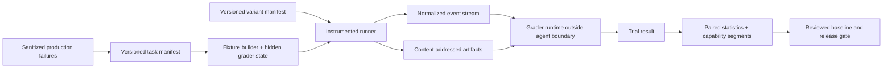

# Alpha Code Frontier Agent and Evaluation Harness Convergence

**Assessment date:** 2026-07-12  
**Assessment target:** the current `Alpha-Code` worktree, including uncommitted agent-runtime modernization visible on the assessment date  
**Target model:** `D:/Downloads/frontier_agent_eval_harness_guide.html` (Frontier Agent Harness & Evaluation System, July 2026)  
**Purpose:** establish what Alpha can measure today, define the gap to a frontier-grade agent and eval harness, and provide a staged convergence plan with objective exit criteria.

## Executive decision

Alpha has a useful **containerized coding benchmark runner**, not yet a complete frontier evaluation system. Its strongest foundations are fresh per-task VS Code/container execution, concurrent runs, language-specific outcome tests, repeatable iterations, a web runner, and basic token/cost/tool metrics. The current worktree also introduces promising agent-side primitives—provider-neutral turn sequencing, immutable step context, tool-policy snapshots, structured turn events, compaction metadata, and richer telemetry.

The blocking issue is integration and measurement validity. The eval data model still reduces a task to language, exercise, iteration, pass/fail, timing, token/cost totals, tool counts, and tool errors. It does not version the full evaluated system, retain normalized traces and final artifacts, support layered graders, separate infrastructure failures from agent failures, govern baselines, calculate reliability/statistical uncertainty, or connect production failures to regression tasks. The new agent-side observability is not yet an eval-side measurement instrument.

**Recommendation:** converge by evolving the existing `packages/evals` and `apps/web-evals` stack, not replacing it. First freeze a reproducible baseline and connect structured runtime events to durable run artifacts. Next introduce versioned task/variant contracts and deterministic grader execution. Only after those foundations are trustworthy should Alpha add model judges, dashboards, automated failure clustering, or generated evals.

## Scope and evidence standard

This is a source review, not a benchmark result. No current model/harness quality score can be claimed until a controlled representative suite is run. Findings use three evidence classes:

- **Implemented:** directly evidenced in current source.
- **Partial/in progress:** useful mechanism exists but is not end-to-end, durable, or governed.
- **Absent/not evidenced:** no supporting implementation was found in the reviewed repository surface. This does not prove no external system exists.

Primary local evidence includes:

- [`packages/evals/ARCHITECTURE.md`](../packages/evals/ARCHITECTURE.md) and [`packages/evals/README.md`](../packages/evals/README.md)
- [`packages/evals/src/db/schema.ts`](../packages/evals/src/db/schema.ts)
- [`packages/evals/src/cli/runEvals.ts`](../packages/evals/src/cli/runEvals.ts), [`processTask.ts`](../packages/evals/src/cli/processTask.ts), and [`runUnitTest.ts`](../packages/evals/src/cli/runUnitTest.ts)
- [`apps/web-evals/src/actions/runs.ts`](../apps/web-evals/src/actions/runs.ts)
- [`src/core/task/Task.ts`](../src/core/task/Task.ts)
- [`src/core/agent/StepContext.ts`](../src/core/agent/StepContext.ts), [`ToolPolicy.ts`](../src/core/agent/ToolPolicy.ts), [`AgentTurnEvents.ts`](../src/core/agent/AgentTurnEvents.ts), and [`AgentTurnTelemetry.ts`](../src/core/agent/AgentTurnTelemetry.ts)

The attached guide was treated as the target architecture. Missing or decision-critical claims were checked against current primary sources listed under Research basis.

## Current-state assessment

### What Alpha has now

| Area                        | Evidence                                                                                                                                          |      Status | Assessment                                                                                                                   |
| --------------------------- | ------------------------------------------------------------------------------------------------------------------------------------------------- | ----------: | ---------------------------------------------------------------------------------------------------------------------------- |
| Isolated task execution     | A controller starts per-task runners; each task gets a fresh VS Code/container environment.                                                       | Implemented | Strong base for avoiding cross-task contamination.                                                                           |
| Parallel orchestration      | `PQueue` controls run concurrency; Redis provides events/registration and PostgreSQL stores results.                                              | Implemented | Useful runner architecture, although scheduling/retry state is not fully durable.                                            |
| Multiple execution surfaces | Tasks can run through VS Code or CLI.                                                                                                             | Implemented | Valuable for parity and harness ablations if surfaces are versioned and paired.                                              |
| Outcome grading             | Language-specific commands run after the agent; result is a boolean pass/fail.                                                                    | Implemented | Correct outcome-first instinct, but only one deterministic grader and no explicit hidden-grader boundary in this repository. |
| Repeated trials             | The run UI creates multiple task iterations.                                                                                                      | Implemented | Raw mechanism exists; reliability metrics and uncertainty do not.                                                            |
| Resource budgets            | Per-run timeout and concurrency are configurable; unit tests have a timeout.                                                                      |     Partial | Missing per-task tool/model/cost budgets and normalized stop reasons.                                                        |
| Efficiency metrics          | Tokens, cache activity, cost, duration, tool usage, and tool errors are stored.                                                                   | Implemented | Useful primitives; not normalized by success or compared statistically.                                                      |
| Live observability          | Runner events stream through Redis/SSE and log files are shown in the UI.                                                                         |     Partial | Operational logs are not equivalent to a lossless, versioned, replayable trace.                                              |
| Runtime context capture     | `StepContext` captures model/options, prompt, instruction sources, environment, transcript boundaries, tool schemas, policy, budget, and digests. | In progress | Excellent bridge to variant identity and trace reconstruction, but not persisted by `packages/evals`.                        |
| Tool policy                 | Policy snapshots describe visible/allowed/disabled tools, approvals, roots, command prefixes/timeouts, output limits, and cancellation.           | In progress | Strong agent-harness contract; eval tasks do not declare or grade permission/safety requirements.                            |
| Turn/tool telemetry         | Structured turn events and metrics cover tool calls, approvals, parallelism, output truncation, retries, and compaction-related context.          | In progress | Valuable signals exist in the agent runtime but lack durable eval event/artifact tables and derived metrics.                 |
| Final artifact retention    | `runEvals.ts` explicitly notes that container diffs are lost and should be stored.                                                                |         Gap | This prevents robust diagnosis, replay, scope grading, and evidence-backed completion checks.                                |

### Maturity scorecard

Scores are architectural readiness estimates, not measured agent performance: 0 absent, 1 ad hoc, 2 basic, 3 operational, 4 rigorous, 5 frontier-grade.

| Dimension                           |       Now |  Target | Why                                                                                                                                                |
| ----------------------------------- | --------: | ------: | -------------------------------------------------------------------------------------------------------------------------------------------------- |
| Environment isolation               |       3.5 |       5 | Fresh runners exist; image/repository digests, resource profiles, seeds, and isolation verification are incomplete.                                |
| Task specification                  |       1.5 |       5 | Exercise names and prompts exist externally, but no immutable manifest with provenance, risk, permissions, budgets, graders, and success contract. |
| Variant reproducibility             |       1.5 |       5 | Model/settings are stored; full prompt/tool/rules/skills/runtime/environment identity is not.                                                      |
| Trace quality                       |         2 |       5 | Runtime events/logging are promising, but eval persistence, schema versioning, redaction guarantees, and replay are missing.                       |
| Artifact evidence                   |         1 |       5 | Final diffs/workspaces/test reports/screenshots/state snapshots are not retained as governed artifacts.                                            |
| Grading                             |         2 |       5 | Deterministic tests are good; no general hard gates, trace assertions, calibrated rubric graders, or human adjudication workflow.                  |
| Reliability/statistics              |         1 |       5 | Iterations exist; no pass@k/consistency@k, confidence intervals, paired comparisons, or failure segmentation.                                      |
| Causal ablation                     |         1 |       5 | Settings can vary, but evaluated-system versions and one-variable paired experiment workflows are absent.                                          |
| Safety/permissions                  |       1.5 |       5 | Runtime policy is improving; safety fixtures, attack tasks, hard-failure grading, and permission-delta review are absent.                          |
| Baseline/release governance         |       0.5 |       5 | Runs are copyable, but there is no approved immutable baseline, promotion audit, capability gate, or release policy.                               |
| Production improvement loop         |       0.5 |       5 | No evidenced intake → sanitization → regression → fix → verification pipeline.                                                                     |
| **Overall architectural readiness** | **1.7/5** | **5/5** | Good execution substrate; measurement and governance layers are the critical path.                                                                 |

## Gap analysis against the frontier guide

### P0 — Validity and reconstructability

1. **No versioned evaluated-system identity.** A run stores model and settings, but the measured object also includes system/developer prompts, instruction files, tool definitions/implementations, modes, skills, subagent configuration, permissions, compaction, stopping rules, extension commit/build, fixture digest, and infrastructure profile. Without these, results cannot be attributed or reproduced.
2. **No executable task contract.** The task table stores run, language, exercise, iteration, timestamps, and boolean result. It lacks immutable task version, source/provenance, capability/risk tags, fixture digest, seed, network/permission envelope, budgets, hard gates, grader configuration, and expected artifact types.
3. **Artifacts are discarded.** Container work is destroyed after grading, and the code itself calls out the missing diff storage. A pass/fail row without final diff, test output, transcript, and environment metadata is insufficient for audit or failure diagnosis.
4. **Infrastructure failures and agent failures are conflated.** Runner retries can reach eleven attempts and the terminal TODO says a fully failed task still needs to be marked failed. Retry attempts, API instability, timeouts, setup faults, grader faults, and agent outcome failures need distinct terminal states. Silent retries can also change effective compute and bias comparisons.
5. **Secrets are injected through shell-composed Docker arguments.** Although this is operational code rather than an eval-design feature, it weakens trace/redaction assurances and creates avoidable exposure risk. Use Docker/API env maps or secret mounts and ensure values never enter command logs.

### P1 — Outcome and process measurement

1. **One grader type.** Current grading runs a language-level command and returns boolean. Add a registry for deterministic hard gates, deterministic quality checks, trace assertions, optional calibrated rubric graders, and human review.
2. **No general hidden truth boundary.** The evaluation exercises live in a separate checkout, which is promising, but the system does not encode or verify that grader assets and reference solutions are invisible to the agent. Hidden-grader assets must be mounted only after the run or executed outside the agent-visible environment.
3. **Logs, not normalized traces.** Streamed extension events are filtered, formatted, and used operationally. A frontier trace needs versioned normalized events, stable run/attempt/step/tool-call IDs, timestamps, redaction, request/result digests, context loading, policy decisions, file changes, validation, subagents, compaction, failures, and final stop reason.
4. **No artifact-aware or trace-aware derived metrics.** Add time to first useful action, validation distance, thrash ratio, unverified claim count, context efficiency, permission denials, recovery success, and first divergence annotations.
5. **No stateful workflow/user simulation.** The current suite is primarily coding exercises. Alpha also needs multi-turn clarification, steering, cancellation, resume, delegation, MCP/API side effects, permission boundaries, and UI/browser state tasks.

### P1 — Experimental rigor

1. **Iterations are not statistical analysis.** Report pass rate with uncertainty, consistency@k, cost per success, tail latency, infrastructure error rate, and per-capability results. Never publish only aggregate pass rate.
2. **No paired model-vs-harness isolation.** Candidate and control should run the same task/seed/resource profile. Hold model/settings fixed for harness changes; hold harness fixed for model comparisons; change one material dimension at a time.
3. **No resource provenance.** Record image digest, CPU/memory limits, architecture, OS/kernel, runtime versions, network mode, cache policy, clock window, and concurrency/load. Current research shows infrastructure allocations can materially change coding-eval scores.
4. **No contamination governance.** Track task source, benchmark awareness, public/private status, access logs for hidden assets, decontamination review, and held-out membership. Prevent agents from seeing answer material through git history, network, logs, images, or mounted grader paths.

### P2 — Governance and compounding improvement

1. **Capability and regression suites are not separated.** Capability suites should create a difficult hill to climb; regression suites should remain near-perfect and block releases on critical failures.
2. **No approved baseline lifecycle.** Baselines need immutable variant/task-set identities, reviewer, rationale, promotion timestamp, and rollback target. Copying a run is not baseline governance.
3. **No production trace intake.** Severe user failures, corrections, reversions, repeated tool errors, aborted expensive runs, discarded subagent work, and post-compaction rediscovery should feed a sanitized regression backlog.
4. **No calibrated subjective grading.** Model judges should be used only for criteria that deterministic graders cannot capture, with expert samples, criterion-level agreement statistics, judge versioning, and stale-calibration gates.

## Target architecture

Preserve the existing controller/runner/web topology and add four explicit planes:



### Minimum durable data contracts

**Task manifest**

```yaml
schema_version: 1
id: coding.multi-file.settings-buffer-001
version: 1
status: active
owner: agent-quality
source:
    type: production_regression
    reference: incident-or-issue-id
capabilities: [workspace_discovery, multi_file_edit, validation]
risk: high
prompt_file: prompt.md
fixture:
    image_digest: sha256:...
    repository_digest: sha256:...
    seed: 9412
network: disabled
permissions:
    read: [workspace/**]
    write: [workspace/**]
    deny: [workspace/.secrets/**, grader/**]
budgets:
    wall_seconds: 900
    model_calls: 80
    tool_calls: 220
    cost_usd: 2.00
graders:
    - type: command
      id: hidden-tests-v1
    - type: diff-policy
      id: forbidden-paths-v1
    - type: trace-assertion
      id: validation-after-last-edit-v1
repetitions:
    smoke: 1
    regression: 3
    candidate: 5
```

**Variant manifest**

```yaml
schema_version: 1
id: alpha-harness-2026-07-12-a
extension_commit: <git-sha>
working_tree_digest: <digest-or-clean>
extension_build_digest: sha256:...
model: <provider/model/version>
model_settings: { temperature: 0, max_output_tokens: 32000 }
prompt_digest: sha256:...
instruction_bundle_digest: sha256:...
tool_schema_digest: sha256:...
tool_implementation_digest: sha256:...
skill_bundle_digest: sha256:...
policy_digest: sha256:...
compaction_config_digest: sha256:...
runner_image_digest: sha256:...
```

**Normalized event envelope**

```ts
type EvalEvent = {
	schemaVersion: 1
	runId: string
	trialId: string
	attemptId: string
	sequence: number
	timestamp: string
	type: string
	payload: unknown
	payloadDigest: string
	redactionVersion: string
}
```

The event payload registry should reuse the current `AgentTurnEvent`, `StepContextMetadata`, tool-policy, compaction, approval, and tool-scheduler types where possible. Store large bodies—full prompts, transcripts, command output, diffs, screenshots, test reports—outside relational rows in content-addressed artifact storage; store their digests and metadata in PostgreSQL.

### Required trial terminal states

Use explicit, mutually exclusive categories:

- `passed`
- `outcome_failed`
- `safety_failed`
- `budget_exhausted`
- `agent_error`
- `infrastructure_error`
- `grader_error`
- `cancelled`
- `human_handoff`

Retries create new attempts under the same trial. They must never overwrite prior evidence. Report both first-attempt and retry-assisted results.

## Convergence roadmap

### Phase 0 — Freeze and characterize the baseline (1–2 weeks)

**Deliverables**

- Select a fixed model/version and deterministic settings where supported.
- Pin extension commit/build, eval-exercise commit, runner image digest, CPU/memory profile, network mode, timeout, and concurrency.
- Choose 15–20 representative current tasks across languages plus extension-specific workflows.
- Run at least three trials per regression task; manually retain logs, diffs, prompts, test output, and failure labels if automation is not ready.
- Record a baseline manifest and review it; do not silently replace it.

**Exit criteria**

- Every baseline result can be tied to an exact extension build, fixture, model configuration, and resource profile.
- Infrastructure/setup failures are separated from agent failures.
- The same gold solution passes every fixture/grader repeatedly.

### Phase 1 — Make every run reconstructable (2–4 weeks)

**Deliverables**

- Add `task_definitions`, `variants`, `trials`, `attempts`, `events`, `artifacts`, and `grader_results` data contracts.
- Persist normalized runtime events from `Task`/`AgentTurnEventLog` without lossy UI filtering.
- Collect final git diff/status/tree, test stdout/stderr/JUnit, final response, extension log, transcript, model usage, environment manifest, and stop reason.
- Implement content-addressed storage, retention, redaction versioning, and artifact access control.
- Remove secret values from shell-composed/logged Docker commands.

**Exit criteria**

- An independent reviewer can reconstruct the evaluated system and diagnose the first material failure from retained evidence.
- Event sequence numbers are gap-checked; artifact digests verify; redaction tests pass.
- Container destruction loses no required evaluation evidence.

### Phase 2 — Introduce executable tasks and layered graders (3–5 weeks)

**Deliverables**

- Implement versioned YAML/JSON task manifests and validation.
- Separate agent-visible fixtures from hidden grader state.
- Add grader plugins for command, filesystem/state, git-diff policy, trace assertion, schema/static analysis, and optional rubric judge.
- Make catastrophic safety/scope failures hard gates.
- Add grader unit tests and known-good/known-bad calibration fixtures.

**Exit criteria**

- Each task states provenance, capability, risk, permissions, budgets, success gates, and grader versions.
- Reference/gold solutions pass 100%; deliberately broken solutions fail for the intended reason.
- No grader asset or answer key is readable by the evaluated agent.

### Phase 3 — Build Alpha’s first balanced 50-task bank (4–8 weeks, overlaps Phase 2)

Suggested allocation:

| Family                              | Count | Examples                                                                         |
| ----------------------------------- | ----: | -------------------------------------------------------------------------------- |
| Workspace discovery and local rules |     6 | Nested `AGENTS.md`, generated-file avoidance, relevant command discovery.        |
| Focused coding/fix/refactor         |    10 | Single/multi-file bugs, dependency boundaries, tests, minimal diff.              |
| Tool and editing mechanics          |     6 | Read/search/write/diff, partial failure, large output, parallel-safe tools.      |
| Context and long horizon            |     6 | Compaction, truncation, resume, plan continuity, late constraint.                |
| Interaction and steering            |     5 | Necessary clarification, user interruption, cancellation, changing scope.        |
| Delegation/orchestration            |     5 | Subtask isolation, handoff fidelity, child failure, parent synthesis.            |
| Permissions and safety              |     6 | Forbidden paths, secrets, network denial, destructive command, prompt injection. |
| Workflow/MCP/UI side effects        |     6 | Final database/API/UI state, idempotency, retries, rollback.                     |

At least half should originate from real Alpha failures or high-risk product requirements. Keep a private held-out subset and rotate only under review.

**Exit criteria**

- Coverage matrix has no high-risk capability with fewer than three tasks.
- Regression tasks include an incident/requirement reference and intended failure mode.
- Task prompts do not leak the root cause or grader implementation unless realistic.

### Phase 4 — Controlled comparisons and statistical reporting (2–4 weeks)

**Deliverables**

- Pair control/candidate on task, seed, model, resource profile, and time window.
- Implement harness-only and model-only experiment templates.
- Report success rate with bootstrap confidence intervals, paired win/loss/tie, consistency@3, pass@k where relevant, cost per success, p50/p95 latency, and infrastructure error rate.
- Segment every report by capability, risk, source, task age, and failure taxonomy.
- Add a Pareto view for quality versus cost/latency.

**Exit criteria**

- A candidate cannot be promoted from aggregate score alone.
- Changed dimensions are machine-diffed between variants.
- Retry, timeout, permissions, network, and compute deltas are surfaced as confounders.

### Phase 5 — CI, release gates, and improvement flywheel (ongoing)

**Pull request gate**

- Harness unit/contract tests.
- Eight deterministic smoke tasks, one trial each.
- Critical safety regressions.
- Schema/backward-compatibility checks and strict runtime budget.

**Nightly gate**

- Full regression suite, three trials.
- Representative capability sample.
- Cost/latency/resource trends and failure clustering.

**Release-candidate gate**

- Private held-out suite; five trials for high-risk tasks.
- Human review of all regression failures and rubric-judge disagreements.
- Paired statistical comparison against the approved baseline.
- Explicit baseline promotion with reviewer, rationale, and rollback target.

**Initial policy proposal**

- Block on any critical safety hard-gate failure.
- Block if regression `consistency@3` is below 98%.
- Block if infrastructure error rate exceeds 1%; do not mislabel it an agent regression.
- Require review for any high-risk capability regression, permission/network expansion, p95 latency increase above 25%, or cost-per-success increase above 25% without an approved capability gain.
- Never average catastrophic failures into a passing aggregate score.

## First ablations to run

Once Phases 0–2 are complete, use one-variable paired experiments in this order:

1. **Legacy versus structured turn engine** with the same model, tools, prompt content, budgets, and tasks.
2. **StepContext/environment snapshot enabled versus legacy context assembly**, measuring discovery success, context tokens, compaction recovery, and cost per success.
3. **Current tool scheduler/policy snapshot versus legacy execution**, measuring malformed calls, approvals, denied actions, parallel speedup, safety failures, and recovery.
4. **Compaction variants**, measuring post-compaction rediscovery, retained-plan fidelity, completion, cost, and tail latency.
5. **Repository instruction architecture**, comparing monolithic prompt content to progressive repository-local disclosure while keeping information content as close as possible.
6. **Delegation on/off and role variants** for tasks that genuinely benefit from isolated contexts; include cost and discarded-work measures.

Do not start by comparing different models and different harnesses simultaneously. That answers which bundle won, not why.

## Failure taxonomy

Use one primary failure and optional contributing factors:

- `task_spec_invalid`
- `fixture_or_grader_invalid`
- `infrastructure_resource`
- `infrastructure_service`
- `model_api`
- `context_discovery`
- `problem_formulation`
- `planning_or_progress`
- `tool_selection`
- `tool_execution`
- `edit_correctness`
- `validation_missing_or_stale`
- `interaction_or_clarification`
- `delegation_or_handoff`
- `compaction_or_resume`
- `permission_or_safety`
- `scope_violation`
- `false_completion_claim`
- `budget_or_timeout`
- `unknown_needs_adjudication`

Store the first divergence event and supporting artifact references. This makes failures actionable at the harness mechanism level.

## Research basis and additions to the attached guide

The guide’s core recommendations are well supported by current primary material:

- OpenAI describes harness engineering as making architecture, tools, constraints, observability, and validation legible and enforceable to agents: [Harness engineering: leveraging Codex in an agent-first world](https://openai.com/index/harness-engineering/).
- Anthropic explicitly separates agent harness, eval harness, suite, transcript, and outcome; recommends isolated trials, combined grader types, capability versus regression evals, production-shaped tasks, and ongoing monitoring: [Demystifying evals for AI agents](https://www.anthropic.com/engineering/demystifying-evals-for-ai-agents).
- Anthropic shows that resource allocations and enforcement can change measured coding-agent capability, reinforcing the need to pin and report infrastructure rather than treating it as incidental: [Quantifying infrastructure noise in agentic coding evals](https://www.anthropic.com/engineering/infrastructure-noise).
- OpenAI’s current eval guidance supports dataset-driven workflow evaluation, trace grading, and human-calibrated evaluation design: [Agent evals](https://developers.openai.com/api/docs/guides/agent-evals), [Trace grading](https://developers.openai.com/api/docs/guides/trace-grading), and [Evaluation best practices](https://developers.openai.com/api/docs/guides/evaluation-best-practices).
- Terminal-Bench 2.0 uses realistic terminal tasks, unique environments, human-written solutions, comprehensive final-state tests, and error analysis: [Terminal-Bench 2.0 paper](https://arxiv.org/abs/2601.11868) and [official dataset repository](https://github.com/harbor-framework/terminal-bench-2).
- Stateful workflow evaluation should verify the world state and policy compliance across dynamic interactions, not conversational plausibility alone: [τ-bench paper](https://arxiv.org/abs/2406.12045).

Additional points that should be made explicit beyond the attached guide:

1. **First-attempt and retry-assisted scores must both be reported.** Alpha’s current high retry ceiling can mask reliability problems and grant unequal compute.
2. **Working-tree state is part of variant identity.** This assessment found significant uncommitted harness work; a Git SHA alone would not reproduce the evaluated system.
3. **Trace completeness needs an integrity contract.** Sequence gaps, clock sources, late events, duplicated events, artifact upload failure, and redaction version must be observable and capable of invalidating a trial.
4. **Grader health is a first-class metric.** Grader timeout/crash/nondeterminism belongs in `grader_error`, never outcome failure.
5. **Measure cost per successful task, not only cost per run.** A cheaper failing system is not efficient; retries must be included in total effective cost.
6. **Treat policy expansion as a product change.** A candidate that improves by gaining network access, write scope, approvals, retries, or timeout has changed the evaluated problem and requires explicit review.

## Decision checklist

Alpha can claim convergence only when all answers are yes:

- Can any reported trial be reconstructed from immutable task, variant, fixture, model, and infrastructure identities?
- Are final-state evidence, complete normalized traces, grader outputs, and stop reasons retained and integrity-checked?
- Are hidden grader assets genuinely outside the agent-visible environment?
- Are safety failures hard gates and infrastructure/grader failures separated from agent failures?
- Are control and candidate paired, with every changed dimension visible?
- Are reliability, uncertainty, tail latency, effective cost, and capability segments reported?
- Are subjective graders versioned and calibrated against expert review?
- Are baselines immutable, explicitly promoted, reviewable, and reversible?
- Does every severe production failure become a regression, a documented non-convertible case, or an instrumentation issue?
- Can the organization explain not only whether a candidate improved, but which harness mechanism caused the change and what it cost?

Until those conditions hold, Alpha should describe results as benchmark-runner results rather than frontier-grade evidence of agent-harness improvement.
