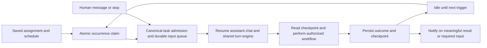

# Persistent scheduled assistants review

Alpha can support persistent assistants while VS Code and the assigned workspace are open. The recommended first version extends the existing scheduler with a continuing chat, durable workflow checkpoints, and useful results. Each invocation finishes normally and waits for its next trigger. Persistence belongs to the assistant's assignment and saved state; it does not require keeping a model turn running between triggers.

This is a design proposal based on code inspection. Runtime changes have not been implemented in this review. Existing uncommitted communication, lifecycle, and UI work was preserved.

## Scope and reference evidence

The user selected **running while VS Code is open**. A separate service for running when VS Code is closed, incoming service events, and coordination across multiple computers are outside the first version.

Local base: `main`, `40803ed6d5f487950b35824fea30e6e2d1a325ee`, with substantial uncommitted work. Findings describe the current local code, including that work; they do not establish shipped behavior.

Codex CLI reference: [`408f48ce0c87827dd556953a9d413323a139e38c`](https://github.com/openai/codex/tree/408f48ce0c87827dd556953a9d413323a139e38c), retrieved **2026-10-01 03:37:19 UTC**, September 30 in the user's time zone. Relevant upstream source and existing tests were read before forming the proposal:

- [`exec/src/lib.rs`](https://github.com/openai/codex/blob/408f48ce0c87827dd556953a9d413323a139e38c/codex-rs/exec/src/lib.rs#L992) resumes through the existing app-server thread lifecycle. [`exec_resume_by_id_appends_to_existing_file`](https://github.com/openai/codex/blob/408f48ce0c87827dd556953a9d413323a139e38c/codex-rs/exec/tests/suite/resume.rs#L706) asserts that resumed input retains the session and transcript.
- [`history/src/heartbeat.rs`](https://github.com/openai/codex/blob/408f48ce0c87827dd556953a9d413323a139e38c/codex-rs/history/src/heartbeat.rs) recognizes scheduled input through host-issued origin metadata. Ordinary text does not acquire that origin by resembling a heartbeat. Its [tests](https://github.com/openai/codex/blob/408f48ce0c87827dd556953a9d413323a139e38c/codex-rs/history/src/heartbeat_tests.rs) preserve exact saved instructions and reject unfamiliar representations.
- [`guardian_heartbeat_authorization.rs`](https://github.com/openai/codex/blob/408f48ce0c87827dd556953a9d413323a139e38c/codex-rs/core/tests/suite/guardian_heartbeat_authorization.rs) checks trusted skill references across repeated scheduled turns and subsequent human input. This supports keeping wake provenance distinct from a new human authorization; it is not proof of every app permission behavior.
- [`exec/tests/suite/approval_policy.rs`](https://github.com/openai/codex/blob/408f48ce0c87827dd556953a9d413323a139e38c/codex-rs/exec/tests/suite/approval_policy.rs) checks host-configured approval behavior. Alpha retains its own execution and security protections.

Official [scheduled-task documentation](https://learn.chatgpt.com/docs/automations), retrieved September 30 locally, distinguishes standalone runs from schedules that return to an existing chat. Local execution requires the computer and desktop app to remain available. Codex CLI has no Scheduled management interface. Alpha's schedule editor is therefore an intentional product capability, while its task execution should follow the shared Codex-aligned harness.

Official [Dots documentation](https://learn.chatgpt.com/docs/dots/tasks-and-memory) describes continuing responsibilities, saved notes, notifications for relevant changes, and separate controls for stopping current work and canceling a schedule. These inform UX recommendations here. No claim about Grok Bot's implementation was verified.

## What Alpha already provides

| Surface            | Verified current behavior                                                                                                                                                                                                       | Implication                                                                                   |
| ------------------ | ------------------------------------------------------------------------------------------------------------------------------------------------------------------------------------------------------------------------------- | --------------------------------------------------------------------------------------------- |
| Saved assignment   | [`ScheduledTask` and `ScheduledTaskRun`](../packages/types/src/scheduled-task.ts) persist cadence, workspace, prompt or execution choice, saved profile reference, reasoning preference, approval mode, and occurrence records. | Most setup controls already exist.                                                            |
| Shared execution   | [`startRun`](../src/services/scheduled-tasks/ScheduledTaskService.ts#L468) creates a background `Task` through `AlphaProvider`, captures effective reasoning, and starts the normal runtime.                                    | Keep this execution path.                                                                     |
| Workflow selection | [`buildPrompt`](../src/services/scheduled-tasks/ScheduledTaskService.ts#L704) resolves a named skill, including path identity and arguments. Plugin execution adds descriptive text to the prompt.                              | A selected plugin name does not establish an authenticated connection.                        |
| Ownership          | [`ScheduledTaskStore`](../src/services/scheduled-tasks/ScheduledTaskStore.ts) uses atomic claims, owner leases, and workspace filtering.                                                                                        | Reuse these mechanisms across windows.                                                        |
| Continuation       | The scheduler creates a fresh task for every model run. Alpha's ordinary task layer already supports completed-task follow-up and durable queued input.                                                                         | Persistent assistants need a scheduler adapter to existing continuation, not another runtime. |
| Reload             | [`recoverInterruptedRuns`](../src/services/scheduled-tasks/ScheduledTaskService.ts#L797) fails orphaned active occurrences; missed occurrences are skipped.                                                                     | Definitions survive, but workflow recovery needs an explicit policy.                          |

Profile identity and reasoning preference are captured when queued. The full saved profile is resolved at admission, and effective reasoning is then recorded. Do not describe this as freezing every model setting at queue time.

Existing scheduler profile, approval, and store tests were read. They cover explicit model selection, captured settings, workspace ownership, reload, and atomic occurrence claims. They were not executed during this review.

## Findings that matter for unattended work

These are static findings, not claims from a live reproduction.

| Priority               | Finding and evidence                                                                                                                                                                                                                                                                                                                                                                                                                 | Required direction                                                                                                                                       |
| ---------------------- | ------------------------------------------------------------------------------------------------------------------------------------------------------------------------------------------------------------------------------------------------------------------------------------------------------------------------------------------------------------------------------------------------------------------------------------ | -------------------------------------------------------------------------------------------------------------------------------------------------------- |
| P1                     | `startRun` awaits [`notifyBeforeRun`](../src/services/scheduled-tasks/ScheduledTaskService.ts#L861) before creating a task or starting a command. The notification awaits selection or dismissal, according to the official [VS Code 1.122.1 API declaration](https://github.com/microsoft/vscode/blob/1.122.1/src/vscode-dts/vscode.d.ts). Work and later queue admission can wait on the popup although the popup says it started. | Dispatch informational notifications independently of launch; retain disposal and error ownership.                                                       |
| P1                     | [`initialize`](../src/services/scheduled-tasks/ScheduledTaskService.ts#L140) subscribes to completion and abortion, not the canonical model-task waiting state. Command approvals explicitly project `waiting_for_approval`, while model-task approval needs are not projected by this service.                                                                                                                                      | Project canonical needs-attention state for all scheduled task paths. This is a scheduler visibility gap, not proof that task approvals themselves fail. |
| P1 for the enhancement | A fresh task per wake has no automatic continuity. Initial scheduled input reaches the ordinary [`human` origin](../src/core/task/Task.ts#L9119); persisted API input origins currently distinguish human and agent only.                                                                                                                                                                                                            | Add typed, host-issued scheduled provenance and reuse the task continuation queue. A wake must not become a new human grant.                             |
| P2                     | [`handleTaskCompleted`](../src/services/scheduled-tasks/ScheduledTaskService.ts#L764) stores a generic summary. Abortion maps to failure. The [run history](../webview-ui/src/components/scheduled-tasks/ScheduledTasksView.tsx#L1002) prints the Alpha task ID without a chat action.                                                                                                                                               | Show actual outcome, distinguish cancellation, and open the relevant chat or pending request.                                                            |
| P2 for the enhancement | An active prior occurrence causes `already_running` skips. Orphans fail after reload; there is no explicit checkpoint or external-effect reconciliation contract.                                                                                                                                                                                                                                                                    | Define one bounded pending wake, recovery, and processed-item tracking for persistent mode.                                                              |

The persisted `permissions` object is not an independently enforced integration permission system. Current model launch passes the saved approval mode into the normal task policy. Configure authority through that policy and existing tool/connection mechanisms. A prompt saying “full permission” or a model choice cannot authenticate an account or replace those boundaries.

## Proposed execution and UX contract

Retain existing independent schedules as the backward-compatible default. Add a **Continue this chat** choice for a persistent assistant. Its definition owns a stable chat ID; each occurrence still owns a distinct run ID and is correlated with the accepted canonical turn. Extend shared schemas with optional fields rather than reinterpret old records.

The scheduler determines when to submit work. Existing kernel sequencing, approvals, cancellation, completion, persistence, and session adapters determine how it executes. Historical chat hydration must support background admission; opening a foreground chat is not a substitute for that operation.

For the first persistent mode, allow one active invocation per assistant chat and at most one pending scheduled wake. Coalesce additional ticks with recorded receipts. Human input, scope changes, and stop requests take priority; a stop invalidates pending wakes rather than allowing an old occurrence to restart work. A conversational request to stop monitoring disables the assignment's schedule. The **Stop current run** button leaves future scheduling enabled and says so. A waiting approval remains visible and does not accumulate repeated reminders or tool attempts.

A skill defines the assignment, sources, allowed actions, completion criteria, and reporting conditions. Store a small, versioned workflow checkpoint through existing task persistence: processed source IDs or cursors, pending work, and relevant result references. Keep secrets in existing credential storage. Conversation context helps reasoning; it is not sufficient evidence that an email was sent or a website update was applied.

Track durable effect receipts where the owning tool and remote service support them. Reconcile uncertain external actions after interruption. Do not promise exactly-once delivery to a service that lacks an idempotency or reconciliation mechanism, and do not blindly repeat a send after a timeout.

The assistant card should show assignment, connection readiness, next wake, latest useful outcome, effective model/reasoning, and an **Open chat** action. Distinguish **Pause schedule** from **Stop current run**. Show approval requests and expired authentication as actionable attention states. Record quiet runs in history; notify by default only for meaningful changes, failures, or a decision. Add a test-run action before enabling unattended recurrence.

For an email workflow, a wake reads the checkpoint, checks new messages, performs the configured actions, records processed IDs and delivery receipts, reports any useful result, and finishes. The user can steer the same chat between runs. Connection preflight must verify available tools and authentication; browser login persistence has not been established by this review.

## Bounded implementation sequence

1. **Repair unattended launch and reporting.** Remove the popup dependency from admission, project canonical waiting/cancellation states, and add direct chat navigation and useful result summaries. Keep independent scheduling behavior intact.
2. **Add persistent chat scheduling.** Extend existing shared schemas with continuation identity, scheduled input provenance, and occurrence-to-turn correlation. Implement background hydrate/resume through `AlphaProvider` and the existing queue and task persistence. Handle missing or deleted chats explicitly.
3. **Add workflow continuity and recovery.** Persist bounded checkpoints and effect receipts, coalesce overlapping wakes, and reconcile interruption. Preserve legacy skip/fail behavior unless persistent mode explicitly selects recovery. Initially offer skipping missed occurrences or one catch-up run, never an unbounded replay backlog.
4. **Complete assistant setup and controls.** Reuse saved profile/reasoning and skill selectors. Add connection readiness, outcome-based notifications, run limits, pause/stop distinctions, and an assistant chat link. Explain unavailable workspace or authentication directly.

No second engine, bot registry, always-running model loop, copied Codex prompt, Rust component, or external worker is needed. Time zones and daylight-saving semantics should be verified before promising calendar schedules: the current schedule calculator uses elapsed intervals for several recurrence forms despite storing a time-zone field.

## Validation required during implementation

Use existing scheduler, task persistence, queue, lifecycle, and UI suites. Add controlled regressions for the new contracts:

- An unresolved informational popup cannot prevent work from starting or admit a false running state.
- Multiple windows claim an occurrence once; repeated ticks during an active or waiting turn create at most one follow-up wake.
- A continuing chat retains its identity and context after reload without stealing foreground focus. Standalone schedules still create separate chats.
- Human scope changes and stops revoke queued scheduled work; changing the model never widens permission. Missing profiles, skills, accounts, workspaces, or chats produce actionable outcomes.
- Approval, failure, cancellation, and completion project once with the correct run and turn IDs. Opening a notification reaches the right chat or request.
- Interruption before, during, and after an external action reconciles checkpoints and receipts without assuming that a timeout means the action never happened.
- Quiet runs remain inspectable; meaningful changes and attention requests notify once. Pause affects future scheduling; stop cancels active work and pending wakes.
- Missed-run handling, time zones, daylight saving, run limits, and history retention remain bounded and deterministic.

Run focused extension and webview tests and their type checks, followed by `pnpm --filter @alpha-code/vscode-e2e test:smoke:1221` for lifecycle, reload, and webview changes. Run managed-agent certification only if implementation changes that contract. This design review ran no tests, build gates, VS Code automation, scheduled jobs, or external workflow actions.
