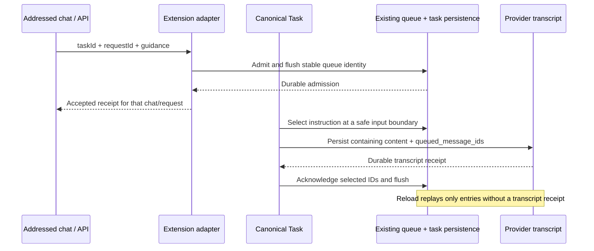

# Subagent and independent chat fixes

Implementation record for the September 30, 2026 review. The user subsequently authorized implementation and tests;
the investigation-only restrictions in `subagent-thread-ux-review-2026-09-30.md` describe that earlier review phase.

The active checkout remains `main`, based on `40803ed6d5f487950b35824fea30e6e2d1a325ee`. The preserved AlphaNet
prototype and original user edits remain in `F:/roo-fork/Alpha-Code-alphanet-preserved-20260930`. None of this change
imports that prototype or creates another task runtime. No commit, branch switch, stash, release, or installation into
the user's normal editor is part of this implementation.

## Reference and ownership

The current Codex CLI upstream commit retrieved for implementation is
[`6996cde697b228fbf5695ce855b2498c5c668795`](https://github.com/openai/codex/commit/6996cde697b228fbf5695ce855b2498c5c668795),
retrieved September 30, 2026. Its three-commit delta from the review's `67727e7cf114cf3e1b71db368d74b24e32f6cb12`
does not change the inspected multi-agent control source and tests. Queue-only passive messaging, explicit follow-up
turn triggering, same-tree upward replies, and mailbox wake behavior remain the verified reference contracts.

Alpha's durable independent completion receipts extend its existing behavior. They are not a claim that Codex CLI
guarantees a durable completion outbox: upstream completion notification is best effort. Alpha preserves its tested
independent-task auto-resume choice, whereas managed messages continue to use the existing passive mailbox boundary.
Public Codex app documentation supplies UX context only; no private app implementation was assumed.

The work was split among launch/lifecycle, communication/persistence, and UX/navigation subagents, with root integration
and cross-boundary regression review. All behavior remains in the existing Task/AgentTurnEngine/ToolScheduler,
AgentControlStore, AgentMessageInbox, TaskSessionRegistry, persistence adapters, and typed webview projections.

## Implemented contracts

| Review findings | Owning change                                                                                                                                                                                                                                                                   |
| --------------- | ------------------------------------------------------------------------------------------------------------------------------------------------------------------------------------------------------------------------------------------------------------------------------- |
| F01             | Persist host input provenance and exclude agent messages, hooks, summaries, truncation markers, and tool-only content from human independent-launch authorization. Legacy agent envelopes are conservatively excluded.                                                          |
| F02, F16        | Share live session ownership and reservations by extension storage within one extension host. Keep view focus local; serialize hydration/replacement and startup recovery; exclude live-owned Worker artifacts; release task ownership only after effect cleanup succeeds.      |
| F03, F06        | Permit passive replies to a parent, root, or peer in the same managed tree. Keep lifecycle authority narrower. Make incoming parent mail observable to an active child wait without claiming it twice.                                                                          |
| F07, F08        | Persist stable independent completion receipts, including offline inbox delivery and reload replay. Recheck waiting state after listener registration. Retain the existing wait/result suppression contract.                                                                    |
| F09             | Resolve a terminal nested follow-up through its immediate lifecycle owner. Reject before mutation when that owner cannot be recovered safely.                                                                                                                                   |
| F04             | Render reviewable, typed approval details for independent creation, messaging, steering, stopping, and follow-up actions.                                                                                                                                                       |
| F05, F11        | Scope composer drafts, queued edits, resume/steer requests and receipts by task and request ID. Retain drafts until admission succeeds; handle background receipts without overwriting the foreground composer.                                                                 |
| F10             | Link new legacy launch/result rows by the exact child ID. Use a conservative fallback for old history only when the relationship is unambiguous.                                                                                                                                |
| F12             | Preserve current blocking attention and Worker approval forwarding when unrelated later guidance is queued. Include the task ID in attention messages.                                                                                                                          |
| F13             | Persist bounded human queues atomically in each task directory. Keep selected instructions recoverable until the containing user/tool transcript boundary durably records their IDs. Wait for storage before admitting UI input; retain input on failed handoff or persistence. |
| F14             | Separate model delivery ACK from durable human activity read cursors. Route activity navigation by recipient identity and expose pending delivery separately.                                                                                                                   |
| F15, F17 UX     | Add launching-chat navigation, clearer agent identity, accessible overflow, and an explicit action for marking displayed and earlier activity read.                                                                                                                             |

## Input durability and correlation

The main implementation entry points are
[human request provenance](F:/roo-fork/Alpha-Code/src/core/agent/requestWorkClass.ts:145),
[host session ownership](F:/roo-fork/Alpha-Code/src/core/webview/TaskSessionRegistry.ts:94),
[durable queue admission](F:/roo-fork/Alpha-Code/src/core/message-queue/MessageQueueService.ts:179),
[queue reload repair](F:/roo-fork/Alpha-Code/src/core/task-persistence/TaskMessageQueuePersistence.ts:23),
[Task admission and selection](F:/roo-fork/Alpha-Code/src/core/task/Task.ts:7773),
[transcript replacement](F:/roo-fork/Alpha-Code/src/core/task/Task.ts:2803),
[completion receipt settlement](F:/roo-fork/Alpha-Code/src/core/webview/AlphaProvider.ts:5402), and
[human activity read state](F:/roo-fork/Alpha-Code/src/core/agent/AgentControlStore.ts:2503).
UI ownership sits in the existing
[composer hook](F:/roo-fork/Alpha-Code/webview-ui/src/components/chat/hooks/useTaskComposer.ts:34),
[approval detail renderer](F:/roo-fork/Alpha-Code/webview-ui/src/components/chat/ToolApprovalDetails.tsx:19), and
[managed tree](F:/roo-fork/Alpha-Code/webview-ui/src/components/agents/ManagedAgentTree.tsx:82).

Human queues have a maximum of 100 retained pending/selected entries and 32 MiB of serialized content, including images.
Capacity failures leave existing accepted input intact. A submission request ID can be reused as its queue identity,
preventing duplicate pending admissions on retry. A selected entry is not deleted merely because an interrupt was
issued. The actual containing transcript boundary records `queued_message_ids`; reload filters those receipts before
replaying pending input. A failed queue cleanup after transcript commit therefore cannot cause the same accepted input
to be delivered again. Environment-only refreshes and unrelated user messages must not acknowledge another instruction.

Queue admission, selection, transcript commit, and UI receipt are distinct stages. The UI reports accepted admission;
it does not claim that the model has consumed the message. Managed mailbox ACK remains a separate runtime receipt, and
human activity read state never modifies claims or delivery ownership. The read action advances a durable cursor through the displayed update, including earlier omitted history; later arrivals remain unread.

The optional history provenance, completion receipt, queued input receipt, child-link and human-read fields keep old
saved tasks readable. Existing independent-task and managed-tree authorization boundaries are preserved.

Independent completion delivery is serialized by the existing host session registry, even when different views have
different history caches. A waiting parent's saved successful `wait_task` result, paired with the exact tool call and
child ID, proves consumption. Merely resolving an in-memory wait does not. Transcript replacement settles those wait
receipts through a write-only fence before it can remove their evidence. Storage failures retain the original history;
interrupted waits recover through the existing inbox with the same completion identity.

Queue emptiness continues to mean that no pending entry can be drained. A separate unconsumed-input barrier also counts
selected entries so completion cannot race ahead of their containing transcript receipt. Admission and edits stay
unavailable for selection until persistence succeeds; failed mutations restore their prior state. An ask accepts one
reply tied to its timestamp. Guidance whose selected ask changes returns to the queue instead of answering a later ask.

When nonempty history contains no trustworthy human request, independent launch authority is conservative: the initial
metadata objective cannot restore a permission that a later human may have revoked before compaction. Empty legacy
history still supports its saved initial objective. Queue reload also durably removes consumed entries before returning,
so subsequent compaction cannot erase the only consumption receipt while leaving a stale queue snapshot on disk.

API guidance for an existing task enters `Task.submitUserMessage` directly in both visible and headless operation.
It therefore does not wait for a composer draft, queued edit, or another chat's transcript hydration. Runtime admission
errors propagate to the API caller. Legacy UI invokes remain bounded and show explicit backpressure when their deferred
presentation buffer is full. Public API queued deletion joins the durable queue write before returning.

## Retained audit state

The UX portion of F17 is addressed. Durable managed mailbox pruning is deliberately excluded from this bounded repair:
the existing store retains entries as event-ID idempotence, ownership, verification, and replay evidence while task
history exists. Deleting acknowledged payloads without a compatible receipt ledger would reintroduce duplicate effects
and break recovery. Root deletion still purges the tree, including the new human read cursor. A later retention change
requires a backward-compatible archived receipt/audit format and recovery tests; acknowledged does not mean disposable.

## Validation record

Validation uses Node 24.14.1, pnpm 11.24.0, and the repository's pinned dependencies. The installed fallback pnpm shim
reports a different version, so commands use the pinned Corepack CLI directly and disable implicit dependency install
before each script. A separate `install --frozen-lockfile` completed with the authoritative lockfile unchanged.

The independent-authorization regression first reproduced eight failures and then passed all 49 cases. A controlled
queue-boundary regression reproduced premature acknowledgement of unrelated instructions before the scoped fix.
Focused store, queue, persistence, routing, lifecycle, approval, composer and navigation suites pass. All commands below
were invoked through the pinned CLI, with a temporary PATH wrapper supplying that same CLI to nested pnpm scripts.

The broad gate also validates deterministic evidence names. Its parent-control wait probe now names the regression
that wakes a child's idle wait for passive parent mail while proving that the message remains unconsumed and does not
steer the child. This deliberately replaces the older unconditional-wait behavior; all other cursor, native wait receipt,
reload, and no-injection probes remain required. Plain-object legacy delegation fixtures were updated to supply the
canonical ownership and durable queue APIs while retaining their ordering, focus, and delivery assertions.

| Command / check                                             | Result                                                                                                                                                                           |
| ----------------------------------------------------------- | -------------------------------------------------------------------------------------------------------------------------------------------------------------------------------- |
| `pnpm install --frozen-lockfile`                            | Passed; no lockfile change.                                                                                                                                                      |
| `pnpm lint`                                                 | Passed: all 8 runnable affected workspace tasks.                                                                                                                                 |
| `pnpm check-types`                                          | Passed: all 9 runnable affected workspace tasks.                                                                                                                                 |
| Changed-file Prettier checks and `git diff --check`         | Passed.                                                                                                                                                                          |
| `pnpm certify:managed-agents:self-check`                    | Passed: matrix/documentation alignment, evidence confinement, and strict debt checks.                                                                                            |
| `pnpm certify:managed-agents:automated`                     | Passed: **2,618 tests, 26 deterministic requirements, zero failures/skips/todos**; then the nested Worker Apply/discard/verification/navigation scenario on VS Code **1.122.1**. |
| `pnpm --filter @alpha-code/vscode-e2e test:smoke:1221`      | Passed: **34 tests across 12 real host suites**, including approvals, native tools, nonblocking questions, compaction/reload, and VS Code LM cancellation/recovery.              |
| `pnpm --filter @alpha-code/vscode-e2e test:cross-task:1221` | Passed: **2 real host cases** covering tool-driven independent creation/list/stop/wait/persistence and completion-triggered parent resumption.                                   |
| `pnpm --filter @alpha-code/vscode-e2e test:core:1221:run`   | Passed: 3 small-answer cases, completion-idle/same-task follow-up, and the nested managed scenario.                                                                              |
| Extension bundle and production webview build               | Passed through the host gate scripts.                                                                                                                                            |

Additional focused runs cover the new queue adapter, transactional admission/edit failures, API routing, authorization,
two-provider ownership, completion replay, transcript receipt correlation, and composer/navigation behavior. The final
Task/ask/receipt/completion cohort passed 371 tests; the final provider/lifecycle/history-store cohort passed 374 tests
with 6 existing standalone provider skips. The strict certification cohort above contains no skips. Counts overlap and
are not summed into a larger coverage claim.

Deterministic evidence is saved in
[`artifacts/certification/managed-agent-milestone-evidence.json`](../artifacts/certification/managed-agent-milestone-evidence.json).
Its source snapshot stayed stable during certification, based on `40803ed6d5f487950b35824fea30e6e2d1a325ee`, with
source-state SHA-256 `bdc6a9a08f7c0f918fb4eba46f558a3b572b2f6006a333d91062ea4bda2d726a`.
Only Markdown review and implementation records were edited afterward; runtime and test source remained frozen.

The initial sandboxed certification preflight could not create its temporary workspace. The same authorized gate was
rerun outside that sandbox and passed. Older delegation fixture APIs and the obsolete evidence-name probe were repaired
without relaxing the deterministic requirements. There is no unresolved failure in the completed commands above.

All real host runs used isolated scripted fixtures on the verified exact version **1.122.1**. They do not establish
billable live-provider budget/timeout behavior, cross-process multi-window crash recovery, or every live webview timing
scenario. The matrix still truthfully records its 8 predeclared integration rows as pending; those require their separate
live playbooks and instrumentation. The original review's later-validation scenarios remain available for that work.
Managed mailbox audit retention remains the bounded follow-up described above. Unsent composer drafts survive navigation
within a webview; full webview reload guarantees apply to admitted runtime queues, not unsent presentation-only text.

Final preservation checks verified all **56** recorded prototype paths, including the intentionally deleted audio file,
against their original SHA-256/deletion state. No AlphaNet references were found in active extension/types/webview source
or rebuilt runtime assets. Changes remain uncommitted on `main`; the preserved prototype checkout was not modified.
