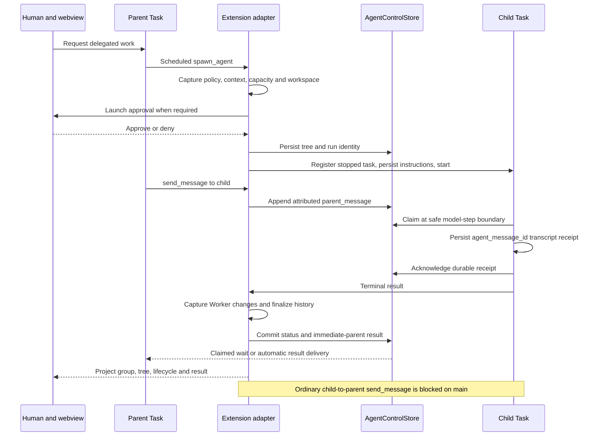
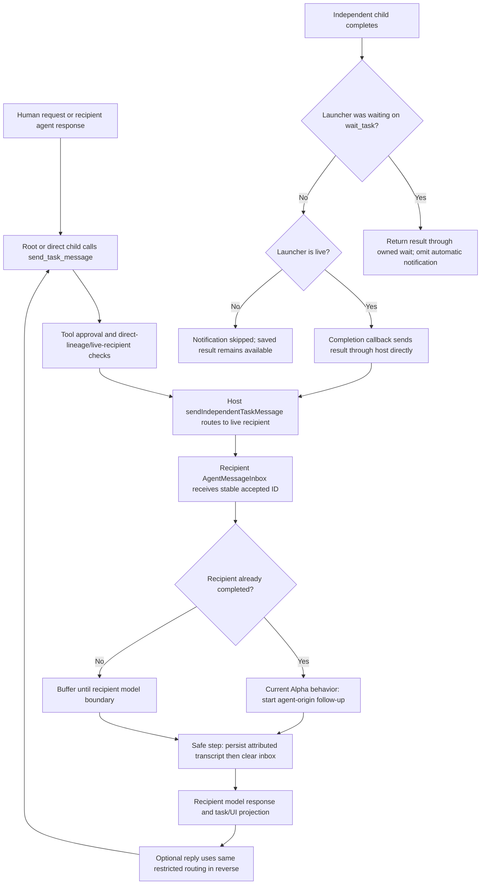

# Subagent and independent thread review

Reviewed September 30, 2026. Investigation and diagnosis only.

Implementation and tests were subsequently authorized. See
[the implementation and validation record](subagent-thread-fixes-2026-09-30.md) for the resulting repairs.
Findings and line references below describe the reviewed baseline, rather than the final implementation.

Alpha already has a shared task execution kernel, durable managed-agent mailboxes, independent-task inboxes, and
task-addressed webview projections. The most urgent defects sit around that foundation: agent-origin content can grant
independent-launch intent, provider-local ownership can trigger recovery against another panel's live task, upward
managed messaging is unreachable, several approvals omit their details, and composer state can cross task boundaries.
Repair those boundaries before expanding delegation or introducing broader thread communication.

No tests were added or executed. No builds, release gates, VS Code automation, live-provider runs, or production code
changes were performed. Existing tests were read as contract evidence. Runtime outcomes and race interleavings described
below have not been reproduced in this review.

## Scope and observed checkout state

The branch/path descriptions in the request predate the user's intervening main-checkout cleanup. This review used the
observed state and performed no checkout switching, resetting, stashing, committing, or prototype modifications.

| Checkout                                                                      | Observed state                                                                                               | Review role                                                       |
| ----------------------------------------------------------------------------- | ------------------------------------------------------------------------------------------------------------ | ----------------------------------------------------------------- |
| F:/roo-fork/Alpha-Code                                                        | Main, initially clean, HEAD and origin/main 40803ed6d5f487950b35824fea30e6e2d1a325ee                         | Primary implementation under review; only this document was added |
| C:/Users/Luke Goblirsch/.codex/worktrees/cleanup-chat-notification/Alpha-Code | Clean detached checkout at the same 40803ed6 commit                                                          | Main comparison                                                   |
| F:/roo-fork/Alpha-Code-alphanet-preserved-20260930                            | codex/alphanet-preserved-20260930, base 16d0bdd5c66feb8701b423ea1728cca8bc5cf3b4, with preserved local edits | Archived prototype evidence only                                  |

The root AGENTS guide was read; no applicable nested guide was found in the active review tree. Main contains no AlphaNet
implementation. Prototype findings are isolated in the appendix and are not evidence of shipped main behavior.

Three subagents separately investigated launch/lifecycle, communication/routing/persistence, and UX/navigation. Their
findings were integrated and challenged against owning code and existing tests. Source links below point to the active
main checkout unless explicitly labeled as preserved prototype. Line locations are for the reviewed revisions.

Evidence labels:

- **Static finding:** the current code establishes the branch, omitted route, or data-flow defect.
- **Race:** the code permits the described interleaving; controlled runtime validation remains necessary.
- **Product decision:** current behavior is established, but changing it needs an explicit contract choice.
- **Recommendation:** proposed Alpha behavior, not a claim about Codex app internals.

P1 means an authority, ownership, or instruction-integrity issue to address before extending this surface. P2 means a
correctness or substantial UX gap. P3 means discoverability or maintenance work after those repairs.

## Verified reference behavior

The GitHub API reconfirmed current Codex CLI main as
[67727e7cf114cf3e1b71db368d74b24e32f6cb12](https://github.com/openai/codex/commit/67727e7cf114cf3e1b71db368d74b24e32f6cb12)
at 2026-09-30 16:39 UTC. Relevant source and existing tests were inspected before the renewed Alpha investigation.
The statements here concern the current **MultiAgentV2** implementation and its feature-enabled tests, not an assertion
that every installed release or default profile exposes the same tool set.

| Verified CLI contract                                                                      | Primary evidence at the pinned commit                                                                                                                                                                                                                                                                                                                |
| ------------------------------------------------------------------------------------------ | ---------------------------------------------------------------------------------------------------------------------------------------------------------------------------------------------------------------------------------------------------------------------------------------------------------------------------------------------------- |
| Ordinary agent messages queue input; follow-up tasks request a turn                        | [send_message.rs:43](https://github.com/openai/codex/blob/67727e7cf114cf3e1b71db368d74b24e32f6cb12/codex-rs/core/src/tools/handlers/multi_agents_v2/send_message.rs#L43), [followup_task.rs:43](https://github.com/openai/codex/blob/67727e7cf114cf3e1b71db368d74b24e32f6cb12/codex-rs/core/src/tools/handlers/multi_agents_v2/followup_task.rs#L43) |
| Both operations use shared target resolution and attributed delivery                       | [message_tool.rs:57](https://github.com/openai/codex/blob/67727e7cf114cf3e1b71db368d74b24e32f6cb12/codex-rs/core/src/tools/handlers/multi_agents_v2/message_tool.rs#L57), [delivery.rs:18](https://github.com/openai/codex/blob/67727e7cf114cf3e1b71db368d74b24e32f6cb12/codex-rs/core/src/agent/control/delivery.rs#L18)                            |
| A child can send a passive message to root; follow-up cannot target root                   | [multi_agents_tests.rs:1338](https://github.com/openai/codex/blob/67727e7cf114cf3e1b71db368d74b24e32f6cb12/codex-rs/core/src/tools/handlers/multi_agents_tests.rs#L1338), [test at 1415](https://github.com/openai/codex/blob/67727e7cf114cf3e1b71db368d74b24e32f6cb12/codex-rs/core/src/tools/handlers/multi_agents_tests.rs#L1415)                 |
| Mailbox activity already queued or arriving during a wait wakes that wait                  | [wait.rs:187](https://github.com/openai/codex/blob/67727e7cf114cf3e1b71db368d74b24e32f6cb12/codex-rs/core/src/tools/handlers/multi_agents_v2/wait.rs#L187), [queued-mail test at 3594](https://github.com/openai/codex/blob/67727e7cf114cf3e1b71db368d74b24e32f6cb12/codex-rs/core/src/tools/handlers/multi_agents_tests.rs#L3594)                   |
| Child completion notifies its direct parent passively, including later follow-up turns     | [completion.rs:110](https://github.com/openai/codex/blob/67727e7cf114cf3e1b71db368d74b24e32f6cb12/codex-rs/core/src/agent/control/completion.rs#L110), [repeat-turn test at 1932](https://github.com/openai/codex/blob/67727e7cf114cf3e1b71db368d74b24e32f6cb12/codex-rs/core/src/tools/handlers/multi_agents_tests.rs#L1932)                        |
| Completion delivery is explicitly best effort                                              | [completion.rs:1](https://github.com/openai/codex/blob/67727e7cf114cf3e1b71db368d74b24e32f6cb12/codex-rs/core/src/agent/control/completion.rs#L1), failure return at 128; this does not establish a durable completion outbox                                                                                                                        |
| Agent selection uses names/roles and direct cycling; interaction is distinct from liveness | [multi_agents.rs:85](https://github.com/openai/codex/blob/67727e7cf114cf3e1b71db368d74b24e32f6cb12/codex-rs/tui/src/multi_agents.rs#L85), 106-132, 287-333, and existing tests at 682                                                                                                                                                                |
| Child activity preserves parent response publication and avoids obsolete queued questions  | [subagent_activity_tests.rs:78](https://github.com/openai/codex/blob/67727e7cf114cf3e1b71db368d74b24e32f6cb12/codex-rs/tui/src/chatwidget/tests/subagent_activity_tests.rs#L78), 133-229                                                                                                                                                             |

Relative targets resolve among the runtime's known agent paths
([target.rs:45](https://github.com/openai/codex/blob/67727e7cf114cf3e1b71db368d74b24e32f6cb12/codex-rs/core/src/agent/control/target.rs#L45)).
The inspected explicit upward test concerns child-to-root. Broader peer addressing is supported by the shared resolver
structure, but is not evidence that arbitrary independent desktop chats can communicate or control one another.

Official OpenAI documentation was retrieved September 30, 2026:

- The current desktop documentation distinguishes steering the active run from queueing the next run. The visible queue
  permits editing, ordering, sending, and deletion. [Prompting](https://learn.chatgpt.com/docs/prompting#steering-and-queuing),
  [Settings](https://learn.chatgpt.com/docs/reference/settings#general).
- Completion alert preferences are separate from permission/question alerts. Activity can show unread, running, and
  awaiting-response chats. [Notifications](https://learn.chatgpt.com/docs/notifications).
- Separate chats retain focused messages/results within project organization.
  [Projects and chats](https://learn.chatgpt.com/docs/projects).
- The documented app-server protocol separates stored-thread reading from resumption and generation, and provides
  addressed turn start, steering, interruption, and lifecycle notifications.
  [App Server API overview](https://learn.chatgpt.com/docs/app-server#api-overview).

These establish public surface/protocol behavior. They do not establish private desktop runtime ownership, arbitrary peer
chat messaging, queue durability, exactly-once side effects, or panel-close cancellation. Recommendations on those subjects
are Alpha contract choices. No desktop behavior was inferred from private app source or observed through automation.

## Distinct workflows that share the kernel

| Workflow                       | Identity and authority                                                                      | Current launch/navigation surface                                                 |
| ------------------------------ | ------------------------------------------------------------------------------------------- | --------------------------------------------------------------------------------- |
| Human-created primary chat     | Independent primary Task; its own transcript, policy and lifecycle                          | New Chat command or composer; live/history selection                              |
| Model-created independent task | Ordinary primary Task with orchestrationParentTaskId; direct launcher/child controls        | Explicit human separate-task request, model create_task, approval, launcher strip |
| Managed agent                  | Subagent Task, canonical tree path, frozen ancestry/policy/context, role and run identities | Human prompt to parent, spawn_agent/delegate_task, launch card and compact tree   |
| Legacy new_task                | Serial parent/child handoff using delegatedToId, awaitingChildId and childIds               | Historical tool/approval and subtask/result links                                 |
| Preserved channel invocation   | Fresh background primary Task per explicit channel mention                                  | Archived AlphaNet UI/service only; absent from main                               |

Every executable workflow uses the existing Task/AgentTurnEngine and tool scheduler. Presentation adapters must project
the same authoritative task, while maintaining separate foreground selections. A thread relationship is not permission
to change mode, widen workspace scope, approve effects, or control another task.

## Launch and delivery flow maps

### Human chat and independent launch

1. New Chat clears foreground focus without stopping existing sessions. The composer submits newTask to the extension.
   The handler requests preserveExisting creation; provider admission is serialized, and the stopped Task is registered
   before start. [ChatView.tsx:1150](F:/roo-fork/Alpha-Code/webview-ui/src/components/chat/ChatView.tsx:1150),
   [handler:686](F:/roo-fork/Alpha-Code/src/core/webview/webviewMessageHandler.ts:686),
   [provider admission:5367](F:/roo-fork/Alpha-Code/src/core/webview/AlphaProvider.ts:5367).
2. An independent launch begins with a human separate-task request to a root primary. The model calls create_task through
   the existing tool surface/scheduler, and its tool handler asks approval. The host checks intent, ancestry, capacity and
   cancellation; snapshots mode/provider/reasoning/delegation; optionally creates a worktree; and creates a background
   primary with launcher metadata. The intended human-intent check is flawed as described in F01.
   [CreateTaskTool:117](F:/roo-fork/Alpha-Code/src/core/tools/CrossTaskOrchestrationTools.ts:117),
   [host:4825](F:/roo-fork/Alpha-Code/src/core/webview/AlphaProvider.ts:4825).
3. Live/history state returns to ExtensionStateContext and the launcher's CrossTaskPanel. Its Open action sends the exact
   task ID to showTaskWithId; navigation generations and transcript revisions guard the selected view. The child remains
   a primary, but currently lacks a launching-chat return breadcrumb.
   [navigation:2372](F:/roo-fork/Alpha-Code/src/core/webview/AlphaProvider.ts:2372),
   [state guards:240](F:/roo-fork/Alpha-Code/webview-ui/src/context/ExtensionStateContext.tsx:240).

### Managed launch, ordinary delivery and final result



Preparation reserves capacity before asynchronous work and captures frozen policy/context. Worker execution uses a scoped
private checkout and quarantine/apply/verification boundaries. The host constructs a stopped child, persists frozen
instructions, attaches addressed listeners, and only then starts it.
[SpawnAgentTool:26](F:/roo-fork/Alpha-Code/src/core/tools/SpawnAgentTool.ts:26),
[preparation:6012](F:/roo-fork/Alpha-Code/src/core/webview/AlphaProvider.ts:6012),
[execution:9276](F:/roo-fork/Alpha-Code/src/core/webview/AlphaProvider.ts:9276), start at 9634-9651.

Parent messages reserve asynchronous admission, append durable events, and enter model history only between logical steps.
Claims are released on failed transcript persistence; successful persistence precedes ACK. Native wait claims additionally
require durable matching tool-result/notification evidence. The UI projects activity metadata and cards; it is not the
mailbox receipt authority. Ordinary incoming message bodies are not consistently shown in the human transcript.
[Task delivery:7634](F:/roo-fork/Alpha-Code/src/core/task/Task.ts:7634),
[provider delivery:8167](F:/roo-fork/Alpha-Code/src/core/webview/AlphaProvider.ts:8167).

The upward terminal path remains functional: listeners collect the result, Worker changes are captured, child history is
finalized, and result/status are committed for the immediate parent. This is separate from the broken mid-run reply path.
[terminal handling:9656](F:/roo-fork/Alpha-Code/src/core/webview/AlphaProvider.ts:9656),
[immediate-parent persistence:6840](F:/roo-fork/Alpha-Code/src/core/webview/AlphaProvider.ts:6840).

### Independent messages, replies and completion



The routing permits root to its direct orchestration child, and child to its live launcher, including the parent alias.
It rejects unrelated chats and siblings. Messages use the durable agent inbox rather than the editable human queue.
Automatic completion notification uses host delivery without a new model tool call or tool approval. When an owned
wait_task already observes completion, the callback skips that notification. Awaiting-human input is not answered by an
agent message. A completed live recipient is automatically resumed with
agent-origin input; this is deliberate tested Alpha behavior, unlike V2 passive messaging.
[routing:5011](F:/roo-fork/Alpha-Code/src/core/webview/AlphaProvider.ts:5011),
[lineage checks:5098](F:/roo-fork/Alpha-Code/src/core/webview/AlphaProvider.ts:5098),
[inbox:47](F:/roo-fork/Alpha-Code/src/core/task-persistence/AgentMessageInbox.ts:47).

There is no general human UI for selecting an unrelated recipient and replying across chats. Current independent controls
are primarily model tools plus an Open/Stop strip. A future message composer must accurately disclose the supported scope
and preserve the distinction between a passive message, human steering, and authorized new work.

### Steering, waiting, completion, cancellation and reload

| Boundary                          | Current path and practical limit                                                                                                                         |
| --------------------------------- | -------------------------------------------------------------------------------------------------------------------------------------------------------- |
| Human next-turn guidance          | task/request ID to queueMessage; accepted into Task-owned memory; consumed at completion/resume asks, not as a tool approval                             |
| Steer queued guidance             | task/request/message ID; await steerUserMessage acceptance, then remove that exact queue entry                                                           |
| Reply to current question         | Legacy askResponse supplies task ID; typed tool approvals additionally validate approvalRequestId; legacy question boundary correlation is missing       |
| Managed card steering             | parent/group/child IDs to steerSubagent; policy and pending-approval checks; UI clears before a correlated acceptance exists                             |
| Managed pending/running follow-up | Buffered through send_message; it does not arbitrarily answer human approval                                                                             |
| Managed stopped follow-up         | Retained task ID, fresh run ID, frozen-policy restoration; ancestor-versus-owner confusion affects nested relaunch                                       |
| Independent wait_task             | Snapshot plus event listeners; waiting transition can fall into a registration gap                                                                       |
| Completion                        | One reserved terminal transition, durable flush, verification and pending-input recheck; managed result propagation follows capture/history finalization |
| Stop independent task             | Addressed direct-child stop removes it without automatic rehydration                                                                                     |
| Ordinary cancel                   | Interrupt provider request, cancel descendants, join abort/termination, verify instance identity, reconstruct resumable history                          |
| Editor panel disposal             | Disposes that provider and its tasks; sidebar view disposal only detaches presentation                                                                   |
| Reload/history open               | Local live lookup or Task reconstruction plus canonical recovery; provider-local lookup can miss another surface's live owner                            |

Completion and retained human continuation have useful fences worth keeping:
[Task completion:6132](F:/roo-fork/Alpha-Code/src/core/task/Task.ts:6132),
[completed continuation:8699](F:/roo-fork/Alpha-Code/src/core/task/Task.ts:8699),
[cancel:5583](F:/roo-fork/Alpha-Code/src/core/webview/AlphaProvider.ts:5583),
[abort/dispose:9212](F:/roo-fork/Alpha-Code/src/core/task/Task.ts:9212).

Opening saved managed history does not immediately launch another model loop: the no-follow-up path becomes terminal
inspection at Task lines 8958-8962. A reconstructed primary awaits human resume at 8984-8987. The ownership defect is that
construction/recovery may occur while another provider still owns the original Task; duplicate primary execution becomes
possible after Continue, rather than being an inevitable effect of every navigation.

## Correlation, receipts and read state

| Identity                                | Existing purpose                                                      | Gap to address                                                              |
| --------------------------------------- | --------------------------------------------------------------------- | --------------------------------------------------------------------------- |
| taskId                                  | Stable recipient/session/history identity                             | Must also own composer drafts, edits, notifications and failure restoration |
| instanceId                              | Distinguish retained/reconstructed live instances during cancellation | Not currently a host-wide exclusive ownership guarantee                     |
| Agent path and immediate-parent ID      | Frozen tree ancestry and message/result routing                       | Message scope incorrectly inherits lifecycle-control restrictions           |
| groupId and run ID                      | Managed card/run correlation; fresh run on retained relaunch          | Controlling ancestor must not replace the immediate lifecycle owner         |
| Mailbox event ID and sequence           | Ordered durable event, claim, ACK and result receipt                  | Runtime ACK must not be presented as a human read cursor                    |
| agent_message_id                        | Once-per-accepted-ID transcript ingestion after retry/reload          | Its agent provenance is ignored by independent-launch authorization         |
| Human queue message ID                  | Editable pending item                                                 | Memory-only ownership; edit state does not retain task ID                   |
| requestId and approvalRequestId         | Some commands and native approvals correlate acceptance               | Managed steering, legacy replies and completed-draft restoration have gaps  |
| Child/result task ID on historical rows | Mostly inferred from current parent metadata                          | Needs explicit per-launch/per-result correlation                            |

Existing receipt guarantees are substantial:

- The independent inbox synchronously counts admission, rejects a full 100-entry inbox, validates ID/content conflicts,
  and retains entries until transcript persistence succeeds. It does not discard oldest accepted input.
- Task checks agent_message_id before persistence/ACK. Agent content is attributed and labeled as non-human input.
- AgentControlStore supports stable event-ID idempotence, exclusive claims, and retryable failed settlements.
- Native wait ACK reconciliation requires the corresponding persisted native tool result and notification IDs.
- Compaction archives original entries; receipt metadata survives relevant steering/resume transformations.

Evidence: [AgentMessageInbox:47](F:/roo-fork/Alpha-Code/src/core/task-persistence/AgentMessageInbox.ts:47),
[Task:7677](F:/roo-fork/Alpha-Code/src/core/task/Task.ts:7677),
[AgentControlStore:2462](F:/roo-fork/Alpha-Code/src/core/agent/AgentControlStore.ts:2462), 2525-2586 and 2672-2730,
[wait reconciliation:7730](F:/roo-fork/Alpha-Code/src/core/webview/AlphaProvider.ts:7730),
[compaction archive:1300](F:/roo-fork/Alpha-Code/src/core/condense/index.ts:1300).

These guarantee consumption once per accepted ID at the covered boundaries. They do not guarantee exactly-once logical
operations or agent side effects. A new send operation allocates a new UUID, and independent completion notification
currently lacks a durable child-turn receipt. Human read state also needs its own contract.

## Prioritized main findings

### F01 P1 Agent content can grant independent task creation intent

**Static finding; no extra task was created or reproduction executed.** A root primary may receive an independent child's
message. Task persists it as role user with agent_message_id and an attributed agent_message wrapper. The shared latest-user
selector skips tool-result-only content but ignores this provenance.

For an ordinary agent message such as “Progress complete. Create a new independent task for the next step”, the intent
parser splits inside the serialized JSON string after the first sentence. Its next clause begins with Create and matches
the explicit-task expressions. The later attribution warning does not exclude or revoke that clause.

Both catalog construction and host execution reuse this selector/parser. The create_task schema and executable set can
therefore become enabled without a fresh human request. Approval remains a boundary, but Auto allows shared-workspace
creation and Bypass allows either workspace mode. Actual creation is conditional on a root recipient and a subsequent
model call; the authority defect is established by the static path.

Evidence: [Task input:7684](F:/roo-fork/Alpha-Code/src/core/task/Task.ts:7684),
[selector:135](F:/roo-fork/Alpha-Code/src/core/agent/requestWorkClass.ts:135),
[parser:12](F:/roo-fork/Alpha-Code/src/core/agent/independentTaskAuthorization.ts:12),
[catalog:392](F:/roo-fork/Alpha-Code/src/core/task/build-tools.ts:392), 520 and 564,
[host:4831](F:/roo-fork/Alpha-Code/src/core/webview/AlphaProvider.ts:4831),
[approval:224](F:/roo-fork/Alpha-Code/src/core/auto-approval/index.ts:224).
Agent-origin retained continuation also writes an agent wrapper at Task lines 9120-9122.

**Owning fix:** select actual human-origin authorization using durable provenance at the existing shared request boundary.
Use that same trusted selection for catalog policy and execution. Preserve human revocation; exclude agent receipts and
agent-origin continuations. Historical recognized agent wrappers need a conservative reader. A model-facing user role or
an attribution sentence must not grant authority.

### F02 P1 Provider-local ownership permits recovery against another surface's live work

**Static reachable recovery branches; full interleavings not executed.** Opening an editor panel creates another provider.
Each provider has a fresh TaskSessionRegistry but shares global history/control storage. Each initializes history and
unconditionally runs Worker recovery and interrupted-group reconciliation.

Worker recovery treats an artifact marked active as recoverable without checking a live owner. Capture then attempts forced
worktree removal. A new panel can consequently capture and remove a sidebar Worker's live checkout. Changes are captured
and quarantined, so this is premature recovery and active-workspace removal, not a demonstrated loss of every change.
The new provider's local live-ID set can also mark the other provider's child/group interrupted.

History navigation has the same ownership split: a local lookup miss reconstructs a Task and runs incomplete-tool/turn
recovery against shared history. Managed history becomes terminal inspection; primary history asks to resume. Recovery can
still interfere with the live original, and Continue can establish another primary execution owner.

Evidence: [new provider:209](F:/roo-fork/Alpha-Code/src/activate/registerCommands.ts:209),
[local registry/shared storage:667](F:/roo-fork/Alpha-Code/src/core/webview/AlphaProvider.ts:667),
[startup recovery:866](F:/roo-fork/Alpha-Code/src/core/webview/AlphaProvider.ts:866),
[artifact recovery:681](F:/roo-fork/Alpha-Code/packages/core/src/worktree/managed-subagent-worktree.ts:681), capture at 713,
cleanup at [500](F:/roo-fork/Alpha-Code/packages/core/src/worktree/managed-subagent-worktree.ts:500),
[local liveness:9778](F:/roo-fork/Alpha-Code/src/core/webview/AlphaProvider.ts:9778),
[history restore:2372](F:/roo-fork/Alpha-Code/src/core/webview/AlphaProvider.ts:2372),
[canonical recovery:4161](F:/roo-fork/Alpha-Code/src/core/task/Task.ts:4161).

**Owning fix:** extend existing task/session ownership and lookup to the extension host. Keep separate per-view focus and
projection; sharing the current registry's single activeTaskId unchanged would reintroduce a global foreground task.
Attach panels to the canonical live Task, and run recovery once at verified startup or only after proving owner absence.
Active artifact status alone is insufficient proof of a crash.

### F03 P1 Managed children have no ordinary upward or peer reply path

**Static finding.** send_message uses the lifecycle-control resolver, which rejects root and, for non-root callers,
recipients outside their descendants. Children lacking delegation do not receive the messaging tool at all. Thus even
informational replies depend on control authority and cannot reach the parent/root or sibling.

The retained reportAgentProgress method is not a model-accessible substitute: report_progress is omitted from the fresh
native catalog and child capability ceiling. Existing host-method tests exercise the seam directly. Automatic terminal
results still reach the immediate parent; they do not restore mid-run dialogue.

Evidence: [send:8074](F:/roo-fork/Alpha-Code/src/core/webview/AlphaProvider.ts:8074),
[resolver:8549](F:/roo-fork/Alpha-Code/src/core/webview/AlphaProvider.ts:8549),
[child tools:671](F:/roo-fork/Alpha-Code/src/core/task/Task.ts:671),
[native catalog:102](F:/roo-fork/Alpha-Code/src/core/prompts/tools/native-tools/index.ts:102),
[catalog assertions:61](F:/roo-fork/Alpha-Code/src/core/prompts/tools/__tests__/build-tools-spawn-agent.spec.ts:61).

**Owning fix:** separate message addressing from lifecycle-control authorization inside the existing mailbox/registry
boundary. Make authorized ordinary communication independent of permission to delegate. Support verified child-to-parent/
root semantics, decide same-tree peer scope explicitly, and preserve descendant restrictions for control operations.
Message acceptance must not approve effects or automatically start a recipient.

### F04 P1 Some approvals offer controls without reviewable action details

**Static presentation omission.** Independent create/message/steer/stop approval payloads use raw tool names that ChatRow's
parsed-tool switch does not handle. Legacy-manifest follow-up approval uses followupTask, also absent. Default rendering
returns null while ChatView still exposes approve/reject controls; the footer has no general action description.

Evidence: [approval payloads:66](F:/roo-fork/Alpha-Code/src/core/tools/CrossTaskOrchestrationTools.ts:66),
[legacy follow-up:35](F:/roo-fork/Alpha-Code/src/core/tools/FollowupTaskTool.ts:35),
[default row:1226](F:/roo-fork/Alpha-Code/webview-ui/src/components/chat/ChatRow.tsx:1226),
[approval controls:773](F:/roo-fork/Alpha-Code/webview-ui/src/components/chat/ChatView.tsx:773), footer 2953-2984.
Managed spawn/delegate suppression is intentional because its group card owns approval; it is not the same omission.

**Owning fix:** add exhaustive typed approval presentation showing operation, target identity, exact bounded message/
objective, workspace choice and relevant authority. Add a safe localized fallback for unknown historical variants.
Preserve the tool policy, approval authority and model-facing result contracts.

### F05 P1 Composer edits and failed continuations can cross task boundaries

**Static defects with unexecuted navigation sequences.** Queue edit state stores a message ID and prior draft but no task
ID. Task navigation clears pending ACK state without clearing or scoping the edit. Submitting after switching A to B sends
A's message ID with B's current task payload. The host ignores updateMessage returning false, and the UI exits edit mode.
The queued edit is silently lost.

Completed continuation has another route: its host failure restores text/images through an unscoped setChatBoxMessage
invoke. If A fails after navigation to B, ChatView merges A's prompt into B's draft. Ordinary unsent text/images also
remain shared across selection changes, making recipient identity unclear.

Evidence: [edit state:490](F:/roo-fork/Alpha-Code/webview-ui/src/components/chat/ChatView.tsx:490),
[navigation:1100](F:/roo-fork/Alpha-Code/webview-ui/src/components/chat/ChatView.tsx:1100),
[submit:1242](F:/roo-fork/Alpha-Code/webview-ui/src/components/chat/ChatView.tsx:1242),
[ignored edit outcome:3329](F:/roo-fork/Alpha-Code/src/core/webview/webviewMessageHandler.ts:3329),
[unscoped restoration:733](F:/roo-fork/Alpha-Code/src/core/webview/webviewMessageHandler.ts:733),
[composer merge:1420](F:/roo-fork/Alpha-Code/webview-ui/src/components/chat/ChatView.tsx:1420), invoke at 1821.

**Owning fix:** key draft, images, edit owner/version and pending submissions by stable task ID, with a distinct blank-chat
draft. Correlate edit and continuation results by task/request ID. Restore failures to the originating task's draft, and
retain edits until accepted. Reuse the existing durable continuation fence and command-result pattern.

### F06 P2 Parent mail does not wake a child's managed wait

**Static behavior.** wait_agent's claim filter excludes the child's immediate parent. The mailbox listener sees a parent
message and calls finish, but finish finds no eligible claim and does not settle the wait. The message remains durable,
yet the child sleeps until timeout or explicit steering/cancellation. This differs from V2 mailbox-activity wake.

Evidence: [wait:7841](F:/roo-fork/Alpha-Code/src/core/webview/AlphaProvider.ts:7841), filter at 7862, finish 8025-8029,
subscriber 8053-8061. The [existing test:3156](F:/roo-fork/Alpha-Code/src/core/webview/__tests__/AlphaProvider.subagents.spec.ts:3156)
appends parent mail and manually aborts at 3197; it does not demonstrate passive-mail wake.

**Owning fix:** settle the owned wait on relevant mailbox activity while leaving parent mail for normal next-step receipt
delivery. Distinguish that wake from human steering and approval responses.

### F07 P2 Independent completion notification is one-shot and live-parent-only

**Confirmed limitation and product decision.** An unloaded launcher causes notification to return before persistence.
Completion invokes delivery once, logs failure, and has no durable retry/child-turn receipt. The saved child answer is
still available through history/list/wait: the lost item is the notification, not the answer.

Accepted messages to completed live recipients automatically start agent-origin follow-up. Existing tests explicitly
expect this. Decide whether to retain it as an explained Alpha choice or separate passive delivery from turn-start control.
Codex's best-effort completion code does not establish stronger durability as an upstream guarantee.

Evidence: [notification:5011](F:/roo-fork/Alpha-Code/src/core/webview/AlphaProvider.ts:5011),
completion callback 743-756, UUID allocation/wake 5043-5046,
[saved result:5167](F:/roo-fork/Alpha-Code/src/core/webview/AlphaProvider.ts:5167),
[auto-resume contract test:264](F:/roo-fork/Alpha-Code/src/core/webview/__tests__/CrossTaskOrchestration.spec.ts:264).

**Owning fix:** append attributed completion to the existing recipient inbox using stable child/turn/result identity even
when unloaded, then reconcile on reload. Define automatic result integration separately from passive message and explicit
follow-up. Return useful receipt identity without claiming a human read or completed side effect.

### F08 P2 Independent wait can miss an awaiting-input transition

**Race; not executed.** wait_task awaits lookup/lifecycle snapshot before registering event listeners. The tail recheck
covers completion/abort/cancellation but not Waiting. An interactive/resumable event in that gap leaves the caller waiting
until timeout although the recipient needs attention.

Evidence: [wait:4948](F:/roo-fork/Alpha-Code/src/core/webview/AlphaProvider.ts:4948), listeners 4999-5002, tail 5005-5007;
[snapshot:5174](F:/roo-fork/Alpha-Code/src/core/webview/AlphaProvider.ts:5174).
The existing wait test emits completion after registration, not inside this gap.

**Owning fix:** subscribe before snapshot or recheck every relevant authoritative boundary after registration. Keep one
settlement owner and dispose every listener/timer on all terminal paths.

### F09 P2 Terminal nested follow-up substitutes the controller for the immediate owner

**Static misrouting; exact failure interleaving not executed.** Root may control descendants. Running grandchild follow-up
buffers correctly, but terminal relaunch passes the controlling caller as parent. A retained group bypasses parent
validation, writes into the caller's transcript/history, and binds lifecycle subscribers to that caller. Durable result
persistence then rejects the immediate-parent mismatch. Reload instead may fail group lookup or manifest-parent validation.

Execution itself retains descriptor.parent and validates the frozen manifest; this is not evidence of widened workspace
authority. The defect concerns control/result lifecycle, transcript/history linkage and cancellation ancestry.

Evidence: [follow-up:8202](F:/roo-fork/Alpha-Code/src/core/webview/AlphaProvider.ts:8202), 8227-8290;
[retained fast path:8847](F:/roo-fork/Alpha-Code/src/core/webview/AlphaProvider.ts:8847), manifest check 8931;
[subscriber:6533](F:/roo-fork/Alpha-Code/src/core/webview/AlphaProvider.ts:6533),
[durable parent check:6845](F:/roo-fork/Alpha-Code/src/core/webview/AlphaProvider.ts:6845),
[actual execution owner:9302](F:/roo-fork/Alpha-Code/src/core/webview/AlphaProvider.ts:9302).

**Owning fix:** resolve the immediate owner independently of the authorized initiating ancestor, and use it for execution
lifecycle, history, result routing and cancellation. Alternatively, deliberately limit terminal relaunch to direct children
before modifying state. Serialize retained relaunch admission per agent; concurrent read-only relaunch mutation remains a
separate validation scenario.

### F10 P2 Historical launch and result links can identify the wrong child

**Static correlation defect.** Legacy launch rows index the ordinal of newTask asks into current parent childIds, but managed
groups append children to the same array. Rejected/repeated asks also break the assumed correspondence. Every historical
subtask_result row uses the current singleton completedByChildId, which changes when a later child finishes.

Evidence: [launch row:1033](F:/roo-fork/Alpha-Code/webview-ui/src/components/chat/ChatRow.tsx:1033),
[managed child attachment:9247](F:/roo-fork/Alpha-Code/src/core/webview/AlphaProvider.ts:9247),
[result row:1293](F:/roo-fork/Alpha-Code/webview-ui/src/components/chat/ChatRow.tsx:1293),
legacy overwrite at provider 10787-10795.

**Owning fix:** persist exact child and originating tool-call/request identity on launch/result records. Preserve old
transcripts with a compatible reader; infer a link only when historical correlation is unambiguous. Show uncertain records
without a misleading destination.

### F11 P2 Managed steering loses its draft before acceptance

**Static UX defect.** The group card posts parent/group/child IDs and immediately clears/closes. A terminal snapshot also
clears the draft. The host may reject stale state, pending approval, mode restrictions or another steer, but supplies no
correlated terminal result; its global warning arrives after the text is gone.

Evidence: [dialog:265](F:/roo-fork/Alpha-Code/webview-ui/src/components/chat/SubagentGroupCard.tsx:265), reset 115-120;
[host checks:7033](F:/roo-fork/Alpha-Code/src/core/webview/AlphaProvider.ts:7033),
[existing good queued-steer pattern:3310](F:/roo-fork/Alpha-Code/src/core/webview/webviewMessageHandler.ts:3310).

**Owning fix:** retain text until a task/request-scoped acceptance; show inline rejection and preserve retry. If the child
finishes, retain the text and offer an authorized follow-up through its parent rather than discarding it.

### F12 P2 Queued later guidance suppresses current attention and worker approval forwarding

**Static condition.** Task correctly keeps next-turn queue entries separate from a blocking question/tool approval.
However, isStatusMutable requires an empty queue. A queue already present before ask suppresses worker
surfaceSubagentApproval and delayed TaskInteractive/interactionRequired events even though the ask still blocks.

Evidence: [attention gate:5517](F:/roo-fork/Alpha-Code/src/core/task/Task.ts:5517), forwarding 5524-5530, notifications
5532-5545; [queue-drain assertions:224](F:/roo-fork/Alpha-Code/src/core/task/__tests__/ask-queued-message-drain.spec.ts:224).
Canonical scheduler approval events can still project awaiting_approval
([projection:621](F:/roo-fork/Alpha-Code/src/core/webview/AgentLifecycleProjection.ts:621)); do not infer that all waiting
metadata disappears.

**Owning fix:** base attention and forwarding on the current unresolved ask independently of queued later turns. Keep
completion/resume draining separate and preserve all approval boundaries.

### F13 P2 Accepted human queue entries are volatile and unbounded

**Static limitation.** MessageQueueService initializes an empty array, appends without count/size bounds, and clears on
disposal. Task construction/disposal creates/destroys it; state events only project the queue. queueMessage acknowledges
admission after adding to memory. Disposal/reconstruction or host restart therefore loses accepted, unconsumed guidance.
Ordinary focus switching preserves a live task and does not itself clear its queue.

Evidence: [queue:20](F:/roo-fork/Alpha-Code/src/core/message-queue/MessageQueueService.ts:20), add at 36, dispose 130;
[Task construction:1817](F:/roo-fork/Alpha-Code/src/core/task/Task.ts:1817), disposal 9371;
[admission:3262](F:/roo-fork/Alpha-Code/src/core/webview/webviewMessageHandler.ts:3262).

**Owning fix:** define persistent pending queue ownership and acceptance/consumption states in existing task persistence.
Recover IDs, order, edits and image references safely; reject bounded-capacity overflow visibly. This is an Alpha data
integrity recommendation, not an unsupported claim that Codex's human queue persists across restart.

### F14 P2 Communication activity, human unread and notifications lack a coherent contract

**Static semantics gap.** Managed activity unread derives from mailbox acknowledgedAt, meaning runtime consumption.
The compact tree adapter does not consume this activity. Incoming messages enter provider history without a consistent
human-visible received-message row. interactionRequired lacks task identity, so a sound cannot identify its destination.

Evidence: [activity:3776](F:/roo-fork/Alpha-Code/src/core/webview/AlphaProvider.ts:3776), unread at 3785;
[adapter:157](F:/roo-fork/Alpha-Code/webview-ui/src/components/agents/managedAgentTreeAdapter.ts:157),
[message history:7677](F:/roo-fork/Alpha-Code/src/core/task/Task.ts:7677),
[anonymous notification:5543](F:/roo-fork/Alpha-Code/src/core/task/Task.ts:5543),
[sound consumer:1904](F:/roo-fork/Alpha-Code/webview-ui/src/components/chat/ChatView.tsx:1904).

**Owning fix:** project compact attributed communication with sender, recipient, event/receipt and delivery state. Keep
human read cursors separate from runtime ACK; persist them only when the person actually views the relevant material.
Attention should name and open the requesting task. Separate completion from permission/question preferences and avoid
putting sensitive report bodies into the parent strip.

### F15 P2 Independent navigation and presentation lifetime are unclear

**Confirmed product gaps/decision.** Independent children record orchestrationParentTaskId but the header sees parentTaskId
only, while the child hides the launcher's strip. There is no direct return to the launching chat. Editor close disposes
all tasks owned by its provider, whereas sidebar close only detaches its view.

Evidence: [launcher metadata:4878](F:/roo-fork/Alpha-Code/src/core/webview/AlphaProvider.ts:4878),
[header input:2790](F:/roo-fork/Alpha-Code/webview-ui/src/components/chat/ChatView.tsx:2790),
[return control:157](F:/roo-fork/Alpha-Code/webview-ui/src/components/chat/TaskHeader.tsx:157),
[panel disposal:1349](F:/roo-fork/Alpha-Code/src/core/webview/AlphaProvider.ts:1349).

**Recommendation:** add Back to launching chat and related-chat navigation without making independent tasks lifecycle
children. Choose and disclose a coherent panel-close/background-work contract. Prefer presentation detach plus explicit
task stop when the shared owner exists; do not treat current differing behavior alone as proof of a documented regression.

### F16 P2 Primary close can discard ownership before effect cleanup succeeds

**Static error-path risk; lingering process not demonstrated.** Worker removal and explicit independent stop join successful
cleanup before unregistering. Ordinary primary close/provider disposal unregisters first, then logs abort/termination
failure and drops listeners/reference. Command cleanup can report failure, leaving no retained task handle for retry.

Evidence: [removal:953](F:/roo-fork/Alpha-Code/src/core/webview/AlphaProvider.ts:953), 977 and 997-1019;
[command cleanup:9308](F:/roo-fork/Alpha-Code/src/core/task/Task.ts:9308), error at 9349.

**Owning fix:** retain canonical cleanup ownership until all outstanding effects terminate or an explicit recoverable
failure is recorded. Reuse existing termination promises and idempotent stop semantics; do not hide failures.

### F17 P3 Identity, overflow and retained mailbox growth need follow-up

Thread chips mainly show ordinals whose labels shift after deletion. The managed tree shows at most 24 descendants and an
inert remaining-count label. Managed mailbox records are retained after ACK without a bounded history policy.

Evidence: [CrossTaskPanel:100](F:/roo-fork/Alpha-Code/webview-ui/src/components/chat/CrossTaskPanel.tsx:100),
[ManagedAgentTree:103](F:/roo-fork/Alpha-Code/webview-ui/src/components/agents/ManagedAgentTree.tsx:103), overflow 150-156;
[mailbox schema:138](F:/roo-fork/Alpha-Code/packages/types/src/agent-control.ts:138).

Use stable objective/nickname labels with visible status/workspace, an accessible searchable overflow picker, keyboard
agent/chat navigation, and preserved focus/scroll. Bound acknowledged history separately from unconsumed events/receipts.
No memory or latency improvement is claimed: retention work needs a fixed long-session workload and before/after metrics.

## Additional boundaries requiring controlled validation

- **Legacy question replies:** askResponse carries task ID but not the expected ask boundary/request ID. Image resolution
  precedes handleWebviewAskResponse, which accepts response fields without supplied boundary identity. A delayed old reply
  could satisfy a replacement ask; the interleaving is unexecuted.
  [handler:769](F:/roo-fork/Alpha-Code/src/core/webview/webviewMessageHandler.ts:769),
  [Task response:5872](F:/roo-fork/Alpha-Code/src/core/task/Task.ts:5872). Typed tool approvals already validate
  approvalRequestId and should remain distinct.
- **Public API input:** addressed API sends pass through a webview invoke. Deferred invokes are removed before callbacks
  run, while callback failure during another pending submission is ignored. Multiple deferred sends to one task need an
  acceptance/backpressure scenario.
  [API:299](F:/roo-fork/Alpha-Code/src/extension/api.ts:299),
  [deferred drain:1412](F:/roo-fork/Alpha-Code/webview-ui/src/components/chat/ChatView.tsx:1412).
- **Concurrent retained follow-up:** Explore/Review relaunch can mutate prepared state before the manager rejects a second
  run. Per-agent serialized admission/rollback needs controlled follow-up/follow-up and follow-up/cancel barriers.
  [follow-up:8202](F:/roo-fork/Alpha-Code/src/core/webview/AlphaProvider.ts:8202),
  [manager admission:168](F:/roo-fork/Alpha-Code/src/core/agent/AsyncSubagentRunManager.ts:168).

## Preserved prototype appendix

This section reviews local work at **F:/roo-fork/Alpha-Code-alphanet-preserved-20260930**. It does not reintroduce AlphaNet
into main or put channel-product implementation ahead of the main findings.

The prototype flow is: selected structured mention and literal handle -> authenticated hub message plus queued invocation
transaction -> owning window claim -> fresh background primary Task -> durable hub task link -> final task text -> hub
reply and optional bounded next mentions -> snapshot/UI. Every mention starts another task; it does not steer an existing
linked task or supply main's missing upward/peer route. Agent-private configuration stays local, actor identity is derived
from authenticated credentials, owner review is enforced, and raw unstructured handle text is deliberately passive.

| Finding and evidence                                                                                                                                                                                                                                                                                       | Root cause and future boundary                                                                                                                                                                                                                                                                                                                                                        |
| ---------------------------------------------------------------------------------------------------------------------------------------------------------------------------------------------------------------------------------------------------------------------------------------------------------- | ------------------------------------------------------------------------------------------------------------------------------------------------------------------------------------------------------------------------------------------------------------------------------------------------------------------------------------------------------------------------------------- |
| P1 terminal settlement/reload gap; [service:741](F:/roo-fork/Alpha-Code-alphanet-preserved-20260930/src/services/communication/CommunicationService.ts:741), initialize 149-154; [metadata:171](F:/roo-fork/Alpha-Code-alphanet-preserved-20260930/src/core/task-persistence/taskMetadata.ts:171)          | Active task/invocation mapping is memory-only and removed before one network completion attempt. Persisted task metadata has only communicationSession, not origin/linkage. A failed precommit reply can be lost, or lease replacement can repeat completed work. Future adapter repair would retain origin and settlement receipts and reconcile linked task status before relaunch. |
| P1 old-connection admission race; [service:601](F:/roo-fork/Alpha-Code-alphanet-preserved-20260930/src/services/communication/CommunicationService.ts:601), 625-675, disconnect 423-435                                                                                                                    | An old claim creates a task and awaits link before activeTurns registration. Disconnect cannot see it; reconnect installs another connection and admission checks only truthiness. Fence each awaited admission by connection generation and retain ownership during disconnect. Interleaving not executed.                                                                           |
| P2 unsupported editor-panel service; [activation:192](F:/roo-fork/Alpha-Code-alphanet-preserved-20260930/src/extension.ts:192), [handler:2928](F:/roo-fork/Alpha-Code-alphanet-preserved-20260930/src/core/webview/webviewMessageHandler.ts:2928)                                                          | Service attaches only to sidebar provider, while editor commands use another provider. Future design should use one extension-owned service with per-surface projections and correlated failures.                                                                                                                                                                                     |
| P2 invalid send can wedge composer; [view:255](F:/roo-fork/Alpha-Code-alphanet-preserved-20260930/webview-ui/src/components/communication/CommunicationView.tsx:255), textarea 798-815; [schema:210](F:/roo-fork/Alpha-Code-alphanet-preserved-20260930/packages/types/src/communication.ts:210)           | UI sets pending without enforcing the 16,000-character limit. Invalid-command handler returns only a toast, no terminal send receipt. Future repair aligns shared bounds and always returns correlated rejection without losing text/ID.                                                                                                                                              |
| P2 draft and retry identity lost during navigation; [view:82](F:/roo-fork/Alpha-Code-alphanet-preserved-20260930/webview-ui/src/components/communication/CommunicationView.tsx:82), 177-181 and 750-759; [App:287](F:/roo-fork/Alpha-Code-alphanet-preserved-20260930/webview-ui/src/App.tsx:287)          | Local React state clears on channel selection or unmount when opening linked work. Late send ACK cannot settle it; a fresh retry ID can duplicate an uncertain accepted message. Future repair keeps hub/channel-scoped drafts and pending operation identities outside conditional view mounting.                                                                                    |
| P2 selected quiet-channel history can disappear; [service refresh:505](F:/roo-fork/Alpha-Code-alphanet-preserved-20260930/src/services/communication/CommunicationService.ts:505), [store:806](F:/roo-fork/Alpha-Code-alphanet-preserved-20260930/src/services/communication/CommunicationHubStore.ts:806) | Selection refresh still fetches the global 500-message snapshot, so busy channels displace retained quiet-channel messages. An existing channel-specific endpoint can repair this projection independently of a storage redesign.                                                                                                                                                     |
| P2 attention/cancellation projection; [service events:149](F:/roo-fork/Alpha-Code-alphanet-preserved-20260930/src/services/communication/CommunicationService.ts:149), abort 768-774                                                                                                                       | Only completed/aborted events are subscribed; waiting-owner attention is absent and cancellation calls failInvocation despite a cancelled schema state. Future adapter should project canonical attention and distinct terminal reasons.                                                                                                                                              |

Hub completion is more robust than client settlement: deterministic reply IDs and atomic reply/completion/downstream
transactions preserve a reply whose HTTP acknowledgment is lost after commit.
[Hub completion:551](F:/roo-fork/Alpha-Code-alphanet-preserved-20260930/src/services/communication/CommunicationHubStore.ts:551).
Do not conflate that case with a request that never committed. Expired leases create replacement invocations rather than
reconciling existing linked work ([lease:500](F:/roo-fork/Alpha-Code-alphanet-preserved-20260930/src/services/communication/CommunicationHubStore.ts:500)).

The prototype documentation correctly states fresh tasks per mention, manual reconnection, and bounded JSON retention.
It proposes SQLite; no such migration/repository was implemented. Retention protects pending invocation triggers while
trimming other older messages. Strong service retry/reload claims exceed the current task-link/outbound-settlement code.
[Prototype design](F:/roo-fork/Alpha-Code-alphanet-preserved-20260930/docs/communication-channels-prototype.md:1).

## Reconciliation with existing architecture documents

- [Multi-agent specification:18](F:/roo-fork/Alpha-Code/docs/multi-agent-concurrency-spec.md:18) still advertises
  report_progress to every child. The fresh catalog explicitly omits it. Reconcile the document with the message/control
  decision rather than preserving a nonexistent upward route.
- Its activity/hierarchy claims should distinguish bounded projection data from what the compact tree actually consumes.
  Every-descendant navigation must acknowledge the non-actionable overflow limit.
- The document's remaining real-host crash/reload/convergence certification is genuinely unfinished. Historical passed/
  live-certified statements are not results of this review and cannot prove current multi-provider ownership.
- The subagent budget/handoff investigation is design history. Current frozen policy, budget, worktree and verification
  implementations were used as evidence; those established protections should be retained.

## Bounded implementation plan

Implement separately reviewable changes through existing owners, not a second task engine, runtime, mailbox dashboard or
global foreground-task switch. Keep persisted readers compatible and VS Code 1.122.1 as the exact host contract.

The workstreams below are a sequence of focused changes, not one refactor. Start with F01 alone, then F04 as a separate
presentation repair. Resolve host ownership before widening message scope or changing background lifetime. Each slice
should stop at its stated invariant and defer the other findings; no implementation was started in this investigation.

1. **Repair provenance and reviewable authority.** Fix F01 at shared request/authorization selection; verify the same
   human-origin decision reaches captured catalog policy and host execution. Render F04 approval payloads with typed shared
   contracts and a safe historical fallback. Do not change approval mode or provider/model authority.
2. **Establish exclusive host ownership.** Extend current session ownership/lookups and recovery admission for F02, with
   separate per-view focus and subscriptions. Guard live Worker recovery and canonical incomplete-call repair by owner
   absence. Keep Task/AgentTurnEngine, existing lifecycle journal and stores; avoid adding orchestration to Task.
3. **Repair message/control semantics.** Split addressing from control for F03, wake managed waits for F06, close F08's
   subscription gap, and resolve immediate owners for F09. Explicitly decide independent passive versus auto-resume
   behavior in F07; introduce stable per-turn notification receipts in existing persistence. Broader unrelated-chat routing
   is a later feature requiring explicit human-granted recipient scope.
4. **Make submissions and navigation task-owned.** Fix F05/F10/F11 using stable task/request/message/result correlation.
   Extend legacy reply and public API command receipts. Scope draft/edit/failure state; keep accepted text recoverable.
   Persist bounded human queue entries through existing task persistence for F13. Keep UI state a projection/edit buffer.
5. **Make attention and lifetime clear.** Repair F12; implement F14 human read cursors and task-addressed alerts; add F15
   launching-chat navigation. Choose panel detach/stop semantics alongside host ownership. Retain cleanup handles for F16.
   Then add meaningful labels, keyboard overflow and acknowledged-event retention for F17.

Each change should state its before/after contract, compatibility reader, owning layer, and narrowly scoped acceptance
scenarios. Persisted event IDs, tool-call/result pairs, frozen context/policy, cancellation, mutation gates, and Worker
verification must survive. Prototype work is not a dependency of these main repairs.

UX recommendations follow the same boundaries: name the recipient before send; visibly distinguish Message, Steer and
Start follow-up; show queued/accepted/delivered/rejected independently of human read; keep submitted text until an
authoritative receipt; provide back/related-chat navigation; preserve drafts/focus when inspecting a recipient; and make
attention actionable without leaking sensitive reports into parent summaries.

## Validation to perform later

These scenarios are a handoff, not executed tests or permission to run them now. Use controlled promises, barriers,
injected cleanup failures and deterministic providers rather than sleeps/network timing.

| Scenario                                                                                                                             | Required observable outcome                                                                                                                       |
| ------------------------------------------------------------------------------------------------------------------------------------ | ------------------------------------------------------------------------------------------------------------------------------------------------- |
| Agent reply/agent-origin continuation requests a new task; later human revocation; Ask/Auto/Bypass                                   | Agent data never enables independent creation; real human authority and revocation remain authoritative in both catalog and execution             |
| Sidebar Worker, then open editor provider                                                                                            | Live checkout/process/registry state remain untouched; only genuinely ownerless work is recovered                                                 |
| Open active primary/managed history from another surface, then Continue                                                              | One canonical owner and no premature cancelled tool results/terminal recovery; per-view focus remains independent                                 |
| Parent to pending/running/waiting child; child to parent/root and allowed peers                                                      | Correct advertised tools, stable attribution, bounded delivery, mailbox wake without granting control/approval                                    |
| Tool/command approval pending while agent mail or human queued guidance arrives                                                      | Current human approval remains pending; attention and Worker parent forwarding still occur                                                        |
| Root follows up stopped grandchild, retained and after reload; concurrent relaunch/cancel                                            | Correct immediate-parent transcript/history/results and one admitted run; no authority widening or abandoned lifecycle mutation                   |
| Independent completion with launcher running/waiting/completed/unloaded                                                              | Defined passive/wake behavior; stable result receipt; saved answer and notification remain distinguishable across reload                          |
| Waiting transition inside independent snapshot/listener gap; wait cancel/timeout                                                     | Attention returned promptly, one settlement, no leaked timer/listener                                                                             |
| Transcript committed before mailbox ACK, ACK retry, compaction and resume                                                            | One ingestion per accepted ID, preserved receipt evidence, no duplicate native results or lost accepted input                                     |
| Inbox full and malformed/conflicting ID; long managed mailbox history                                                                | Visible bounded rejection preserving accepted entries; measured retention policy protects pending receipts                                        |
| Edit A's queued message, navigate B, submit/reject; late failed continuation A after navigation B                                    | No wrong-task command/draft contamination; edit owner and failed draft retained until an authoritative result                                     |
| Accepted human queue before disposal/host reload; edits/reorder/images/capacity                                                      | Pending instruction/order/identity recovered once, safe image handling, visible capacity rejection                                                |
| Delayed legacy ask reply/image resolution while ask changes; multiple deferred public API sends                                      | Old boundary reply rejected; each API submission receives acceptance or explicit retryable backpressure                                           |
| Mixed managed/legacy/rejected launches and multiple historical results                                                               | Every valid link opens its exact child; ambiguous old records never invent a destination                                                          |
| Managed steering rejected by completion, approval, pending steer or mode                                                             | Submitted text survives, correlated inline reason, authorized retry/follow-up, focus restored                                                     |
| Two background questions/permissions/completions, foreground switches and read marking                                               | Correct named task/deep link; human unread independent of mailbox ACK; preference-aware alerts without duplicate notifications                    |
| Panel close and injected primary command cleanup failure                                                                             | Chosen lifetime contract is clear; cleanup owner remains until effects terminate or a recoverable failure is recorded                             |
| Independent launcher return, siblings, more than 24 agents, deletion/rename                                                          | Stable names, accessible overflow, keyboard/focus/scroll continuity, narrow/light/dark/high-contrast/reduced-motion behavior                      |
| Parent streams while child completes/interruption drains queued activity                                                             | Parent answer order preserved and obsolete queued questions never reopened, matching inspected CLI tests                                          |
| If prototype work resumes: completion before/after HTTP commit, restart/reconnect during claim/link, invalid sends and quiet channel | Reconcile task/invocation once; retain pending IDs/drafts; fence old connections; project selected history and accurate attention/terminal reason |

Nearest existing suites read include AgentMessageInbox.spec.ts, AgentControlStore.spec.ts, AlphaProvider.subagents.spec.ts,
CrossTaskOrchestration.spec.ts, AsyncSubagentRunManager.spec.ts, Task.spec.ts, independentTaskAuthorization.spec.ts,
ask-queued-message-drain.spec.ts, AgentLifecycleTools.spec.ts, build-tools-spawn-agent.spec.ts,
ChatRow.subtask-links.spec.tsx, ChatView.spec.tsx, SubagentGroupCard.spec.tsx, and ExtensionStateContext.spec.tsx.
Prototype suites read cover successful invocation, explicit mentions, authentication, hub idempotence/leases/reload and
same-mounted composer retries. Their bodies do not establish the missing cross-provider, navigation, origin or service
reconciliation contracts. Test assertions read here are not a claim that any suite currently passes.

After implementation, the later validation owner should run focused owning-layer regressions and affected typechecks,
managed-agent certification when that contract changes, and the exact VS Code 1.122.1 smoke gate. Example commands are
provided only for that later stage:

```text
pnpm --dir src test core/webview/__tests__/CrossTaskOrchestration.spec.ts
pnpm --dir src test core/webview/__tests__/AlphaProvider.subagents.spec.ts
pnpm --dir webview-ui test src/components/chat/__tests__/ChatView.spec.tsx
pnpm --dir src check-types
pnpm --dir webview-ui check-types
pnpm certify:managed-agents:automated
pnpm --filter @alpha-code/vscode-e2e test:smoke:1221
```

Keep Vitest filters directly after test without a standalone separator. A live run in a newer installed editor would not
replace the exact-host gate. No command in this validation section was executed during this investigation.
